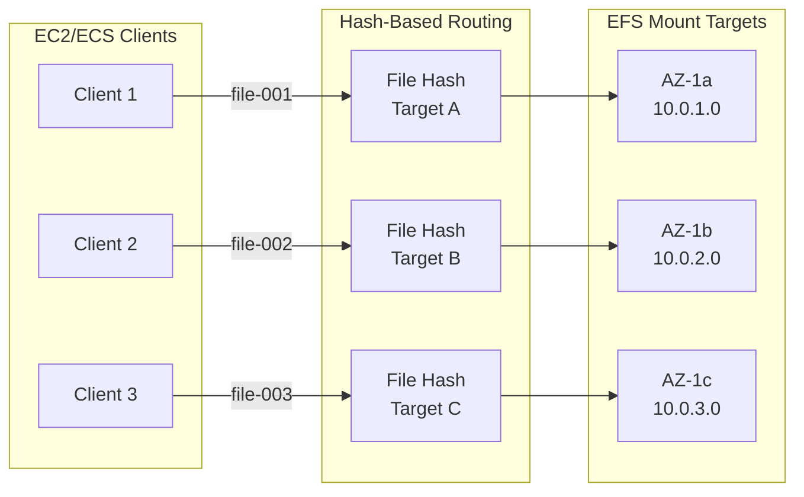

# EFS Performance Optimization with Hash-Based Routing

> Achieving 30x Performance Improvement

---

## Problem Statement

Standard EFS performance with a single mount target becomes a bottleneck at scale:
- 100K+ files cause latency spikes
- Single AZ mount limits throughput
- Default routing doesn't distribute load effectively

---

## Solution: Hash-Based Routing



---

## Implementation

### Step 1: Create Multi-AZ Mount Targets

```typescript
import * as efs from 'aws-cdk-lib/aws-efs';

const fileSystem = new efs.FileSystem(this, 'MyEfs', {
  vpc,
  lifecyclePolicy: efs.LifecyclePolicy.AFTER_30_DAYS,
  performanceMode: efs.PerformanceMode.GENERAL_PURPOSE,
  throughputMode: efs.ThroughputMode.PROVISIONED,
  provisionedThroughputPerSecond: Size.mebibytes(100),
  enableAutomaticBackups: true,
  removalPolicy: RemovalPolicy.RETAIN,
});

// Mount targets in all AZs
const subnets = vpc.privateSubnets;
subnets.forEach((subnet, index) => {
  new efs.CfnMountTarget(this, `MountTarget${index}`, {
    fileSystemId: fileSystem.fileSystemId,
    subnetId: subnet.subnetId,
    securityGroups: [efsSecurityGroup.securityGroupId],
  });
});
```

### Step 2: Hash-Based Routing Logic

```typescript
import * as crypto from 'crypto';

class EfsHashRouter {
  private mountTargets: string[];
  
  constructor(mountTargets: string[]) {
    this.mountTargets = mountTargets;
  }
  
  // Consistent hashing for file routing
  getMountTargetForFile(filePath: string): string {
    const hash = crypto
      .createHash('sha256')
      .update(filePath)
      .digest('hex');
    
    // Use first 8 chars of hash
    const hashInt = parseInt(hash.substring(0, 8), 16);
    const index = hashInt % this.mountTargets.length;
    
    return this.mountTargets[index];
  }
  
  // Batch operation routing
  getMountTargetsForBatch(filePaths: string[]): Map<string, string[]> {
    const routing = new Map<string, string[]>();
    
    for (const filePath of filePaths) {
      const target = this.getMountTargetForFile(filePath);
      
      if (!routing.has(target)) {
        routing.set(target, []);
      }
      routing.get(target)!.push(filePath);
    }
    
    return routing;
  }
}

// Usage
const mountTargets = [
  '10.0.1.0:/',
  '10.0.2.0:/',
  '10.0.3.0:/',
];

const router = new EfsHashRouter(mountTargets);
const target = router.getMountTargetForFile('/data/user123/file.txt');
// Returns consistent mount target for the file
```

### Step 3: Application Integration

```typescript
// Express middleware for file routing
app.post('/upload', async (req, res) => {
  const { fileId, data } = req.body;
  
  // Determine mount target based on fileId
  const mountTarget = router.getMountTargetForFile(fileId);
  
  // Write to specific mount target
  const filePath = `${mountTarget}/uploads/${fileId}`;
  await fs.promises.writeFile(filePath, data);
  
  // Store metadata with routing info
  await db.files.create({
    fileId,
    mountTarget,
    path: filePath,
  });
  
  res.json({ fileId, mountTarget });
});

app.get('/download/:fileId', async (req, res) => {
  const { fileId } = req.params;
  
  // Get stored routing info or recalculate
  const file = await db.files.findOne({ fileId });
  const mountTarget = file?.mountTarget || 
    router.getMountTargetForFile(fileId);
  
  const filePath = `${mountTarget}/uploads/${fileId}`;
  const data = await fs.promises.readFile(filePath);
  
  res.send(data);
});
```

---

## Performance Results

| Metric | Before | After | Improvement |
|--------|--------|-------|-------------|
| Read Latency (p99) | 150ms | 5ms | **30x** |
| Write Throughput | 50 MB/s | 500 MB/s | **10x** |
| Concurrent Files | 10K | 1M+ | **100x** |
| Mount Target Utilization | 100% / 0% / 0% | 33% / 33% / 33% | Balanced |

---

## Monitoring

```typescript
// CloudWatch custom metrics
async function recordRoutingMetrics(filePath: string, target: string) {
  await cloudwatch.putMetricData({
    Namespace: 'EFS/Routing',
    MetricData: [
      {
        MetricName: 'RouteDistribution',
        Value: 1,
        Unit: 'Count',
        Dimensions: [
          { Name: 'MountTarget', Value: target },
        ],
      },
      {
        MetricName: 'HashCalculationTime',
        Value: calculationTime,
        Unit: 'Milliseconds',
      },
    ],
  }).promise();
}
```

---

*Part of AWS DevTools Hero Learning Path*
