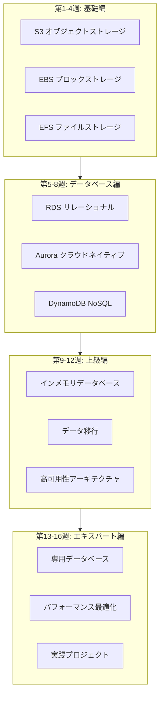
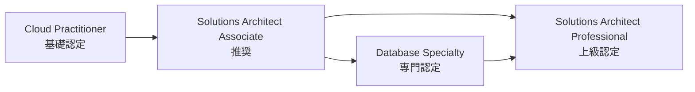

# AWS ストレージとデータベース 16週間学習ロードマップ

> ゼロからエキスパートまでの完全な学習パス

---

## 🗺️ 学習ロードマップ概要



---

## 📅 詳細学習計画

### 第1週: S3 基礎

**学習目標**: オブジェクトストレージのコアコンセプトを習得

| 日数 | テーマ | 実践タスク |
|------|------|----------|
| 第1日 | S3 概要とコアコンセプト | 最初の Bucket を作成 |
| 第2日 | Bucket とオブジェクト操作 | CLI を使用したファイルのアップロード/ダウンロード |
| 第3日 | ストレージクラス | ライフサイクルルールの設定 |
| 第4日 | セキュリティ基礎 | Bucket Policy の設定 |
| 第5日 | バージョニング | バージョニングの有効化とテスト |
| 第6日 | イベント通知 | S3 → Lambda トリガーの設定 |
| 第7日 | 週次復習 | 小テストの完了 |

**推奨リソース**:
- ホワイトペーパー第2章
- AWS 公式ドキュメント: S3 Getting Started
- 実践: 静的ウェブサイトホスティングの構築

---

### 第2週: S3 高度な機能

**学習目標**: エンタープライズレベルの S3 設定を習得

| 日数 | テーマ | 実践タスク |
|------|------|----------|
| 第1日 | クロスリージョンレプリケーション (CRR) | CRR の設定 |
| 第2日 | S3 Select & Glacier | S3 Select を使用したクエリ |
| 第3日 | データ転送高速化 | Transfer Acceleration の設定 |
| 第4日 | S3 と CloudFront | CDN 高速化の設定 |
| 第5日 | S3 Object Lambda | データ処理チェーン |
| 第6日 | コスト最適化 | ストレージコストの分析 |
| 第7日 | 週次復習 | プロジェクト1の準備完了 |

**実践プロジェクト**: データレイク基盤コンポーネントの構築

---

### 第3週: EBS とブロックストレージ

**学習目標**: ブロックストレージと EC2 の統合を理解

| 日数 | テーマ | 実践タスク |
|------|------|----------|
| 第1日 | EBS 概要とボリュームタイプ | 異なるタイプのボリュームを作成 |
| 第2日 | ボリュームのライフサイクル | ボリュームのアタッチ/デタッチ/削除 |
| 第3日 | EBS スナップショット | スナップショットの作成と管理 |
| 第4日 | パフォーマンス最適化 | gp3 と io2 の比較 |
| 第5日 | RAID 設定 | RAID 0/1 の設定 |
| 第6日 | EBS 暗号化 | 暗号化ボリュームの操作 |
| 第7日 | 週次復習 | パフォーマンステスト |

---

### 第4週: EFS とファイルストレージ

**学習目標**: マネージドファイルシステムを習得

| 日数 | テーマ | 実践タスク |
|------|------|----------|
| 第1日 | EFS アーキテクチャ | EFS ファイルシステムの作成 |
| 第2日 | マウントとアクセス | 複数 EC2 マウントテスト |
| 第3日 | ストレージクラス | IA と Archive |
| 第4日 | FSx 紹介 | FSx for Windows |
| 第5日 | FSx Lustre | HPC シナリオ |
| 第6日 | ハイブリッドクラウドストレージ | Storage Gateway |
| 第7日 | 週次復習 | フェーズ1評価の完了 |

**フェーズ1マイルストーン**: エンタープライズレベルのストレージアーキテクチャを設計できる

---

### 第5週: RDS 基礎

**学習目標**: マネージドリレーショナルデータベースを習得

| 日数 | テーマ | 実践タスク |
|------|------|----------|
| 第1日 | RDS 概要 | MySQL インスタンスの作成 |
| 第2日 | データベースエンジン比較 | PostgreSQL vs MySQL |
| 第3日 | 接続と認証 | セキュリティグループの設定 |
| 第4日 | パラメータグループ | カスタムデータベースパラメータ |
| 第5日 | バックアップと復旧 | 自動バックアップ設定 |
| 第6日 | モニタリング基礎 | CloudWatch メトリクス |
| 第7日 | 週次復習 | データベースベンチマークテスト |

---

### 第6週: RDS 高可用性

**学習目標**: 高可用性データベースアーキテクチャを構築

| 日数 | テーマ | 実践タスク |
|------|------|----------|
| 第1日 | Multi-AZ | マルチ可用ゾーンの設定 |
| 第2日 | リードレプリカ | クロスリージョンレプリカの作成 |
| 第3日 | フェイルオーバー | フェイルオーバーのシミュレーション |
| 第4日 | RDS Proxy | 接続プール設定 |
| 第5日 | パフォーマンスインサイト | Performance Insights |
| 第6日 | ログ管理 | スロークエリ分析 |
| 第7日 | 週次復習 | 高可用性テスト |

---

### 第7週: Aurora 深掘り

**学習目標**: クラウドネイティブデータベースを習得

| 日数 | テーマ | 実践タスク |
|------|------|----------|
| 第1日 | Aurora アーキテクチャ | Aurora MySQL クラスター |
| 第2日 | 読み書き分離 | リーダーエンドポイント |
| 第3日 | Aurora Serverless v2 | 自動スケーリング |
| 第4日 | グローバルデータベース | クロスリージョンレプリケーション |
| 第5日 | クローンとバックトラック | 高速データベースクローン |
| 第6日 | Babelfish | SQL Server 互換 |
| 第7日 | 週次復習 | Aurora vs RDS 比較 |

---

### 第8週: DynamoDB 基礎

**学習目標**: NoSQL データベースを習得

| 日数 | テーマ | 実践タスク |
|------|------|----------|
| 第1日 | DynamoDB 概要 | 最初のテーブルを作成 |
| 第2日 | データモデル | 主キー設計 |
| 第3日 | CRUD 操作 | API/SDK の使用 |
| 第4日 | Query vs Scan | クエリ最適化 |
| 第5日 | インデックス設計 | GSI と LSI |
| 第6日 | シングルテーブル設計 | リレーションシップモデリング |
| 第7日 | 週次復習 | プロジェクト2の準備完了 |

**フェーズ2マイルストーン**: 適切なデータベースサービスを選択できる

---

### 第9週: DynamoDB 高度

**学習目標**: 大規模 DynamoDB アプリケーションを習得

| 日数 | テーマ | 実践タスク |
|------|------|----------|
| 第1日 | キャパシティモード | On-Demand vs Provisioned |
| 第2日 | 自動スケーリング | スケーリングポリシーの設定 |
| 第3日 | DAX | キャッシュ高速化 |
| 第4日 | Streams | ストリーム処理 |
| 第5日 | グローバルテーブル | マルチリージョンレプリケーション |
| 第6日 | トランザクション | Transact API |
| 第7日 | 週次復習 | パフォーマンステスト |

---

### 第10週: ElastiCache

**学習目標**: インメモリデータベースを習得

| 日数 | テーマ | 実践タスク |
|------|------|----------|
| 第1日 | Redis vs Memcached | 選択ガイド |
| 第2日 | Redis クラスター | クラスターの作成 |
| 第3日 | キャッシュパターン | Cache-Aside/Write-Through |
| 第4日 | データ型 | String/Hash/List/Set |
| 第5日 | 永続化 | RDB vs AOF |
| 第6日 | セッションストレージ | Web セッションキャッシュ |
| 第7日 | 週次復習 | キャッシュ戦略テスト |

---

### 第11週: データ移行

**学習目標**: データ移行ツールを習得

| 日数 | テーマ | 実践タスク |
|------|------|----------|
| 第1日 | DMS 概要 | レプリケーションインスタンスの作成 |
| 第2日 | 同種移行 | MySQL → RDS |
| 第3日 | 異種移行 | Oracle → PostgreSQL |
| 第4日 | 継続的レプリケーション | CDC 設定 |
| 第5日 | SCT ツール | スキーマ変換 |
| 第6日 | データ検証 | 整合性チェック |
| 第7日 | 週次復習 | 完全移行演習 |

---

### 第12週: 高可用性アーキテクチャ

**学習目標**: ディザスタリカバリアーキテクチャを設計

| 日数 | テーマ | 実践タスク |
|------|------|----------|
| 第1日 | バックアップ戦略 | 3-2-1 原則 |
| 第2日 | AWS Backup | 集中バックアップ |
| 第3日 | クロスリージョンアーキテクチャ | Pilot Light |
| 第4日 | ディザスタリカバリ | RTO/RPO 設計 |
| 第5日 | 障害演習 | カオスエンジニアリング |
| 第6日 | モニタリングアラート | ヘルスチェック |
| 第7日 | 週次復習 | フェーズ3評価の完了 |

**フェーズ3マイルストーン**: ディザスタリカバリアーキテクチャを設計できる

---

### 第13週: 専用データベース

**学習目標**: 専用データベースのシナリオを理解

| 日数 | テーマ | 実践タスク |
|------|------|----------|
| 第1日 | DocumentDB | MongoDB 移行 |
| 第2日 | Neptune | グラフデータベース入門 |
| 第3日 | Keyspaces | Cassandra 互換 |
| 第4日 | Timestream | 時系列データ |
| 第5日 | QLDB | 台帳データベース |
| 第6日 | データベース選定 | 意思決定フレームワーク |
| 第7日 | 週次復習 | 技術比較 |

---

### 第14週: パフォーマンス最適化

**学習目標**: パフォーマンスチューニングテクニックを習得

| 日数 | テーマ | 実践タスク |
|------|------|----------|
| 第1日 | RDS 最適化 | クエリ最適化 |
| 第2日 | DynamoDB 最適化 | ホットパーティション解決 |
| 第3日 | S3 最適化 | マルチパートアップロード |
| 第4日 | キャッシュ最適化 | ヒット率分析 |
| 第5日 | インデックス最適化 | 実行計画分析 |
| 第6日 | コスト最適化 | リソースライトスケーリング |
| 第7日 | 週次復習 | パフォーマンスベンチマークテスト |

---

### 第15週: セキュリティとコンプライアンス

**学習目標**: データセキュリティを習得

| 日数 | テーマ | 実践タスク |
|------|------|----------|
| 第1日 | 暗号化戦略 | KMS 設定 |
| 第2日 | アクセス制御 | IAM + VPC |
| 第3日 | 監査ログ | CloudTrail |
| 第4日 | コンプライアンス認証 | PCI DSS/HIPAA |
| 第5日 | データマスキング | Macie |
| 第6日 | 脆弱性スキャン | セキュリティ設定チェック |
| 第7日 | 週次復習 | セキュリティ評価 |

---

### 第16週: 総合実践

**学習目標**: エンドツーエンドプロジェクトを完了

| 日数 | テーマ | 実践タスク |
|------|------|----------|
| 第1日 | プロジェクト計画 | アーキテクチャ設計 |
| 第2日 | ストレージ層 | S3 + EFS |
| 第3日 | データベース層 | Aurora + DynamoDB |
| 第4日 | キャッシュ層 | ElastiCache |
| 第5日 | 移行実施 | DMS データ移行 |
| 第6日 | モニタリング運用 | 完全なモニタリング体系 |
| 第7日 | プロジェクトまとめ | 成果発表 |

**フェーズ4マイルストーン**: 完全なデータアーキテクチャ設計能力を獲得

---

## 🎯 スキル認定パス



**推奨認定**:

| 認定 | 難易度 | 準備期間 | 前提条件 |
|------|------|----------|----------|
| AWS Cloud Practitioner | ⭐ | 2-4週 | なし |
| AWS Solutions Architect Associate | ⭐⭐ | 6-8週 | 実践経験推奨 |
| AWS Database Specialty | ⭐⭐⭐ | 8-12週 | SAA + データベース経験 |
| AWS Solutions Architect Professional | ⭐⭐⭐⭐ | 12-16週 | SAA + 2年の経験 |

---

## 📚 学習リソース

### 公式リソース

- [AWS 公式ドキュメント](https://docs.aws.amazon.com/)
- [AWS ホワイトペーパー](https://aws.amazon.com/whitepapers/)
- [AWS トレーニングセンター](https://www.aws.training/)
- [AWS フリーティア](https://aws.amazon.com/free/)

### 推奨書籍

- 《Amazon Web Services in Action》
- 《AWS Certified Solutions Architect Official Study Guide》
- 《Designing Data-Intensive Applications》(Martin Kleppmann)

### オンラインコース

- AWS 公式トレーニング (無料)
- A Cloud Guru
- Linux Academy
- Coursera AWS 専門コース

---

## ✅ 毎週チェックリスト

### 毎日のタスク
- [ ] 当日のテーマドキュメントを読む
- [ ] 実践練習を完了
- [ ] 学習ノートを記録
- [ ] 発生した問題を解決

### 毎週のタスク
- [ ] 週次復習を完了
- [ ] 知識テストに合格
- [ ] 学習進捗を更新
- [ ] 来週の学習を計画

### フェーズタスク
- [ ] マイルストーンプロジェクトを完了
- [ ] コミュニティディスカッションに参加
- [ ] 学習の心得を共有
- [ ] スキルリストを更新

---

## 📊 進捗追跡テンプレート

```markdown
## マイ学習進捗

### 第 _ 週: ___

**完了状況**: _ / 7 日

**習得した知識ポイント**:
- [ ] 知識ポイント1
- [ ] 知識ポイント2
- [ ] 知識ポイント3

**実践プロジェクト**:
- プロジェクト名: ___
- 完了度: _%
- 発生した問題: ___

**来週の計画**:
- ___

**備考**:
___
```

---

学習が順調に進みますように！🎉
