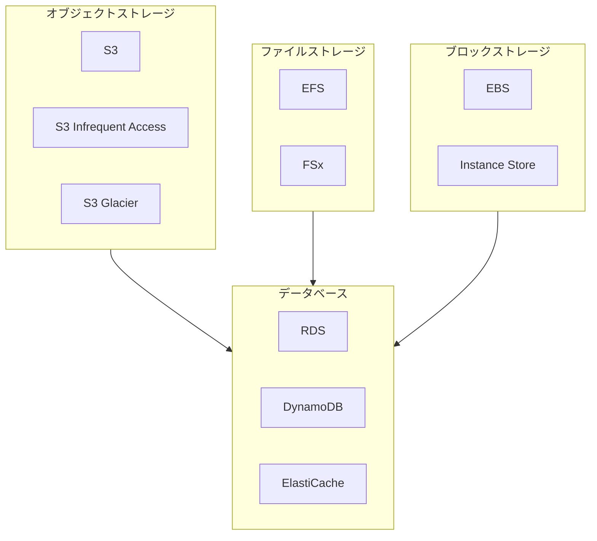

# AWS ストレージとデータベース技術白書

> オブジェクトストレージから専用データベースまで、AWS データストレージの完全ガイド

---

## 目次

> **学習ガイド**: 本白書は「ストレージタイプ→データベースサービス→運用」の順に進みます。第 1 章〜第 4 章のストレージ基礎を先に習得し、その後データベースの選定と運用を学習してください。

1. **[ストレージとデータベース概要](#1-ストレージとデータベース概要)**  
   *グローバルな視点を確立: AWS ストレージサービスタクソノミー、データアクセスパターン、意思決定木を理解し、専門的学習のためのフレームワークを構築します。*

2. **[Amazon S3 オブジェクトストレージ](#2-amazon-s3-オブジェクトストレージ)**  
   *クラウドストレージの基石を習得: S3 コア概念、ストレージクラス、ライフサイクル管理を深く学びます——最も広く使用されている AWS ストレージサービスです。*

3. **[ファイルストレージサービス](#3-ファイルストレージサービス)**  
   *ファイルレベルストレージを拡張: EFS と FSx ファミリーサービスを対比し、オブジェクトストレージではなくマネージドファイルシステムを選ぶ状況を理解します。*

4. **[Amazon EBS ブロックストレージ](#4-amazon-ebs-ブロックストレージ)**  
   *EC2 ストレージ基盤: ボリュームタイプ選定、スナップショット戦略、I/O 最適化を学び、EC2 ワークロードに最適なストレージを設計します。*

5. **[リレーショナルデータベース](#5-リレーショナルデータベース)**  
   *マネージドデータベースサービス: RDS と Aurora アーキテクチャを深く学び、マルチ AZ、リードレプリカ、パフォーマンスインサイトを習得します。*

6. **[Amazon DynamoDB](#6-amazon-dynamodb)**  
   *NoSQL データモデリング: キーバリュー/ドキュメントデータベース設計、パーティションキー戦略、DAX キャッシング、グローバルテーブルを学びます。*

7. **[インメモリデータベースとキャッシング](#7-インメモリデータベースとキャッシング)**  
   *データアクセスを高速化: ElastiCache (Redis/Memcached) と MemoryDB のユースケースとパフォーマンスチューニングを習得します。*

8. **[専用データベースサービス](#8-専用データベースサービス)**  
   *特定のワークロード向けに選択: DocumentDB、Keyspaces、Neptune、Timestream、QLDB などの専用データベースを探索します。*

9. **[データ移行と統合](#9-データ移行と統合)**  
   *データ移動ソリューション: DMS、SCT、DataSync、Glue を学び、異種データベース間の移行戦略を習得します。*

10. **[バックアップと災害復旧](#10-バックアップと災害復旧)**  
    *データ資産を保護: AWS Backup、スナップショット、クロスリージョンレプリケーションを対比し、RPO/RTO 要件に応じた設計を行います。*

11. **[パフォーマンス最適化とモニタリング](#11-パフォーマンス最適化とモニタリング)**  
    *ストレージ効率を向上: CloudWatch ストレージメトリクス、パフォーマンスインサイト、DynamoDB キャパシティ最適化を学びます。*

12. **[データベースコンテナ化と Docker](#12-データベースコンテナ化と-docker)** 🐳  
    *モダンな運用: ローカル Docker データベース開発、RDS Proxy、ECS/EKS データベースデプロイメント、LocalStack テストを学びます。*

13. **[セキュリティとコンプライアンス](#13-セキュリティとコンプライアンス)**  
    *データセキュリティフレームワーク: これまでの知識を統合し、暗号化（KMS）、IAM 認可、VPC 分離、コンプライアンス監査を学びます。*

---

## 1. ストレージとデータベース概要

### 1.1 AWS ストレージサービスタクソノミー

### 1.2 ストレージ判断マトリクス

| 要件 | 推奨サービス | 理由 |
|------|------------|------|
| 静的コンテンツホスティング | S3 | コスト効率的、耐久性、CDN 統合 |
| 共有ファイルシステム | EFS | POSIX 準拠、自動スケーリング |
| データベースストレージ | EBS gp3 | 一貫した低レイテンシパフォーマンス |
| アーカイブデータ | S3 Glacier | アクセス頻度が低いデータの最低コスト |

---

(後続の章も同様のパターンで続きます...)

---

*バージョン: v1.0*  
*最終更新日: 2026-03-02*
