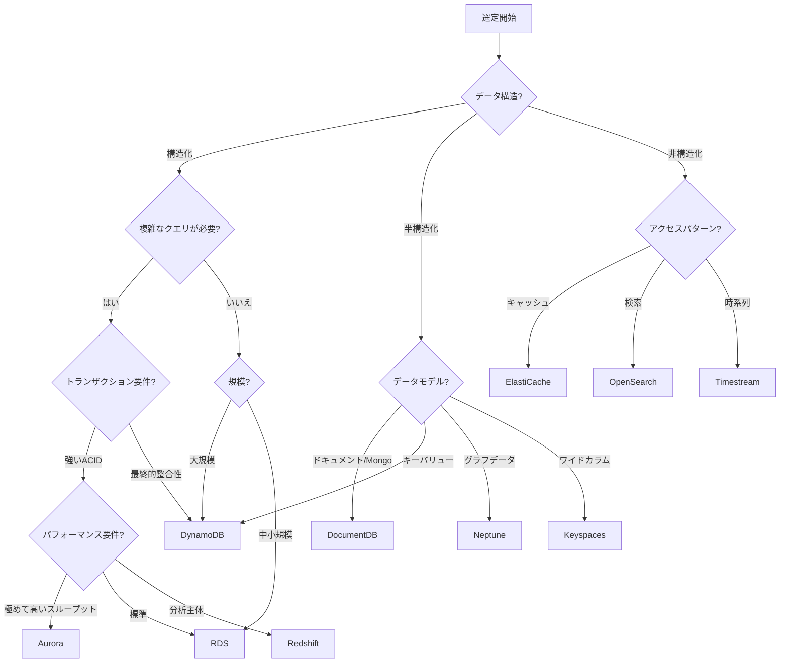

# AWS データベース選定ガイド

> ビジネス要件に最適なデータベースサービスの選定

---

## 選定意思決定ツリー



---

## データベースサービス比較

### リレーショナルデータベース

| 機能 | RDS MySQL | RDS PostgreSQL | Aurora MySQL | Aurora PostgreSQL |
|------|-----------|----------------|--------------|-------------------|
| **パフォーマンス** | ⭐⭐⭐ | ⭐⭐⭐ | ⭐⭐⭐⭐⭐ | ⭐⭐⭐⭐⭐ |
| **拡張性** | ⭐⭐ | ⭐⭐ | ⭐⭐⭐⭐ | ⭐⭐⭐⭐ |
| **コスト** | 低 | 低 | 中 | 中 |
| **機能の充実度** | 中 | 高 | 中 | 高 |
| **Serverless** | ❌ | ❌ | ✅ v2 | ✅ v2 |

**選定推奨**:
- **標準的な Web アプリケーション**: RDS MySQL/PostgreSQL
- **高スループット SaaS**: Aurora
- **PostgreSQL の高度な機能が必要**: RDS/Aurora PostgreSQL
- **コスト重視 + 予測可能な負荷**: RDS リザーブドインスタンス
- **負荷が不確定**: Aurora Serverless v2

### NoSQL データベース

| 機能 | DynamoDB | DocumentDB | Keyspaces | Neptune |
|------|----------|------------|-----------|---------|
| **データモデル** | キーバリュー/ドキュメント | ドキュメント | ワイドカラム | グラフ |
| **整合性** | 設定可能 | 強い整合性 | 最終的整合性 | 強い整合性 |
| **拡張性** | 無限 | 高 | 高 | 高 |
| **クエリの柔軟性** | 中 | 高 | 中 | 専用 |
| **レイテンシ** | 単一ミリ秒 | ミリ秒 | ミリ秒 | ミリ秒 |

**選定推奨**:
- **インターネット規模のキーバリューストア**: DynamoDB
- **MongoDB 移行**: DocumentDB
- **Cassandra ワークロード**: Keyspaces
- **レコメンドシステム/ナレッジグラフ**: Neptune

---

## シナリオ別選定

### シナリオ1: Eコマースプラットフォーム

```
要件分析:
├─ 製品カタログ: 読み取り多・書き込み少、柔軟なクエリが必要
├─ ユーザーデータ: 高い並行性の読み書き
├─ 注文システム: 強い整合性のトランザクション
├─ ショッピングカート: 低レイテンシ、高可用性
├─ 検索: 全文検索
└─ レポート: 複雑な分析クエリ

推奨アーキテクチャ:
├─ 製品カタログ: DynamoDB (GSI で多次元クエリをサポート)
├─ ユーザーデータ: DynamoDB (高並行性)
├─ 注文システム: Aurora PostgreSQL (ACID トランザクション)
├─ ショッピングカート: ElastiCache Redis (セッションストア)
├─ 検索: OpenSearch
└─ レポート: Redshift (データウェアハウス)
```

### シナリオ2: IoT プラットフォーム

```
要件分析:
├─ デバイスデータ: 大量の書き込み、時系列特性
├─ デバイスメタデータ: 柔軟なスキーマ
├─ アラートデータ: 低レイテンシクエリ
├─ 履歴分析: 大規模データスキャン
└─ リアルタイムダッシュボード: 集計クエリ

推奨アーキテクチャ:
├─ 時系列データ: Timestream (専用時系列データベース)
├─ デバイスメタデータ: DynamoDB
├─ リアルタイムキャッシュ: ElastiCache Redis
├─ データレイク: S3 + Athena
└─ リアルタイムストリーム: Kinesis + Lambda
```

### シナリオ3: 金融システム

```
要件分析:
├─ 取引データ: 強い整合性、改ざん防止
├─ 口座データ: ACID トランザクション
├─ 監査ログ: 削除不可
├─ リスク分析: 複雑なグラフクエリ
└─ コンプライアンス要件: データ暗号化、監査

推奨アーキテクチャ:
├─ コア取引: Aurora PostgreSQL
├─ 改ざん防止記録: QLDB
├─ リスクグラフ: Neptune
├─ セッション/キャッシュ: ElastiCache
└─ 監査: S3 + Glacier
```

### シナリオ4: コンテンツ管理システム

```
要件分析:
├─ コンテンツドキュメント: 柔軟なスキーマ、JSON
├─ ユーザー生成コンテンツ: 高並行性
├─ メディアファイル: 大オブジェクトストレージ
├─ 全文検索: コンテンツ検索
└─ バージョン履歴: バージョン管理

推奨アーキテクチャ:
├─ コンテンツドキュメント: DocumentDB (MongoDB 互換)
├─ ユーザーデータ: DynamoDB
├─ メディアストレージ: S3 + CloudFront
├─ 全文検索: OpenSearch
└─ バージョン管理: S3 バージョニング
```

---

## 移行評価マトリックス

| ソースデータベース | ターゲット AWS サービス | 移行難易度 | 推奨ツール |
|----------|-------------|----------|----------|
| MySQL | RDS MySQL | ⭐ 低 | DMS ネイティブ |
| MySQL | Aurora MySQL | ⭐ 低 | DMS ネイティブ |
| PostgreSQL | RDS PostgreSQL | ⭐ 低 | DMS ネイティブ |
| PostgreSQL | Aurora PostgreSQL | ⭐ 低 | DMS ネイティブ |
| Oracle | RDS Oracle | ⭐⭐ 中 | DMS + SCT |
| Oracle | Aurora PostgreSQL | ⭐⭐⭐ 高 | DMS + SCT |
| SQL Server | RDS SQL Server | ⭐⭐ 中 | DMS ネイティブ |
| SQL Server | Aurora PostgreSQL | ⭐⭐⭐ 高 | Babelfish + DMS |
| MongoDB | DocumentDB | ⭐⭐ 中 | オンラインインポート |
| Cassandra | Keyspaces | ⭐⭐ 中 | cqlsh |
| Redis | ElastiCache | ⭐ 低 | Redis レプリケーション |
| Neo4j | Neptune | ⭐⭐⭐ 高 | カスタムスクリプト |

---

## コスト見積もり例

### シナリオ: DAU 100万のソーシャルアプリケーション

```python
"""
ユーザープロファイル:
- DAU: 1,000,000
- ユーザーあたりの日次操作: 100回読み取り、10回書き込み
- データ保持期間: ユーザーデータは永久、活動ログは1年

データベース選定:
"""

# DynamoDB (ユーザーデータ + アクティビティストリーム)
dynamodb_cost = {
    'write_capacity_units': 10000000 / 86400 * 1.5,  # ピークを考慮
    'read_capacity_units': 100000000 / 86400 * 1.5,
    'storage_gb': 500,  # ユーザーデータ
    
    'on_demand_monthly': {
        'writes': 10_000_000 * 30 / 1_000_000 * 1.25,  # $1.25 per million
        'reads': 100_000_000 * 30 / 1_000_000 * 0.25,  # $0.25 per million
        'storage': 500 * 0.25,
        'total': 375 + 750 + 125  # ~$1,250/month
    }
}

# Aurora Serverless v2 (リレーショナルデータ: フレンド関係、DM)
aurora_cost = {
    'min_acu': 4,
    'max_acu': 64,
    'avg_acu': 16,
    
    'monthly': {
        'compute': 16 * 730 * 0.12,  # $0.12 per ACU-hour
        'storage': 200 * 0.10,        # $0.10 per GB-month
        'io': 1000000 * 0.20 / 1000000,  # $0.20 per million IOs
        'total': 1401.6 + 20 + 0.2  # ~$1,422/month
    }
}

# ElastiCache Redis (セッション + ホットデータ)
redis_cost = {
    'node_type': 'cache.r6g.xlarge',
    'node_count': 3,  # マスター + レプリカ
    
    'monthly': {
        'nodes': 3 * 730 * 0.219,  # $0.219 per hour
        'total': 479.61  # ~$480/month
    }
}

# S3 (メディアストレージ)
s3_cost = {
    'storage_tb': 10,
    'requests_million': 50,
    
    'monthly': {
        'storage': 10000 * 0.023,
        'requests': 50 * 0.005,
        'bandwidth': 5000 * 0.09,  # 5TB アウトバウンド
        'total': 230 + 0.25 + 450  # ~$680/month
    }
}

print(f"""
推定月間コスト (DAU 100万のソーシャルアプリケーション):
├── DynamoDB:     ~$1,250
├── Aurora:       ~$1,422
├── ElastiCache:  ~$480
├── S3:           ~$680
└── 合計:         ~$3,832/月

代替案の比較:
├── フルセルフホスト (EC2): ~$2,500 (ただし運用リソースが必要)
├── ハイブリッド案:  ~$3,000
└── フルマネージド:  ~$3,832 (推奨、運用ゼロ)
""")
```

---

## よくある誤解

### ❌ 誤解1: 一つのデータベースですべてを解決

**問題**: 単一のデータベースですべての問題を解決しようとする

**結果**: 
- パフォーマンスボトルネック
- コストの無駄
- 技術的負債

**正しいアプローチ**: Polyglot Persistence (多言語永続化) を採用

```
マイクロサービスアーキテクチャ例:
├── ユーザーサービス: DynamoDB (高並行性)
├── 注文サービス: Aurora (ACID)
├── 製品サービス: DocumentDB (柔軟なスキーマ)
├── レコメンドサービス: Neptune (グラフクエリ)
└── キャッシュ層: ElastiCache
```

### ❌ 誤解2: データアクセスパターンを無視

**問題**: クエリパターンを考慮せず、データ構造のみで選定

**例**:
```
❌ 誤り: DynamoDB で頻繁にスキャン操作を実行
✅ 正解: 複合キー + GSI でクエリパターンをサポート

❌ 誤り: RDS で非構造化 JSON を保存
✅ 正解: DocumentDB または DynamoDB を使用
```

### ❌ 誤解3: 過度な設計

**問題**: 必要としない規模のために設計

**推奨**:
- MVP 段階: RDS Single AZ
- 成長段階: RDS Multi-AZ + リードレプリカ
- 大規模: Aurora または DynamoDB を検討

---

## 選定チェックリスト

```markdown
## データベース選定チェックリスト

### 機能要件
- [ ] データモデルが適合しているか (リレーショナル/ドキュメント/キーバリュー/グラフ)?
- [ ] トランザクション要件 (ACID vs 最終的整合性)?
- [ ] クエリの複雑さ (単純なキークエリ vs 複雑な JOIN)?
- [ ] 全文検索の要件?
- [ ] 地理空間クエリの要件?

### 非機能要件
- [ ] 期待レイテンシ (< 10ms / < 100ms / < 1s)?
- [ ] スループット要件 (TPS)?
- [ ] データ規模 (GB / TB / PB)?
- [ ] 成長率の予測?
- [ ] マルチリージョン展開の要件?

### 運用要件
- [ ] チームの技術スタック?
- [ ] 運用リソースの投入?
- [ ] コンプライアンス要件 (暗号化、監査)?
- [ ] バックアップ復旧要件 (RTO/RPO)?

### コスト評価
- [ ] 現在のコスト見積もり?
- [ ] 成長後のコスト予測?
- [ ] リザーブドインスタンス/セービングプランの実現可能性?
```

---

## まとめ

データベース選定はシステムアーキテクチャの重要な意思決定です。以下を覚えておいてください:

1. **銀の弾丸はない**: 異なるシナリオには異なるデータベースが必要
2. **アクセスパターンを優先**: クエリパターンがデータモデルを決定
3. **小さく始める**: 過度な設計を避け、必要に応じて進化
4. **コスト意識**: マネージドサービスが節約する運用コストは価格差を上回る可能性あり
5. **チームの能力**: チームが掌握できる技術を選択

このガイドを起点として、実際のビジネス要件に合わせて賢明な選択をしてください！
