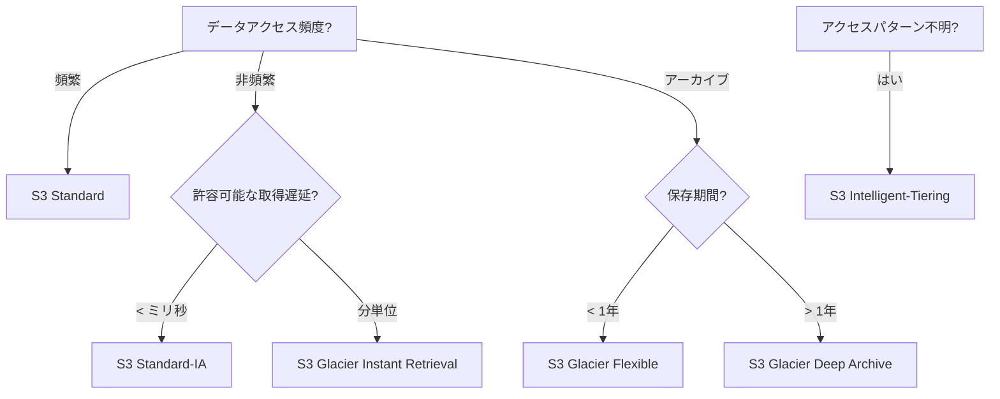

# Amazon S3 完全ガイド

> S3 入門から習得までの使用マニュアル

---

## 目次

1. [S3 コアコンセプト](#コアコンセプト)
2. [ストレージクラス詳解](#ストレージクラス詳解)
3. [セキュリティのベストプラクティス](#セキュリティのベストプラクティス)
4. [パフォーマンス最適化](#パフォーマンス最適化)
5. [コスト管理](#コスト管理)
6. [一般的な使用シナリオ](#一般的な使用シナリオ)

---

## コアコンセプト

### Bucket 命名規則

```
✅ 有効な名前:
- my-unique-bucket-2024
- company.data.storage
- logs.us-east-1.production

❌ 無効な名前:
- MyBucket (大文字)
- bucket_name (アンダースコア)
- 192.168.1.1 (IPアドレス形式)
- bucket..name (連続するドット)
```

**命名のベストプラクティス**:
- 環境プレフィックスを使用: `prod-`, `dev-`, `test-`
- リージョンサフィックスを使用: `-us-east-1`, `-eu-west-1`
- アプリケーション名を使用: `webapp-`, `api-`, `analytics-`

### オブジェクトメタデータ

```python
import boto3

s3 = boto3.client('s3')

# メタデータ付きオブジェクトのアップロード
s3.put_object(
    Bucket='my-bucket',
    Key='documents/report.pdf',
    Body=file_content,
    Metadata={
        'department': 'finance',
        'project': 'q4-report',
        'classification': 'confidential',
        'retention-years': '7'
    },
    ContentType='application/pdf',
    ContentDisposition='attachment; filename="report.pdf"'
)
```

---

## ストレージクラス詳解

### 選定意思決定フロー



### Intelligent-Tiering 設定

```python
import boto3

s3 = boto3.client('s3')

# 自動アーカイブの有効化
s3.put_bucket_intelligent_tiering_configuration(
    Bucket='my-data-lake',
    Id='DeepArchiveArchive',
    IntelligentTieringConfiguration={
        'Status': 'Enabled',
        'Tierings': [
            {
                'Days': 90,
                'AccessTier': 'ARCHIVE_ACCESS'  # 90日後にアーカイブ
            },
            {
                'Days': 180,
                'AccessTier': 'DEEP_ARCHIVE_ACCESS'  # 180日後に深度アーカイブ
            }
        ],
        'Filter': {
            'Prefix': 'logs/',
            'Tag': {
                'Key': 'Archive',
                'Value': 'true'
            }
        }
    }
)
```

---

## セキュリティのベストプラクティス

### Bucket Policy テンプレート

```json
{
    "Version": "2012-10-17",
    "Statement": [
        {
            "Sid": "EnforceSSLOnly",
            "Effect": "Deny",
            "Principal": "*",
            "Action": "s3:*",
            "Resource": [
                "arn:aws:s3:::secure-bucket",
                "arn:aws:s3:::secure-bucket/*"
            ],
            "Condition": {
                "Bool": {
                    "aws:SecureTransport": "false"
                }
            }
        },
        {
            "Sid": "DenyUnencryptedUploads",
            "Effect": "Deny",
            "Principal": "*",
            "Action": "s3:PutObject",
            "Resource": "arn:aws:s3:::secure-bucket/*",
            "Condition": {
                "StringNotEquals": {
                    "s3:x-amz-server-side-encryption": "aws:kms"
                }
            }
        },
        {
            "Sid": "AllowSpecificVPCOnly",
            "Effect": "Deny",
            "Principal": "*",
            "Action": "s3:*",
            "Resource": [
                "arn:aws:s3:::secure-bucket",
                "arn:aws:s3:::secure-bucket/*"
            ],
            "Condition": {
                "StringNotEquals": {
                    "aws:VpcSourceIp": [
                        "10.0.0.0/8",
                        "172.16.0.0/12"
                    ]
                }
            }
        }
    ]
}
```

### プリサイン URL のセキュリティ

```python
import boto3
from datetime import timedelta

s3 = boto3.client('s3')

# 安全な一時アクセス URL の生成
def generate_secure_url(bucket, key, expiration_minutes=15):
    """
    安全なプリサイン URL を生成
    - 短い有効期間 (デフォルト15分)
    - 特定の IP のみ許可
    - HTTPS 強制
    """
    url = s3.generate_presigned_url(
        'get_object',
        Params={
            'Bucket': bucket,
            'Key': key,
            'ResponseContentDisposition': 'attachment'
        },
        ExpiresIn=expiration_minutes * 60
    )
    return url

# IP 制限付き URL (CloudFront または Lambda@Edge が必要)
def generate_restricted_url(bucket, key, allowed_ip):
    """IP 制限付きアクセス URL の生成"""
    # 実際の実装では CloudFront Signed URLs
    # または Lambda@Edge を使用してリアルタイム検証が必要
    pass
```

---

## パフォーマンス最適化

### マルチパートアップロードのベストプラクティス

```python
import boto3
from concurrent.futures import ThreadPoolExecutor
import os

s3 = boto3.client('s3')

def multipart_upload_with_progress(file_path, bucket, key):
    """進捗トラッキング付きマルチパートアップロード"""
    
    file_size = os.path.getsize(file_path)
    part_size = 100 * 1024 * 1024  # 100MB パート
    
    # アップロードの初期化
    mpu = s3.create_multipart_upload(
        Bucket=bucket,
        Key=key,
        ServerSideEncryption='aws:kms'
    )
    upload_id = mpu['UploadId']
    
    parts = []
    part_number = 1
    
    try:
        with open(file_path, 'rb') as f:
            while True:
                data = f.read(part_size)
                if not data:
                    break
                
                # パートのアップロード
                response = s3.upload_part(
                    Bucket=bucket,
                    Key=key,
                    UploadId=upload_id,
                    PartNumber=part_number,
                    Body=data
                )
                
                parts.append({
                    'PartNumber': part_number,
                    'ETag': response['ETag']
                })
                
                progress = (part_number * part_size / file_size) * 100
                print(f"アップロード進捗: {min(progress, 100):.2f}%")
                part_number += 1
        
        # アップロードの完了
        s3.complete_multipart_upload(
            Bucket=bucket,
            Key=key,
            UploadId=upload_id,
            MultipartUpload={'Parts': parts}
        )
        
        print("アップロード完了!")
        
    except Exception as e:
        # アップロードの中止
        s3.abort_multipart_upload(
            Bucket=bucket,
            Key=key,
            UploadId=upload_id
        )
        raise e

# 複数ファイルの並列アップロード
def concurrent_uploads(file_list, bucket):
    with ThreadPoolExecutor(max_workers=5) as executor:
        futures = [
            executor.submit(multipart_upload_with_progress, f, bucket, os.path.basename(f))
            for f in file_list
        ]
        for future in futures:
            future.result()
```

### S3 Select によるクエリ最適化

```python
# 完全なファイルをダウンロードせずに CSV/JSON を S3 Select でクエリ
import boto3

s3 = boto3.client('s3')

def query_large_csv(bucket, key, query):
    """S3 Select を使用した大きなファイルのクエリ"""
    
    response = s3.select_object_content(
        Bucket=bucket,
        Key=key,
        Expression=query,
        ExpressionType='SQL',
        InputSerialization={
            'CSV': {
                'FileHeaderInfo': 'USE',
                'RecordDelimiter': '\n',
                'FieldDelimiter': ','
            }
        },
        OutputSerialization={
            'JSON': {
                'RecordDelimiter': '\n'
            }
        }
    )
    
    results = []
    for event in response['Payload']:
        if 'Records' in event:
            records = event['Records']['Payload'].decode('utf-8')
            results.extend(records.strip().split('\n'))
    
    return results

# クエリ例
results = query_large_csv(
    'data-lake-bucket',
    'sales/2024.csv',
    "SELECT * FROM s3object s WHERE s.region = 'APAC' AND s.amount > 10000"
)
```

---

## コスト管理

### ライフサイクルポリシーテンプレート

```python
import boto3

s3 = boto3.client('s3')

# 包括的ライフサイクルポリシー
def configure_cost_optimized_lifecycle(bucket):
    """コスト最適化ライフサイクルポリシーの設定"""
    
    lifecycle_policy = {
        'Rules': [
            {
                'ID': 'TransitionToIA',
                'Status': 'Enabled',
                'Filter': {
                    'Prefix': 'data/'
                },
                'Transitions': [
                    {
                        'Days': 30,
                        'StorageClass': 'STANDARD_IA'
                    },
                    {
                        'Days': 90,
                        'StorageClass': 'GLACIER'
                    }
                ]
            },
            {
                'ID': 'DeleteOldVersions',
                'Status': 'Enabled',
                'Filter': {},
                'NoncurrentVersionExpiration': {
                    'NoncurrentDays': 90
                },
                'NoncurrentVersionTransitions': [
                    {
                        'NoncurrentDays': 30,
                        'StorageClass': 'STANDARD_IA'
                    }
                ]
            },
            {
                'ID': 'AbortIncompleteMultipart',
                'Status': 'Enabled',
                'Filter': {},
                'AbortIncompleteMultipartUpload': {
                    'DaysAfterInitiation': 7
                }
            },
            {
                'ID': 'ExpireOldLogs',
                'Status': 'Enabled',
                'Filter': {
                    'Prefix': 'logs/'
                },
                'Expiration': {
                    'Days': 365
                }
            }
        ]
    }
    
    s3.put_bucket_lifecycle_configuration(
        Bucket=bucket,
        LifecycleConfiguration=lifecycle_policy
    )
```

### コストモニタリング

```python
# S3 Inventory を使用したストレージコスト分析
import boto3

def analyze_storage_costs(bucket):
    """S3 ストレージコスト分布の分析"""
    
    s3 = boto3.client('s3')
    cloudwatch = boto3.client('cloudwatch')
    
    # 各ストレージクラスの使用状況取得
    metrics = cloudwatch.get_metric_statistics(
        Namespace='AWS/S3',
        MetricName='BucketSizeBytes',
        Dimensions=[
            {'Name': 'BucketName', 'Value': bucket},
            {'Name': 'StorageType', 'Value': 'StandardStorage'}
        ],
        StartTime=datetime.utcnow() - timedelta(days=7),
        EndTime=datetime.utcnow(),
        Period=86400,
        Statistics=['Average']
    )
    
    # 推定コストの計算
    storage_gb = metrics['Datapoints'][0]['Average'] / (1024**3)
    standard_cost = storage_gb * 0.023
    ia_cost = storage_gb * 0.0125
    glacier_cost = storage_gb * 0.004
    
    print(f"ストレージ分析 ({bucket}):")
    print(f"  現在のストレージ量: {storage_gb:.2f} GB")
    print(f"  Standard コスト: ${standard_cost:.2f}/月")
    print(f"  IA への移行時: ${ia_cost:.2f}/月 (節約 ${standard_cost-ia_cost:.2f})")
    print(f"  Glacier への移行時: ${glacier_cost:.2f}/月 (節約 ${standard_cost-glacier_cost:.2f})")
```

---

## 一般的な使用シナリオ

### シナリオ1: 静的ウェブサイトホスティング

```yaml
# CloudFormation: S3 静的ウェブサイト
Resources:
  WebsiteBucket:
    Type: AWS::S3::Bucket
    Properties:
      BucketName: my-static-website
      WebsiteConfiguration:
        IndexDocument: index.html
        ErrorDocument: error.html
        RoutingRules:
          - RoutingRuleCondition:
              KeyPrefixEquals: "docs/"
            RedirectRule:
              HostName: docs.example.com
              ReplaceKeyPrefixWith: "documentation/"
      PublicAccessBlockConfiguration:
        BlockPublicAcls: false
        BlockPublicPolicy: false
        IgnorePublicAcls: false
        RestrictPublicBuckets: false

  WebsiteBucketPolicy:
    Type: AWS::S3::BucketPolicy
    Properties:
      Bucket: !Ref WebsiteBucket
      PolicyDocument:
        Statement:
          - Sid: PublicReadGetObject
            Effect: Allow
            Principal: "*"
            Action: "s3:GetObject"
            Resource: !Sub "${WebsiteBucket}/*"
```

### シナリオ2: データレイク基盤

```python
# データレイクパーティション戦略
def create_partitioned_key(event_type, date, file_id):
    """
    Athena クエリを最適化するパーティションキーの作成
    形式: event_type=xxx/year=2024/month=01/day=15/file_id.json
    """
    return (
        f"event_type={event_type}/"
        f"year={date.year}/"
        f"month={date.month:02d}/"
        f"day={date.day:02d}/"
        f"{file_id}.json"
    )

# 書き込み例
date = datetime.now()
key = create_partitioned_key('clickstream', date, uuid.uuid4())

s3.put_object(
    Bucket='data-lake-raw',
    Key=key,
    Body=json.dumps(event_data),
    ContentType='application/json'
)
```

### シナリオ3: ログアーカイブと分析

```python
# ログ処理パイプライン
import gzip
import io

def process_log_files(bucket, prefix):
    """ログファイルの処理とアーカイブ"""
    
    s3 = boto3.client('s3')
    
    # すべてのログファイルをリスト
    response = s3.list_objects_v2(
        Bucket=bucket,
        Prefix=prefix
    )
    
    for obj in response.get('Contents', []):
        key = obj['Key']
        
        # ダウンロードと圧縮
        file_obj = s3.get_object(Bucket=bucket, Key=key)
        content = file_obj['Body'].read()
        
        compressed = io.BytesIO()
        with gzip.GzipFile(fileobj=compressed, mode='wb') as f:
            f.write(content)
        
        # アーカイブ位置へアップロード
        archive_key = key.replace('logs/raw/', 'logs/archive/') + '.gz'
        s3.put_object(
            Bucket=bucket,
            Key=archive_key,
            Body=compressed.getvalue(),
            StorageClass='GLACIER'
        )
        
        # 元のファイルを削除
        s3.delete_object(Bucket=bucket, Key=key)
```

---

## まとめ

S3 は AWS で最も基本的かつ強力なサービスの一つです。これらのベストプラクティスを習得することで:

- **コスト削減**: ライフサイクル管理と適切なストレージクラスの使用
- **パフォーマンス向上**: マルチパートアップロード、S3 Select、Transfer Acceleration
- **セキュリティ確保**: 暗号化、アクセス制御、監査ログ
- **アプリケーション構築**: 静的ウェブサイト、データレイク、ログ分析

S3 の使用方法を継続的に最適化し、クラウドストレージの価値を最大化してください！
