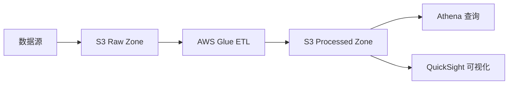
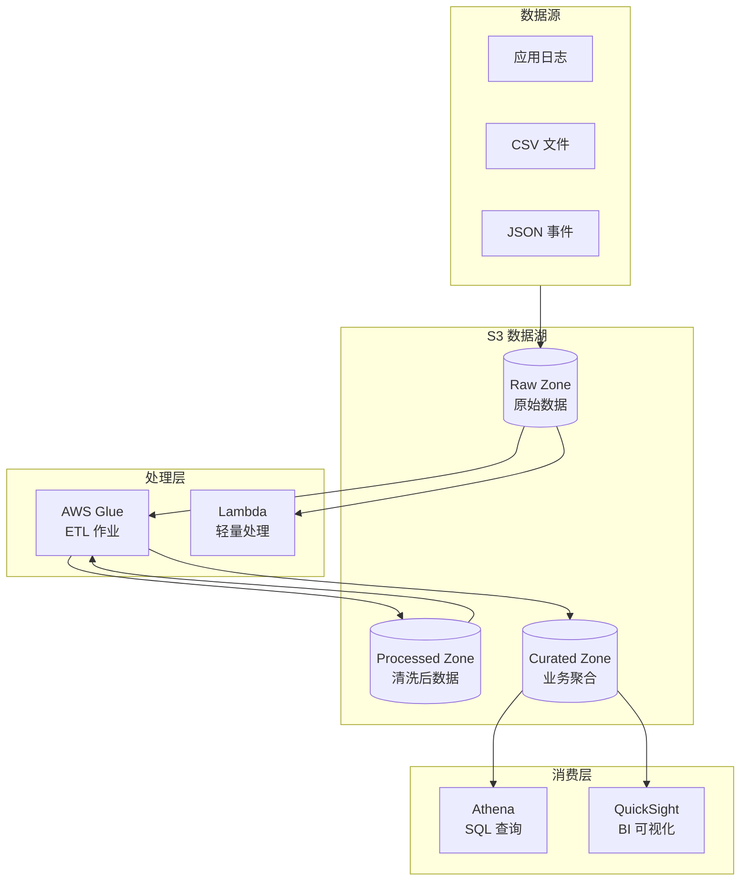

# 项目1: S3 数据湖构建

> 难度: ⭐ 入门 | 预计时间: 4-6 小时

---

## 项目概述

构建一个基于 S3 的数据湖基础架构, 实现数据的采集、存储、处理和分析。



---

## 学习目标

完成本项目后, 您将能够:

- 设计 S3 数据湖目录结构
- 配置 S3 生命周期策略
- 使用 AWS Glue 进行 ETL 处理
- 使用 Athena 进行交互式查询
- 实现数据的安全访问控制

---

## 架构图



---

## 实施步骤

### 步骤1: 环境准备

**创建 S3 Bucket 结构**:

```bash
# 创建主 Bucket
aws s3 mb s3://my-data-lake-123456 --region us-east-1

# 创建分区目录
aws s3api put-object --bucket my-data-lake-123456 --key raw/
aws s3api put-object --bucket my-data-lake-123456 --key processed/
aws s3api put-object --bucket my-data-lake-123456 --key curated/
```

**目录结构**:
```
my-data-lake-123456/
├── raw/
│   ├── logs/
│   │   └── year=2024/month=01/day=15/
│   ├── events/
│   │   └── year=2024/month=01/
│   └── csv/
├── processed/
│   ├── logs/
│   └── events/
└── curated/
    ├── daily_metrics/
    └── user_analytics/
```

### 步骤2: 上传样本数据

```bash
# 创建样本日志数据
cat > sample_logs.jsonl << 'EOF'
{"timestamp": "2024-01-15T10:00:00Z", "level": "INFO", "message": "User login", "user_id": "user123", "ip": "192.168.1.1"}
{"timestamp": "2024-01-15T10:01:00Z", "level": "ERROR", "message": "Database connection failed", "service": "api", "retry_count": 3}
{"timestamp": "2024-01-15T10:02:00Z", "level": "INFO", "message": "Order created", "order_id": "ORD-001", "amount": 99.99}
EOF

# 上传
aws s3 cp sample_logs.jsonl s3://my-data-lake-123456/raw/logs/year=2024/month=01/day=15/
```

### 步骤3: 配置生命周期策略

```json
{
    "Rules": [
        {
            "ID": "RawToIA",
            "Status": "Enabled",
            "Filter": {
                "Prefix": "raw/"
            },
            "Transitions": [
                {
                    "Days": 30,
                    "StorageClass": "STANDARD_IA"
                },
                {
                    "Days": 90,
                    "StorageClass": "GLACIER"
                }
            ]
        },
        {
            "ID": "ProcessedToIA",
            "Status": "Enabled",
            "Filter": {
                "Prefix": "processed/"
            },
            "Transitions": [
                {
                    "Days": 60,
                    "StorageClass": "STANDARD_IA"
                }
            ]
        }
    ]
}
```

```bash
aws s3api put-bucket-lifecycle-configuration \
    --bucket my-data-lake-123456 \
    --lifecycle-configuration file://lifecycle.json
```

### 步骤4: Glue ETL 作业

```python
# glue_etl_job.py
import sys
from awsglue.transforms import *
from awsglue.utils import getResolvedOptions
from pyspark.context import SparkContext
from awsglue.context import GlueContext
from awsglue.job import Job
from pyspark.sql.functions import col, year, month, dayofmonth, hour

args = getResolvedOptions(sys.argv, ['JOB_NAME'])
sc = SparkContext()
glueContext = GlueContext(sc)
spark = glueContext.spark_session
job = Job(glueContext)
job.init(args['JOB_NAME'], args)

# 读取原始数据
raw_df = spark.read.json("s3://my-data-lake-123456/raw/logs/")

# 数据清洗和转换
cleaned_df = raw_df \
    .filter(col("timestamp").isNotNull()) \
    .withColumn("year", year("timestamp")) \
    .withColumn("month", month("timestamp")) \
    .withColumn("day", dayofmonth("timestamp")) \
    .withColumn("hour", hour("timestamp"))

# 按日期分区写入处理区
cleaned_df.write \
    .partitionBy("year", "month", "day") \
    .mode("overwrite") \
    .parquet("s3://my-data-lake-123456/processed/logs/")

# 创建聚合数据
metrics_df = cleaned_df.groupBy("year", "month", "day", "level").count()
metrics_df.write \
    .partitionBy("year", "month") \
    .mode("overwrite") \
    .parquet("s3://my-data-lake-123456/curated/daily_metrics/")

job.commit()
```

### 步骤5: Athena 查询

```sql
-- 创建数据库
CREATE DATABASE IF NOT EXISTS data_lake;

-- 创建表 (Raw 数据)
CREATE EXTERNAL TABLE IF NOT EXISTS data_lake.raw_logs (
    timestamp string,
    level string,
    message string,
    user_id string,
    ip string,
    service string,
    retry_count int,
    order_id string,
    amount double
)
PARTITIONED BY (year int, month int, day int)
ROW FORMAT SERDE 'org.openx.data.jsonserde.JsonSerDe'
LOCATION 's3://my-data-lake-123456/raw/logs/';

-- 修复分区
MSCK REPAIR TABLE data_lake.raw_logs;

-- 查询示例
SELECT 
    date_format(from_iso8601_timestamp(timestamp), '%Y-%m-%d') as date,
    level,
    count(*) as count
FROM data_lake.raw_logs
WHERE year = 2024 AND month = 1
GROUP BY 1, 2
ORDER BY 1, 3 DESC;
```

---

## 清理资源

```bash
# 删除所有对象
aws s3 rm s3://my-data-lake-123456 --recursive

# 删除 Bucket
aws s3 rb s3://my-data-lake-123456

# 删除 Glue 作业 (在控制台或使用 CLI)
aws glue delete-job --job-name data-lake-etl
```

---

## 扩展挑战

1. **实时数据流**: 添加 Kinesis Firehose 实时摄入
2. **数据质量**: 使用 Deequ 进行数据验证
3. **数据血缘**: 集成 AWS Glue Data Catalog
4. **数据共享**: 使用 Lake Formation 跨账户共享

---

## 参考文档

- [S3 数据湖最佳实践](https://docs.aws.amazon.com/whitepapers/latest/building-data-lakes/data-lake-storage.html)
- [AWS Glue 开发者指南](https://docs.aws.amazon.com/glue/)
- [Athena 查询参考](https://docs.aws.amazon.com/athena/)
