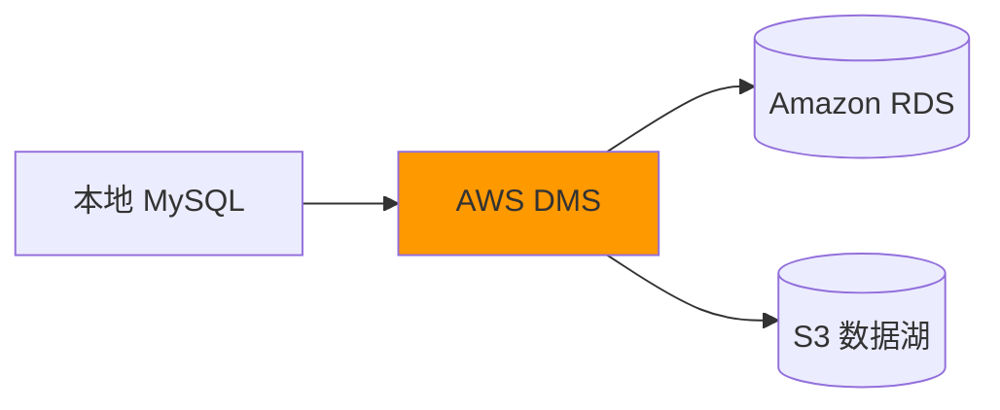
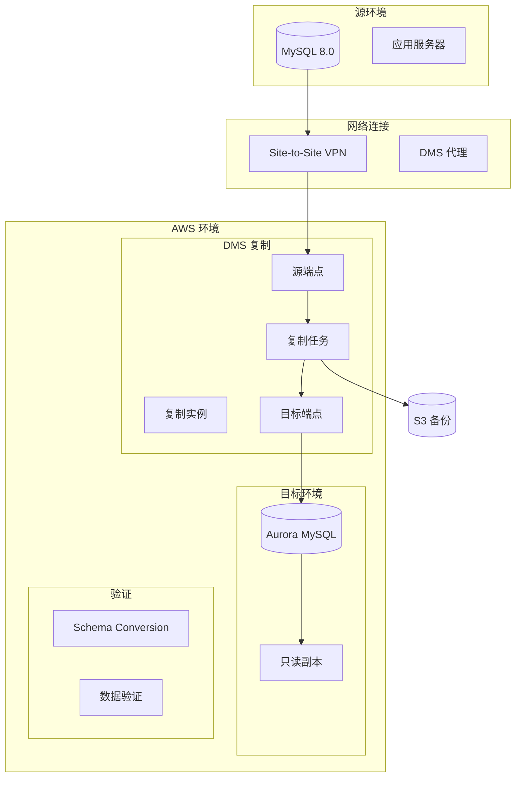

# 项目2: 数据库迁移实战

> 难度: ⭐⭐ 进阶 | 预计时间: 6-8 小时

---

## 项目概述

使用 AWS Database Migration Service (DMS) 将本地 MySQL 数据库迁移到 Amazon RDS, 并实现增量同步。



---

## 学习目标

完成本项目后, 您将能够:

- 评估数据库迁移可行性
- 使用 DMS 进行全量 + 增量迁移
- 配置异构数据库迁移
- 验证数据一致性
- 实施零停机迁移策略

---

## 架构图



---

## 实施步骤

### 步骤1: 源数据库准备

**创建模拟本地数据库** (在 EC2 上):

```bash
# 安装 MySQL
sudo yum install mysql-server -y
sudo systemctl start mysqld

# 创建测试数据库
mysql -u root -p << 'EOF'
CREATE DATABASE ecommerce;
USE ecommerce;

CREATE TABLE customers (
    customer_id INT PRIMARY KEY AUTO_INCREMENT,
    email VARCHAR(255) UNIQUE NOT NULL,
    name VARCHAR(100),
    created_at TIMESTAMP DEFAULT CURRENT_TIMESTAMP,
    updated_at TIMESTAMP DEFAULT CURRENT_TIMESTAMP ON UPDATE CURRENT_TIMESTAMP
);

CREATE TABLE orders (
    order_id INT PRIMARY KEY AUTO_INCREMENT,
    customer_id INT,
    total_amount DECIMAL(10,2),
    status ENUM('pending', 'shipped', 'delivered'),
    created_at TIMESTAMP DEFAULT CURRENT_TIMESTAMP,
    FOREIGN KEY (customer_id) REFERENCES customers(customer_id)
);

-- 插入测试数据
INSERT INTO customers (email, name) VALUES
('alice@example.com', 'Alice'),
('bob@example.com', 'Bob'),
('charlie@example.com', 'Charlie');

INSERT INTO orders (customer_id, total_amount, status) VALUES
(1, 99.99, 'delivered'),
(1, 49.99, 'shipped'),
(2, 199.99, 'pending');

-- 创建复制用户
CREATE USER 'dms_user'@'%' IDENTIFIED BY 'DmsPassword123!';
GRANT REPLICATION SLAVE, REPLICATION CLIENT ON *.* TO 'dms_user'@'%';
GRANT SELECT ON ecommerce.* TO 'dms_user'@'%';
FLUSH PRIVILEGES;
EOF

# 启用二进制日志 (my.cnf)
echo "
[mysqld]
log-bin=mysql-bin
binlog-format=ROW
server-id=1
expire_logs_days=7
" | sudo tee -a /etc/my.cnf

sudo systemctl restart mysqld
```

### 步骤2: 创建目标数据库

```bash
# 创建 RDS 实例
aws rds create-db-instance \
    --db-instance-identifier migration-target \
    --db-instance-class db.t3.medium \
    --engine mysql \
    --master-username admin \
    --master-user-password TargetPassword123! \
    --allocated-storage 100 \
    --storage-type gp3 \
    --vpc-security-group-ids sg-12345678 \
    --db-subnet-group-name my-db-subnet-group

# 等待实例可用
aws rds wait db-instance-available \
    --db-instance-identifier migration-target
```

### 步骤3: 配置 DMS

```bash
# 创建复制实例
aws dms create-replication-instance \
    --replication-instance-identifier migration-replicator \
    --replication-instance-class dms.c5.large \
    --allocated-storage 100 \
    --vpc-security-group-ids sg-12345678 \
    --replication-subnet-group-arn arn:aws:dms:us-east-1:123456789:subgrp:default

# 创建源端点
aws dms create-endpoint \
    --endpoint-identifier source-mysql \
    --endpoint-type source \
    --engine-name mysql \
    --server-name 192.168.1.100 \
    --port 3306 \
    --database-name ecommerce \
    --username dms_user \
    --password 'DmsPassword123!'

# 创建目标端点
aws dms create-endpoint \
    --endpoint-identifier target-rds \
    --endpoint-type target \
    --engine-name mysql \
    --server-name migration-target.abcxyz.us-east-1.rds.amazonaws.com \
    --port 3306 \
    --database-name ecommerce \
    --username admin \
    --password 'TargetPassword123!'

# 测试端点连接
aws dms test-connection \
    --replication-instance-arn arn:aws:dms:us-east-1:123456789:rep:migration-replicator \
    --endpoint-arn arn:aws:dms:us-east-1:123456789:endpoint:source-mysql
```

### 步骤4: 创建迁移任务

```bash
# 创建表映射 (JSON 文件)
cat > table-mappings.json << 'EOF'
{
    "rules": [
        {
            "rule-type": "selection",
            "rule-id": "1",
            "rule-name": "1",
            "object-locator": {
                "schema-name": "ecommerce",
                "table-name": "customers"
            },
            "rule-action": "include"
        },
        {
            "rule-type": "selection",
            "rule-id": "2",
            "rule-name": "2",
            "object-locator": {
                "schema-name": "ecommerce",
                "table-name": "orders"
            },
            "rule-action": "include"
        },
        {
            "rule-type": "transformation",
            "rule-id": "3",
            "rule-name": "3",
            "rule-action": "add-column",
            "rule-target": "column",
            "object-locator": {
                "schema-name": "ecommerce",
                "table-name": "%"
            },
            "value": "migrated_at",
            "data-type": {
                "type": "datetime",
                "date-time-format": "YYYY-MM-DD HH:MI:SS"
            },
            "expression": "$AR_M$"
        }
    ]
}
EOF

# 创建迁移任务 (全量 + CDC)
aws dms create-replication-task \
    --replication-task-identifier ecommerce-migration \
    --source-endpoint-arn arn:aws:dms:us-east-1:123456789:endpoint:source-mysql \
    --target-endpoint-arn arn:aws:dms:us-east-1:123456789:endpoint:target-rds \
    --replication-instance-arn arn:aws:dms:us-east-1:123456789:rep:migration-replicator \
    --migration-type full-load-and-cdc \
    --table-mappings file://table-mappings.json \
    --replication-task-settings '{
        "TargetMetadata": {
            "SupportLobs": true,
            "LobMaxSize": 32
        },
        "FullLoadSettings": {
            "TargetTablePrepMode": "DO_NOTHING",
            "CreatePkAfterFullLoad": false
        },
        "Logging": {
            "EnableLogging": true
        },
        "Validation": {
            "EnableValidation": true,
            "ValidationMode": "ROW_LEVEL"
        }
    }'

# 启动任务
aws dms start-replication-task \
    --replication-task-arn arn:aws:dms:us-east-1:123456789:task:ecommerce-migration \
    --start-replication-task-type start-replication
```

### 步骤5: 验证数据一致性

```python
# data_validation.py
import pymysql
import pandas as pd

def compare_databases(source_config, target_config, tables):
    """比较源和目标数据库的数据"""
    
    source_conn = pymysql.connect(**source_config)
    target_conn = pymysql.connect(**target_config)
    
    results = {}
    
    for table in tables:
        # 行数比较
        source_count = pd.read_sql(f"SELECT COUNT(*) as cnt FROM {table}", source_conn).iloc[0]['cnt']
        target_count = pd.read_sql(f"SELECT COUNT(*) as cnt FROM {table}", target_conn).iloc[0]['cnt']
        
        # 校验和比较
        source_checksum = pd.read_sql(f"CHECKSUM TABLE {table}", source_conn).iloc[0]['Checksum']
        target_checksum = pd.read_sql(f"CHECKSUM TABLE {table}", target_conn).iloc[0]['Checksum']
        
        results[table] = {
            'source_rows': source_count,
            'target_rows': target_count,
            'row_match': source_count == target_count,
            'checksum_match': source_checksum == target_checksum
        }
    
    source_conn.close()
    target_conn.close()
    
    return results

# 配置
source_config = {
    'host': '192.168.1.100',
    'user': 'dms_user',
    'password': 'DmsPassword123!',
    'database': 'ecommerce',
    'port': 3306
}

target_config = {
    'host': 'migration-target.abcxyz.us-east-1.rds.amazonaws.com',
    'user': 'admin',
    'password': 'TargetPassword123!',
    'database': 'ecommerce',
    'port': 3306
}

results = compare_databases(source_config, target_config, ['customers', 'orders'])
print(pd.DataFrame(results).T)
```

### 步骤6: 切换流量 (蓝绿部署)

```python
# cutover_script.py
import boto3
import time

def safe_cutover():
    """安全的流量切换流程"""
    
    # 1. 验证同步延迟
    dms = boto3.client('dms')
    
    task = dms.describe_replication_tasks(
        Filters=[{'Name': 'replication-task-arn', 'Values': ['arn:aws:dms:us-east-1:123456789:task:ecommerce-migration']}]
    )['ReplicationTasks'][0]
    
    if task['ReplicationLag'] > 5:  # 5秒延迟
        raise Exception(f"复制延迟过高: {task['ReplicationLag']}秒")
    
    # 2. 暂停源数据库写入 (维护窗口)
    print("进入维护窗口, 暂停源数据库写入...")
    
    # 3. 等待最终同步
    time.sleep(10)
    
    # 4. 停止 DMS 任务
    dms.stop_replication_task(
        ReplicationTaskArn='arn:aws:dms:us-east-1:123456789:task:ecommerce-migration'
    )
    
    # 5. 最终验证
    print("执行最终数据验证...")
    
    # 6. 切换应用连接到 RDS
    print("切换应用连接到 RDS...")
    
    # 7. 监控新环境
    print("监控 RDS 性能...")
    
    print("切换完成!")

if __name__ == '__main__':
    safe_cutover()
```

---

## 清理资源

```bash
# 停止并删除 DMS 任务
aws dms stop-replication-task \
    --replication-task-arn arn:aws:dms:us-east-1:123456789:task:ecommerce-migration

aws dms delete-replication-task \
    --replication-task-arn arn:aws:dms:us-east-1:123456789:task:ecommerce-migration

# 删除端点
aws dms delete-endpoint \
    --endpoint-arn arn:aws:dms:us-east-1:123456789:endpoint:source-mysql

aws dms delete-endpoint \
    --endpoint-arn arn:aws:dms:us-east-1:123456789:endpoint:target-rds

# 删除复制实例
aws dms delete-replication-instance \
    --replication-instance-arn arn:aws:dms:us-east-1:123456789:rep:migration-replicator

# 删除 RDS 实例
aws rds delete-db-instance \
    --db-instance-identifier migration-target \
    --skip-final-snapshot
```

---

## 扩展挑战

1. **异构迁移**: 将 MySQL 迁移到 Aurora PostgreSQL
2. **不停机迁移**: 使用双写模式实现零停机
3. **数据校验**: 实现行级校验和验证
4. **回滚计划**: 设计快速回滚机制

---

## 参考文档

- [AWS DMS 文档](https://docs.aws.amazon.com/dms/)
- [DMS 最佳实践](https://docs.aws.amazon.com/dms/latest/userguide/CHAP_BestPractices.html)
- [Schema Conversion Tool](https://docs.aws.amazon.com/SchemaConversionTool/)
