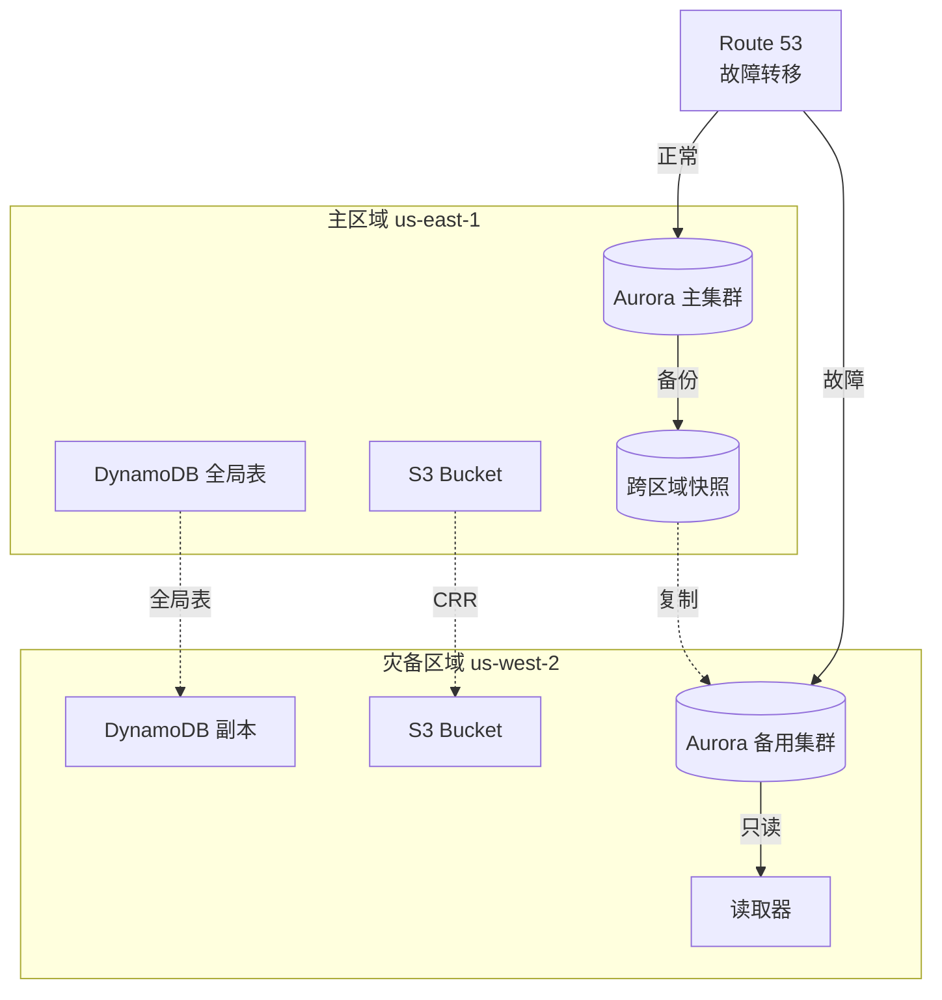
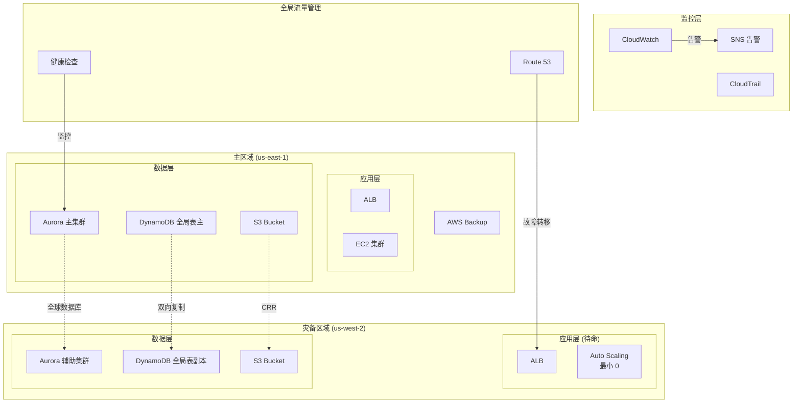

# 项目3: 跨区域备份与灾难恢复

> 难度: ⭐⭐⭐ 高级 | 预计时间: 8-10 小时

---

## 项目概述

构建完整的跨区域灾难恢复方案, 实现 RPO < 5分钟, RTO < 30分钟 的恢复目标。



---

## 学习目标

完成本项目后, 您将能够:

- 设计多区域灾难恢复架构
- 配置 Aurora 全球数据库
- 实施 DynamoDB 全局表
- 自动化故障转移流程
- 执行灾难恢复演练

---

## 架构图



---

## 实施步骤

### 步骤1: 主区域部署

**创建 Aurora 集群**:

```bash
# 主区域 (us-east-1)
export AWS_DEFAULT_REGION=us-east-1

# 创建 Aurora 集群
aws rds create-db-cluster \
    --db-cluster-identifier production-cluster \
    --engine aurora-mysql \
    --engine-version 8.0.mysql_aurora.3.04.0 \
    --master-username admin \
    --master-user-password SecurePassword123! \
    --db-subnet-group-name production-subnet-group \
    --vpc-security-group-ids sg-12345678 \
    --backup-retention-period 35 \
    --preferred-backup-window 03:00-04:00 \
    --enable-http-endpoint \
    --deletion-protection

# 创建写入器实例
aws rds create-db-instance \
    --db-instance-identifier production-writer \
    --db-cluster-identifier production-cluster \
    --engine aurora-mysql \
    --db-instance-class db.r6g.large \
    --auto-minor-version-upgrade

# 创建读取器实例
aws rds create-db-instance \
    --db-instance-identifier production-reader \
    --db-cluster-identifier production-cluster \
    --engine aurora-mysql \
    --db-instance-class db.r6g.large
```

**创建 DynamoDB 全局表**:

```bash
# 创建表
aws dynamodb create-table \
    --table-name GlobalUsers \
    --attribute-definitions AttributeName=UserId,AttributeType=S \
    --key-schema AttributeName=UserId,KeyType=HASH \
    --billing-mode PAY_PER_REQUEST \
    --stream-specification StreamEnabled=true,StreamViewType=NEW_AND_OLD_IMAGES

# 等待表创建完成
aws dynamodb wait table-exists --table-name GlobalUsers
```

**配置 S3 跨区域复制**:

```json
{
    "Rules": [
        {
            "ID": "CrossRegionReplication",
            "Status": "Enabled",
            "Priority": 1,
            "DeleteMarkerReplication": {
                "Status": "Enabled"
            },
            "Filter": {
                "Prefix": ""
            },
            "Destination": {
                "Bucket": "arn:aws:s3:::dr-data-bucket-us-west-2",
                "StorageClass": "STANDARD",
                "ReplicationTime": {
                    "Status": "Enabled",
                    "Time": {
                        "Minutes": 15
                    }
                },
                "Metrics": {
                    "Status": "Enabled",
                    "Minutes": 15
                }
            },
            "SourceSelectionCriteria": {
                "SseKmsEncryptedObjects": {
                    "Status": "Enabled"
                },
                "ReplicaModifications": {
                    "Status": "Enabled"
                }
            }
        }
    ]
}
```

### 步骤2: 配置全球数据库

```bash
# 创建全局集群
aws rds create-global-cluster \
    --global-cluster-identifier production-global-db \
    --source-db-cluster-identifier arn:aws:rds:us-east-1:123456789:cluster:production-cluster \
    --engine aurora-mysql

# 在灾备区域创建辅助集群
export AWS_DEFAULT_REGION=us-west-2

aws rds create-db-cluster \
    --db-cluster-identifier dr-cluster \
    --engine aurora-mysql \
    --global-cluster-identifier production-global-db \
    --db-subnet-group-name dr-subnet-group \
    --vpc-security-group-ids sg-87654321

# 在灾备区域创建实例 (最小配置, 可读取)
aws rds create-db-instance \
    --db-instance-identifier dr-reader \
    --db-cluster-identifier dr-cluster \
    --engine aurora-mysql \
    --db-instance-class db.r6g.large
```

### 步骤3: 扩展 DynamoDB 到多个区域

```python
# 添加区域到 DynamoDB 全局表
import boto3

# 主区域客户端
dynamodb_east = boto3.client('dynamodb', region_name='us-east-1')
dynamodb_west = boto3.client('dynamodb', region_name='us-west-2')

# 在 us-west-2 创建副本表
dynamodb_west.create_table(
    TableName='GlobalUsers',
    AttributeDefinitions=[
        {'AttributeName': 'UserId', 'AttributeType': 'S'}
    ],
    KeySchema=[
        {'AttributeName': 'UserId', 'KeyType': 'HASH'}
    ],
    BillingMode='PAY_PER_REQUEST'
)

# 添加为全局表副本 (需要在主区域执行)
dynamodb_east.update_table(
    TableName='GlobalUsers',
    ReplicaUpdates=[
        {
            'Create': {
                'RegionName': 'us-west-2',
                'KMSMasterKeyId': 'alias/aws/dynamodb'
            }
        }
    ]
)

print("DynamoDB 全局表配置完成!")
```

### 步骤4: Route 53 故障转移配置

```yaml
# CloudFormation: Route 53 健康检查和故障转移
Resources:
  # 主区域健康检查
  PrimaryHealthCheck:
    Type: AWS::Route53::HealthCheck
    Properties:
      HealthCheckConfig:
        Type: HTTPS
        ResourcePath: /health
        FullyQualifiedDomainName: !GetAtt PrimaryALB.DNSName
        Port: 443
        RequestInterval: 30
        FailureThreshold: 3
        
  # 主区域 DNS 记录 (故障转移主)
  PrimaryRecord:
    Type: AWS::Route53::RecordSet
    Properties:
      HostedZoneId: !Ref HostedZone
      Name: api.example.com
      Type: A
      SetIdentifier: Primary
      Failover: PRIMARY
      HealthCheckId: !Ref PrimaryHealthCheck
      AliasTarget:
        DNSName: !GetAtt PrimaryALB.DNSName
        HostedZoneId: !GetAtt PrimaryALB.CanonicalHostedZoneID
        
  # 灾备区域 DNS 记录 (故障转移备)
  SecondaryRecord:
    Type: AWS::Route53::RecordSet
    Properties:
      HostedZoneId: !Ref HostedZone
      Name: api.example.com
      Type: A
      SetIdentifier: Secondary
      Failover: SECONDARY
      AliasTarget:
        DNSName: !GetAtt DRALB.DNSName
        HostedZoneId: !GetAtt DRALB.CanonicalHostedZoneID
```

### 步骤5: 自动化故障转移脚本

```python
#!/usr/bin/env python3
"""
自动故障转移脚本
用于在主区域发生故障时自动切换到灾备区域
"""

import boto3
import sys
import time

class DRFailoverManager:
    def __init__(self):
        self.rds_east = boto3.client('rds', region_name='us-east-1')
        self.rds_west = boto3.client('rds', region_name='us-west-2')
        self.route53 = boto3.client('route53')
        self.autoscaling = boto3.client('autoscaling', region_name='us-west-2')
        
    def check_primary_health(self):
        """检查主区域健康状况"""
        try:
            response = self.rds_east.describe_db_clusters(
                DBClusterIdentifier='production-cluster'
            )
            cluster = response['DBClusters'][0]
            
            # 检查集群状态
            if cluster['Status'] != 'available':
                return False, f"集群状态异常: {cluster['Status']}"
            
            # 检查写入器状态
            writer = [i for i in cluster['DBClusterMembers'] if i['IsClusterWriter']][0]
            if writer['DBInstanceIdentifier']:
                instance = self.rds_east.describe_db_instances(
                    DBInstanceIdentifier=writer['DBInstanceIdentifier']
                )['DBInstances'][0]
                if instance['DBInstanceStatus'] != 'available':
                    return False, f"写入器状态异常: {instance['DBInstanceStatus']}"
            
            return True, "主区域健康"
            
        except Exception as e:
            return False, f"检查失败: {str(e)}"
    
    def failover_aurora(self):
        """执行 Aurora 故障转移"""
        print("执行 Aurora 故障转移到 us-west-2...")
        
        # 从灾备区域移除辅助集群
        self.rds_west.failover_global_cluster(
            GlobalClusterIdentifier='production-global-db',
            TargetDbClusterIdentifier='dr-cluster'
        )
        
        # 等待提升完成
        print("等待集群提升为主集群...")
        waiter = self.rds_west.get_waiter('db_cluster_available')
        waiter.wait(DBClusterIdentifier='dr-cluster')
        
        print("Aurora 故障转移完成!")
        return True
    
    def scale_up_dr_app(self):
        """扩展灾备区域应用层"""
        print("扩展灾备区域应用服务器...")
        
        self.autoscaling.update_auto_scaling_group(
            AutoScalingGroupName='dr-asg',
            MinSize=2,
            DesiredCapacity=4,
            MaxSize=10
        )
        
        # 等待实例启动
        print("等待应用服务器启动...")
        time.sleep(60)
        
        print("应用层扩展完成!")
        return True
    
    def update_route53(self):
        """更新 Route 53 指向灾备区域"""
        print("更新 DNS 指向灾备区域...")
        
        # 这里假设我们已经配置了故障转移路由
        # 实际上 Route 53 会自动根据健康检查切换
        # 但我们可以更新其他 DNS 记录或加速切换
        
        print("DNS 更新完成!")
        return True
    
    def execute_failover(self):
        """执行完整故障转移流程"""
        print("=" * 60)
        print("开始执行故障转移流程")
        print("=" * 60)
        
        # 1. 验证灾备区域就绪
        print("\n1. 验证灾备区域就绪...")
        
        # 2. 提升 Aurora 辅助集群
        print("\n2. 提升 Aurora 辅助集群为主集群...")
        self.failover_aurora()
        
        # 3. 扩展应用层
        print("\n3. 扩展灾备区域应用层...")
        self.scale_up_dr_app()
        
        # 4. 更新 DNS
        print("\n4. 更新 DNS 配置...")
        self.update_route53()
        
        # 5. 验证服务
        print("\n5. 验证服务可用性...")
        
        print("\n" + "=" * 60)
        print("故障转移完成!")
        print("=" * 60)
    
    def execute_failback(self):
        """执行故障恢复 (切回主区域)"""
        print("=" * 60)
        print("开始执行故障恢复流程")
        print("=" * 60)
        
        # 1. 修复主区域问题
        print("\n1. 确保主区域问题已修复...")
        
        # 2. 重建全局数据库关系
        print("\n2. 重建 Aurora 全球数据库...")
        
        # 3. 同步数据
        print("\n3. 等待数据同步...")
        
        # 4. 切回主区域
        print("\n4. 切回主区域...")
        
        print("\n故障恢复完成!")

def main():
    if len(sys.argv) < 2:
        print("用法: python dr_failover.py [failover|failback|status]")
        sys.exit(1)
    
    command = sys.argv[1]
    manager = DRFailoverManager()
    
    if command == 'failover':
        # 确认
        confirm = input("确定要执行故障转移吗? 这将中断服务. (yes/no): ")
        if confirm.lower() != 'yes':
            print("取消操作")
            return
        manager.execute_failover()
        
    elif command == 'failback':
        confirm = input("确定要执行故障恢复吗? (yes/no): ")
        if confirm.lower() != 'yes':
            print("取消操作")
            return
        manager.execute_failback()
        
    elif command == 'status':
        healthy, message = manager.check_primary_health()
        print(f"主区域状态: {'健康' if healthy else '异常'}")
        print(f"详细信息: {message}")
        
    else:
        print(f"未知命令: {command}")
        print("用法: python dr_failover.py [failover|failback|status]")

if __name__ == '__main__':
    main()
```

### 步骤6: AWS Backup 集中备份

```python
import boto3

backup = boto3.client('backup')

# 创建备份计划
backup_plan = backup.create_backup_plan(
    BackupPlan={
        'BackupPlanName': 'multi-region-backup-plan',
        'Rules': [
            {
                'RuleName': 'daily-backup-copy-to-dr',
                'TargetBackupVaultName': 'Default',
                'ScheduleExpression': 'cron(0 5 ? * * *)',
                'StartWindowMinutes': 60,
                'CompletionWindowMinutes': 180,
                'Lifecycle': {
                    'DeleteAfterDays': 35
                },
                'CopyActions': [
                    {
                        'DestinationBackupVaultArn': 'arn:aws:backup:us-west-2:123456789:backup-vault:Default',
                        'Lifecycle': {
                            'DeleteAfterDays': 35
                        }
                    }
                ]
            }
        ]
    }
)

# 创建资源分配
selection = backup.create_backup_selection(
    BackupPlanId=backup_plan['BackupPlanId'],
    BackupSelection={
        'SelectionName': 'production-resources',
        'IamRoleArn': 'arn:aws:iam::123456789:role/AWSBackupRole',
        'Resources': [
            'arn:aws:rds:us-east-1:123456789:cluster:production-cluster',
            'arn:aws:dynamodb:us-east-1:123456789:table/GlobalUsers'
        ]
    }
)

print("AWS Backup 配置完成!")
```

---

## 灾难恢复演练

### 演练计划

```markdown
## DR 演练检查清单

### 演练前准备
- [ ] 通知相关团队
- [ ] 选择低峰时段
- [ ] 准备回滚计划
- [ ] 确认监控告警正常

### 演练执行
- [ ] 模拟主区域故障
- [ ] 执行故障转移脚本
- [ ] 验证应用可用性
- [ ] 验证数据一致性
- [ ] 测试业务功能

### 演练后恢复
- [ ] 执行故障恢复
- [ ] 验证主区域功能
- [ ] 更新演练文档
- [ ] 总结改进点
```

### 混沌工程测试

```python
# 使用 AWS Fault Injection Simulator 进行混沌测试
import boto3

fis = boto3.client('fis')

# 创建实验模板
experiment = fis.create_experiment_template(
    description='Test Aurora failover',
    roleArn='arn:aws:iam::123456789:role/FISRole',
    stopConditions=[
        {
            'source': 'none'
        }
    ],
    targets={
        'DBClusters': {
            'resourceType': 'aws:rds:cluster',
            'selectionMode': 'ALL',
            'parameters': {
                'clusterIdentifier': 'production-cluster'
            }
        }
    },
    actions={
        'FailoverDBCluster': {
            'actionId': 'aws:rds:failover-db-cluster',
            'targets': {
                'Clusters': 'DBClusters'
            }
        }
    },
    logConfiguration={
        'logSchemaVersion': 1,
        'cloudWatchLogsConfiguration': {
            'logGroupArn': 'arn:aws:logs:us-east-1:123456789:log-group:/aws/fis'
        }
    }
)

# 启动实验
fis.start_experiment(
    experimentTemplateId=experiment['experimentTemplate']['id']
)
```

---

## 监控与告警

### CloudWatch Dashboard

```python
import boto3

cloudwatch = boto3.client('cloudwatch')

dashboard_body = {
    "widgets": [
        {
            "type": "metric",
            "properties": {
                "title": "Aurora Global Database Lag",
                "metrics": [
                    ["AWS/RDS", "AuroraGlobalDBReplicationLag", "DBClusterIdentifier", "production-cluster"]
                ],
                "period": 60,
                "stat": "Average",
                "region": "us-east-1",
                "annotations": {
                    "horizontal": [
                        {
                            "value": 5,
                            "label": "RPO Target",
                            "color": "#ff0000"
                        }
                    ]
                }
            }
        },
        {
            "type": "metric",
            "properties": {
                "title": "DynamoDB Replication Lag",
                "metrics": [
                    ["AWS/DynamoDB", "ReplicationLatency", "TableName", "GlobalUsers", "ReceivingRegion", "us-west-2"]
                ],
                "period": 60,
                "stat": "Average",
                "region": "us-east-1"
            }
        }
    ]
}

cloudwatch.put_dashboard(
    DashboardName='DR-Monitoring',
    DashboardBody=json.dumps(dashboard_body)
)
```

---

## 清理资源

```bash
# 删除 Route 53 记录
# 在控制台或使用 CLI 删除

# 删除 Aurora 全球数据库
aws rds delete-db-instance --db-instance-identifier production-writer --skip-final-snapshot
aws rds delete-db-instance --db-instance-identifier production-reader --skip-final-snapshot
aws rds delete-db-cluster --db-cluster-identifier production-cluster --skip-final-snapshot

aws rds delete-db-instance --db-instance-identifier dr-reader --region us-west-2 --skip-final-snapshot
aws rds delete-db-cluster --db-cluster-identifier dr-cluster --region us-west-2 --skip-final-snapshot

aws rds delete-global-cluster --global-cluster-identifier production-global-db

# 删除 DynamoDB 全局表
aws dynamodb delete-table --table-name GlobalUsers
aws dynamodb delete-table --table-name GlobalUsers --region us-west-2
```

---

## 参考文档

- [Aurora 全球数据库](https://docs.aws.amazon.com/AmazonRDS/latest/AuroraUserGuide/aurora-global-database.html)
- [DynamoDB 全局表](https://docs.aws.amazon.com/amazondynamodb/latest/developerguide/GlobalTables.html)
- [AWS 灾难恢复白皮书](https://docs.aws.amazon.com/whitepapers/latest/disaster-recovery-workloads-on-aws/disaster-recovery-workloads-on-aws.html)
