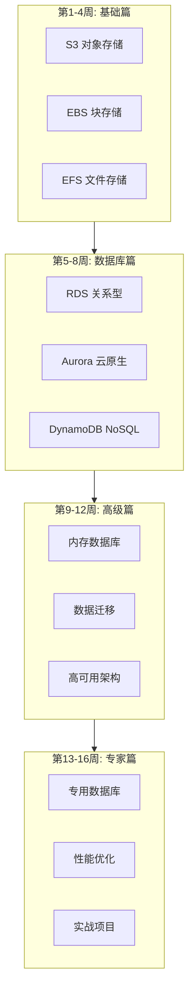
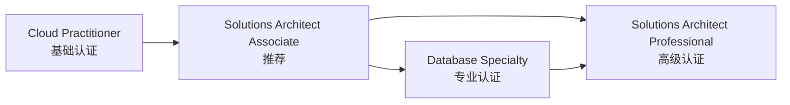

# AWS 存储与数据库 16周学习路线图

> 从零基础到专家级的完整学习路径

---

## 🗺️ 学习路线图概览



---

## 📅 详细学习计划

### 第1周: S3 基础

**学习目标**: 掌握对象存储核心概念

| 天数 | 主题 | 实践任务 |
|------|------|----------|
| 第1天 | S3 概述与核心概念 | 创建第一个 Bucket |
| 第2天 | Bucket 与对象操作 | 使用 CLI 上传/下载文件 |
| 第3天 | 存储类别 | 配置生命周期规则 |
| 第4天 | 安全基础 | 配置 Bucket Policy |
| 第5天 | 版本控制 | 启用版本控制并测试 |
| 第6天 | 事件通知 | 配置 S3 → Lambda 触发 |
| 第7天 | 周复习 | 完成小测验 |

**推荐资源**:
- 白皮书第2章
- AWS 官方文档: S3 Getting Started
- 实践: 搭建静态网站托管

---

### 第2周: S3 高级特性

**学习目标**: 掌握企业级 S3 配置

| 天数 | 主题 | 实践任务 |
|------|------|----------|
| 第1天 | 跨区域复制 (CRR) | 配置 CRR |
| 第2天 | S3 Select & Glacier | 使用 S3 Select 查询 |
| 第3天 | 数据传输加速 | 配置 Transfer Acceleration |
| 第4天 | S3 与 CloudFront | 配置 CDN 加速 |
| 第5天 | S3 Object Lambda | 数据处理链 |
| 第6天 | 成本优化 | 分析存储成本 |
| 第7天 | 周复习 | 完成项目1准备 |

**实践项目**: 数据湖基础组件搭建

---

### 第3周: EBS 与块存储

**学习目标**: 理解块存储与 EC2 集成

| 天数 | 主题 | 实践任务 |
|------|------|----------|
| 第1天 | EBS 概述与卷类型 | 创建不同类型卷 |
| 第2天 | 卷的生命周期 | 附加/分离/删除卷 |
| 第3天 | EBS 快照 | 创建和管理快照 |
| 第4天 | 性能优化 | gp3 与 io2 对比 |
| 第5天 | RAID 配置 | 配置 RAID 0/1 |
| 第6天 | EBS 加密 | 加密卷操作 |
| 第7天 | 周复习 | 性能测试 |

---

### 第4周: EFS 与文件存储

**学习目标**: 掌握托管文件系统

| 天数 | 主题 | 实践任务 |
|------|------|----------|
| 第1天 | EFS 架构 | 创建 EFS 文件系统 |
| 第2天 | 挂载与访问 | 多 EC2 挂载测试 |
| 第3天 | 存储类别 | IA 与 Archive |
| 第4天 | FSx 介绍 | FSx for Windows |
| 第5天 | FSx Lustre | HPC 场景 |
| 第6天 | 混合云存储 | Storage Gateway |
| 第7天 | 周复习 | 完成阶段1评估 |

**阶段1里程碑**: 能够设计企业级存储架构

---

### 第5周: RDS 基础

**学习目标**: 掌握托管关系型数据库

| 天数 | 主题 | 实践任务 |
|------|------|----------|
| 第1天 | RDS 概述 | 创建 MySQL 实例 |
| 第2天 | 数据库引擎对比 | PostgreSQL vs MySQL |
| 第3天 | 连接与认证 | 配置安全组 |
| 第4天 | 参数组 | 自定义数据库参数 |
| 第5天 | 备份与恢复 | 自动备份配置 |
| 第6天 | 监控基础 | CloudWatch 指标 |
| 第7天 | 周复习 | 数据库基准测试 |

---

### 第6周: RDS 高可用

**学习目标**: 构建高可用数据库架构

| 天数 | 主题 | 实践任务 |
|------|------|----------|
| 第1天 | Multi-AZ | 配置多可用区 |
| 第2天 | 只读副本 | 创建跨区域副本 |
| 第3天 | 故障转移 | 模拟故障转移 |
| 第4天 | RDS Proxy | 连接池配置 |
| 第5天 | 性能洞察 | Performance Insights |
| 第6天 | 日志管理 | 慢查询分析 |
| 第7天 | 周复习 | 高可用测试 |

---

### 第7周: Aurora 深入

**学习目标**: 掌握云原生数据库

| 天数 | 主题 | 实践任务 |
|------|------|----------|
| 第1天 | Aurora 架构 | Aurora MySQL 集群 |
| 第2天 | 读写分离 | 读取器端点 |
| 第3天 | Aurora Serverless v2 | 自动扩缩容 |
| 第4天 | 全局数据库 | 跨区域复制 |
| 第5天 | 克隆与回溯 | 快速克隆数据库 |
| 第6天 | Babelfish | SQL Server 兼容 |
| 第7天 | 周复习 | Aurora vs RDS 对比 |

---

### 第8周: DynamoDB 基础

**学习目标**: 掌握 NoSQL 数据库

| 天数 | 主题 | 实践任务 |
|------|------|----------|
| 第1天 | DynamoDB 概述 | 创建第一个表 |
| 第2天 | 数据模型 | 主键设计 |
| 第3天 | CRUD 操作 | API/SDK 使用 |
| 第4天 | 查询 vs 扫描 | 查询优化 |
| 第5天 | 索引设计 | GSI 与 LSI |
| 第6天 | 单表设计 | 关系建模 |
| 第7天 | 周复习 | 完成项目2准备 |

**阶段2里程碑**: 能够选择合适的数据库服务

---

### 第9周: DynamoDB 高级

**学习目标**: 掌握大规模 DynamoDB 应用

| 天数 | 主题 | 实践任务 |
|------|------|----------|
| 第1天 | 容量模式 | On-Demand vs Provisioned |
| 第2天 | 自动扩展 | 配置扩展策略 |
| 第3天 | DAX | 缓存加速 |
| 第4天 | Streams | 流处理 |
| 第5天 | 全局表 | 多区域复制 |
| 第6天 | 事务 | Transact API |
| 第7天 | 周复习 | 性能测试 |

---

### 第10周: ElastiCache

**学习目标**: 掌握内存数据库

| 天数 | 主题 | 实践任务 |
|------|------|----------|
| 第1天 | Redis vs Memcached | 选择指南 |
| 第2天 | Redis 集群 | 创建集群 |
| 第3天 | 缓存模式 | Cache-Aside/Write-Through |
| 第4天 | 数据类型 | String/Hash/List/Set |
| 第5天 | 持久化 | RDB vs AOF |
| 第6天 | 会话存储 | Web 会话缓存 |
| 第7天 | 周复习 | 缓存策略测试 |

---

### 第11周: 数据迁移

**学习目标**: 掌握数据迁移工具

| 天数 | 主题 | 实践任务 |
|------|------|----------|
| 第1天 | DMS 概述 | 创建复制实例 |
| 第2天 | 同构迁移 | MySQL → RDS |
| 第3天 | 异构迁移 | Oracle → PostgreSQL |
| 第4天 | 持续复制 | CDC 配置 |
| 第5天 | SCT 工具 | 模式转换 |
| 第6天 | 数据验证 | 一致性检查 |
| 第7天 | 周复习 | 完整迁移演练 |

---

### 第12周: 高可用架构

**学习目标**: 设计容灾架构

| 天数 | 主题 | 实践任务 |
|------|------|----------|
| 第1天 | 备份策略 | 3-2-1 原则 |
| 第2天 | AWS Backup | 集中备份 |
| 第3天 | 跨区域架构 | Pilot Light |
| 第4天 | 灾难恢复 | RTO/RPO 设计 |
| 第5天 | 故障演练 | 混沌工程 |
| 第6天 | 监控告警 | 健康检查 |
| 第7天 | 周复习 | 完成阶段3评估 |

**阶段3里程碑**: 能够设计容灾架构

---

### 第13周: 专用数据库

**学习目标**: 了解专用数据库场景

| 天数 | 主题 | 实践任务 |
|------|------|----------|
| 第1天 | DocumentDB | MongoDB 迁移 |
| 第2天 | Neptune | 图数据库入门 |
| 第3天 | Keyspaces | Cassandra 兼容 |
| 第4天 | Timestream | 时序数据 |
| 第5天 | QLDB | 账本数据库 |
| 第6天 | 数据库选型 | 决策框架 |
| 第7天 | 周复习 | 技术对比 |

---

### 第14周: 性能优化

**学习目标**: 掌握性能调优技巧

| 天数 | 主题 | 实践任务 |
|------|------|----------|
| 第1天 | RDS 优化 | 查询优化 |
| 第2天 | DynamoDB 优化 | 热分区解决 |
| 第3天 | S3 优化 | 多部分上传 |
| 第4天 | 缓存优化 | 命中率分析 |
| 第5天 | 索引优化 | 执行计划分析 |
| 第6天 | 成本优化 | 资源右缩放 |
| 第7天 | 周复习 | 性能基准测试 |

---

### 第15周: 安全与合规

**学习目标**: 掌握数据安全

| 天数 | 主题 | 实践任务 |
|------|------|----------|
| 第1天 | 加密策略 | KMS 配置 |
| 第2天 | 访问控制 | IAM + VPC |
| 第3天 | 审计日志 | CloudTrail |
| 第4天 | 合规认证 | PCI DSS/HIPAA |
| 第5天 | 数据脱敏 | Macie |
| 第6天 | 漏洞扫描 | 安全配置检查 |
| 第7天 | 周复习 | 安全评估 |

---

### 第16周: 综合实战

**学习目标**: 完成端到端项目

| 天数 | 主题 | 实践任务 |
|------|------|----------|
| 第1天 | 项目规划 | 架构设计 |
| 第2天 | 存储层 | S3 + EFS |
| 第3天 | 数据库层 | Aurora + DynamoDB |
| 第4天 | 缓存层 | ElastiCache |
| 第5天 | 迁移实施 | DMS 数据迁移 |
| 第6天 | 监控运维 | 完整监控体系 |
| 第7天 | 项目总结 | 成果展示 |

**阶段4里程碑**: 获得完整的数据架构设计能力

---

## 🎯 技能认证路径



**推荐认证**:

| 认证 | 难度 | 准备时间 | 前置要求 |
|------|------|----------|----------|
| AWS Cloud Practitioner | ⭐ | 2-4周 | 无 |
| AWS Solutions Architect Associate | ⭐⭐ | 6-8周 | 建议有实践经验 |
| AWS Database Specialty | ⭐⭐⭐ | 8-12周 | SAA + 数据库经验 |
| AWS Solutions Architect Professional | ⭐⭐⭐⭐ | 12-16周 | SAA + 2年经验 |

---

## 📚 学习资源

### 官方资源

- [AWS 官方文档](https://docs.aws.amazon.com/)
- [AWS 白皮书](https://aws.amazon.com/whitepapers/)
- [AWS 培训中心](https://www.aws.training/)
- [AWS 免费套餐](https://aws.amazon.com/free/)

### 推荐书籍

- 《Amazon Web Services in Action》
- 《AWS Certified Solutions Architect Official Study Guide》
- 《Designing Data-Intensive Applications》(Martin Kleppmann)

### 在线课程

- AWS 官方培训 (免费)
- A Cloud Guru
- Linux Academy
- Coursera AWS 专项课程

---

## ✅ 每周检查清单

### 每日任务
- [ ] 阅读当日主题文档
- [ ] 完成实践练习
- [ ] 记录学习笔记
- [ ] 解决遇到的问题

### 每周任务
- [ ] 完成周复习
- [ ] 通过知识测验
- [ ] 更新学习进度
- [ ] 规划下周学习

### 阶段任务
- [ ] 完成里程碑项目
- [ ] 参加社区讨论
- [ ] 分享学习心得
- [ ] 更新技能清单

---

## 📊 进度追踪模板

```markdown
## 我的学习进度

### 第 _ 周: ___

**完成情况**: _ / 7 天

**掌握知识点**:
- [ ] 知识点1
- [ ] 知识点2
- [ ] 知识点3

**实践项目**:
- 项目名称: ___
- 完成度: _%
- 遇到的问题: ___

**下周计划**:
- ___

**备注**:
___
```

---

祝学习顺利！🎉
