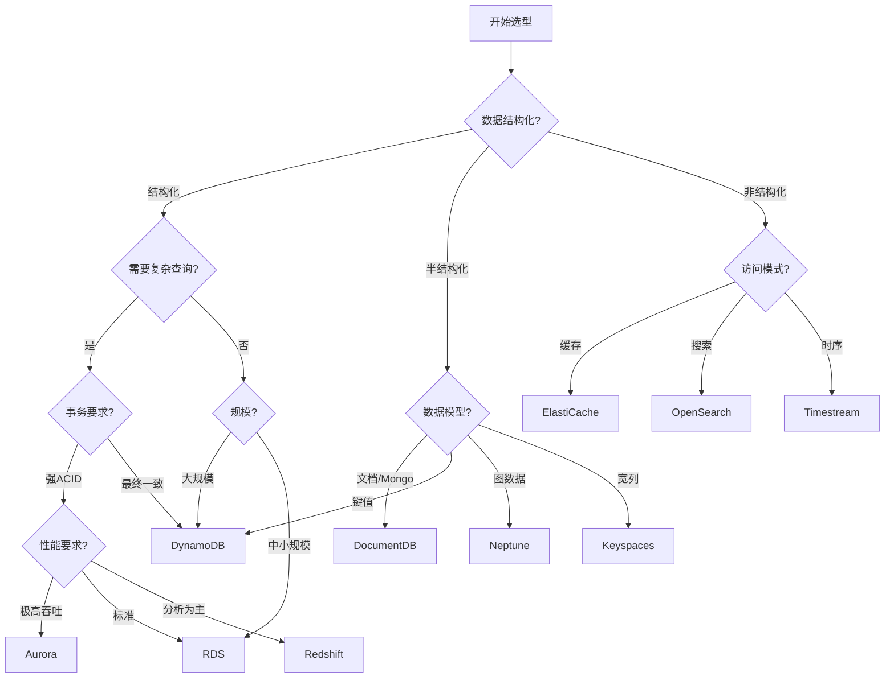

# AWS 数据库选型指南

> 根据业务需求选择最合适的数据库服务

---

## 选型决策树



---

## 数据库服务对比

### 关系型数据库

| 特性 | RDS MySQL | RDS PostgreSQL | Aurora MySQL | Aurora PostgreSQL |
|------|-----------|----------------|--------------|-------------------|
| **性能** | ⭐⭐⭐ | ⭐⭐⭐ | ⭐⭐⭐⭐⭐ | ⭐⭐⭐⭐⭐ |
| **扩展性** | ⭐⭐ | ⭐⭐ | ⭐⭐⭐⭐ | ⭐⭐⭐⭐ |
| **成本** | 低 | 低 | 中 | 中 |
| **功能丰富度** | 中 | 高 | 中 | 高 |
| **Serverless** | ❌ | ❌ | ✅ v2 | ✅ v2 |

**选择建议**:
- **标准 Web 应用**: RDS MySQL/PostgreSQL
- **高吞吐量 SaaS**: Aurora
- **需要 PostgreSQL 高级特性**: RDS/Aurora PostgreSQL
- **成本敏感 + 可预测负载**: RDS 预留实例
- **不确定负载**: Aurora Serverless v2

### NoSQL 数据库

| 特性 | DynamoDB | DocumentDB | Keyspaces | Neptune |
|------|----------|------------|-----------|---------|
| **数据模型** | 键值/文档 | 文档 | 宽列 | 图 |
| **一致性** | 可配置 | 强一致 | 最终一致 | 强一致 |
| **扩展性** | 无限 | 高 | 高 | 高 |
| **查询灵活度** | 中 | 高 | 中 | 专用 |
| **延迟** | 单毫秒 | 毫秒 | 毫秒 | 毫秒 |

**选择建议**:
- **互联网规模键值存储**: DynamoDB
- **MongoDB 迁移**: DocumentDB
- **Cassandra 工作负载**: Keyspaces
- **推荐系统/知识图谱**: Neptune

---

## 场景化选型

### 场景1: 电商平台

```
需求分析:
├─ 产品目录: 读多写少, 需要灵活查询
├─ 用户数据: 高并发读写
├─ 订单系统: 强一致性事务
├─ 购物车: 低延迟, 高可用
├─ 搜索: 全文检索
└─ 报表: 复杂分析查询

推荐架构:
├─ 产品目录: DynamoDB (GSI 支持多维度查询)
├─ 用户数据: DynamoDB (高并发)
├─ 订单系统: Aurora PostgreSQL (ACID 事务)
├─ 购物车: ElastiCache Redis (会话存储)
├─ 搜索: OpenSearch
└─ 报表: Redshift (数据仓库)
```

### 场景2: 物联网平台

```
需求分析:
├─ 设备数据: 海量写入, 时序特征
├─ 设备元数据: 灵活模式
├─ 告警数据: 低延迟查询
├─ 历史分析: 大数据量扫描
└─ 实时仪表板: 聚合查询

推荐架构:
├─ 时序数据: Timestream (专用时序数据库)
├─ 设备元数据: DynamoDB
├─ 实时缓存: ElastiCache Redis
├─ 数据湖: S3 + Athena
└─ 实时流: Kinesis + Lambda
```

### 场景3: 金融系统

```
需求分析:
├─ 交易数据: 强一致性, 不可篡改
├─ 账户数据: ACID 事务
├─ 审计日志: 不可删除
├─ 风控分析: 复杂图查询
└─ 合规要求: 数据加密, 审计

推荐架构:
├─ 核心交易: Aurora PostgreSQL
├─ 不可篡改记录: QLDB
├─ 风控图谱: Neptune
├─ 会话/缓存: ElastiCache
└─ 审计: S3 + Glacier
```

### 场景4: 内容管理系统

```
需求分析:
├─ 内容文档: 灵活模式, JSON
├─ 用户生成内容: 高并发
├─ 媒体文件: 大对象存储
├─ 全文搜索: 内容检索
└─ 版本历史: 版本控制

推荐架构:
├─ 内容文档: DocumentDB (MongoDB 兼容)
├─ 用户数据: DynamoDB
├─ 媒体存储: S3 + CloudFront
├─ 全文搜索: OpenSearch
└─ 版本控制: S3 版本控制
```

---

## 迁移评估矩阵

| 源数据库 | 目标AWS服务 | 迁移难度 | 工具推荐 |
|----------|-------------|----------|----------|
| MySQL | RDS MySQL | ⭐ 低 | DMS 原生 |
| MySQL | Aurora MySQL | ⭐ 低 | DMS 原生 |
| PostgreSQL | RDS PostgreSQL | ⭐ 低 | DMS 原生 |
| PostgreSQL | Aurora PostgreSQL | ⭐ 低 | DMS 原生 |
| Oracle | RDS Oracle | ⭐⭐ 中 | DMS + SCT |
| Oracle | Aurora PostgreSQL | ⭐⭐⭐ 高 | DMS + SCT |
| SQL Server | RDS SQL Server | ⭐⭐ 中 | DMS 原生 |
| SQL Server | Aurora PostgreSQL | ⭐⭐⭐ 高 | Babelfish + DMS |
| MongoDB | DocumentDB | ⭐⭐ 中 | 在线导入 |
| Cassandra | Keyspaces | ⭐⭐ 中 | cqlsh |
| Redis | ElastiCache | ⭐ 低 | Redis 复制 |
| Neo4j | Neptune | ⭐⭐⭐ 高 | 自定义脚本 |

---

## 成本估算示例

### 场景: 100万DAU的社交应用

```python
"""
用户画像:
- DAU: 1,000,000
- 每用户日均操作: 100次读, 10次写
- 数据保留: 用户数据永久, 活动日志1年

数据库选型:
"""

# DynamoDB (用户数据 + 活动流)
dynamodb_cost = {
    'write_capacity_units': 10000000 / 86400 * 1.5,  # 考虑峰值
    'read_capacity_units': 100000000 / 86400 * 1.5,
    'storage_gb': 500,  # 用户数据
    
    'on_demand_monthly': {
        'writes': 10_000_000 * 30 / 1_000_000 * 1.25,  # $1.25 per million
        'reads': 100_000_000 * 30 / 1_000_000 * 0.25,  # $0.25 per million
        'storage': 500 * 0.25,
        'total': 375 + 750 + 125  # ~$1,250/month
    }
}

# Aurora Serverless v2 (关系型数据: 好友关系、私信)
aurora_cost = {
    'min_acu': 4,
    'max_acu': 64,
    'avg_acu': 16,
    
    'monthly': {
        'compute': 16 * 730 * 0.12,  # $0.12 per ACU-hour
        'storage': 200 * 0.10,        # $0.10 per GB-month
        'io': 1000000 * 0.20 / 1000000,  # $0.20 per million IOs
        'total': 1401.6 + 20 + 0.2  # ~$1,422/month
    }
}

# ElastiCache Redis (会话 + 热点数据)
redis_cost = {
    'node_type': 'cache.r6g.xlarge',
    'node_count': 3,  # 主从 + 副本
    
    'monthly': {
        'nodes': 3 * 730 * 0.219,  # $0.219 per hour
        'total': 479.61  # ~$480/month
    }
}

# S3 (媒体存储)
s3_cost = {
    'storage_tb': 10,
    'requests_million': 50,
    
    'monthly': {
        'storage': 10000 * 0.023,
        'requests': 50 * 0.005,
        'bandwidth': 5000 * 0.09,  # 5TB 出站流量
        'total': 230 + 0.25 + 450  # ~$680/month
    }
}

print(f"""
预估月度成本 (100万 DAU 社交应用):
├── DynamoDB:     ~$1,250
├── Aurora:       ~$1,422
├── ElastiCache:  ~$480
├── S3:           ~$680
└── 总计:         ~$3,832/月

替代方案对比:
├── 全自托管 (EC2): ~$2,500 (但需运维人力)
├── 混合方案:  ~$3,000
└── 全托管:    ~$3,832 (推荐, 零运维)
""")
```

---

## 常见误区

### ❌ 误区1: 一种数据库走天下

**问题**: 试图用单一数据库解决所有问题

**后果**: 
- 性能瓶颈
- 成本浪费
- 技术债务

**正确做法**: 采用 Polyglot Persistence (多语言持久化)

```
微服务架构示例:
├── 用户服务: DynamoDB (高并发)
├── 订单服务: Aurora (ACID)
├── 产品服务: DocumentDB (灵活模式)
├── 推荐服务: Neptune (图查询)
└── 缓存层: ElastiCache
```

### ❌ 误区2: 忽视数据访问模式

**问题**: 仅根据数据结构选型, 不考虑查询模式

**示例**:
```
❌ 错误: 在 DynamoDB 中频繁执行扫描操作
✅ 正确: 使用复合键 + GSI 支持查询模式

❌ 错误: 在 RDS 中存储非结构化 JSON
✅ 正确: 使用 DocumentDB 或 DynamoDB
```

### ❌ 误区3: 过度设计

**问题**: 为不需要的规模设计

**建议**:
- MVP 阶段: RDS Single AZ
- 增长阶段: RDS Multi-AZ + 只读副本
- 大规模: 考虑 Aurora 或 DynamoDB

---

## 选型检查清单

```markdown
## 数据库选型检查清单

### 功能需求
- [ ] 数据模型是否匹配 (关系型/文档/键值/图)?
- [ ] 事务要求 (ACID vs 最终一致)?
- [ ] 查询复杂度 (简单键查询 vs 复杂 JOIN)?
- [ ] 全文搜索需求?
- [ ] 地理空间查询需求?

### 非功能需求
- [ ] 期望延迟 (< 10ms / < 100ms / < 1s)?
- [ ] 吞吐量要求 (TPS)?
- [ ] 数据规模 (GB / TB / PB)?
- [ ] 增长率预测?
- [ ] 多区域部署需求?

### 运维需求
- [ ] 团队技术栈?
- [ ] 运维人力投入?
- [ ] 合规要求 (加密、审计)?
- [ ] 备份恢复要求 (RTO/RPO)?

### 成本评估
- [ ] 当前成本估算?
- [ ] 增长后成本预测?
- [ ] 预留实例/节省计划可行性?
```

---

## 总结

数据库选型是系统架构的关键决策。记住:

1. **没有银弹**: 不同场景需要不同数据库
2. **访问模式优先**: 查询模式决定数据模型
3. **从小开始**: 避免过度设计, 按需演进
4. **成本意识**: 托管服务节省的运维成本可能超过价格差异
5. **团队能力**: 选择团队能够掌控的技术

使用本指南作为起点, 结合实际业务需求做出明智选择!
