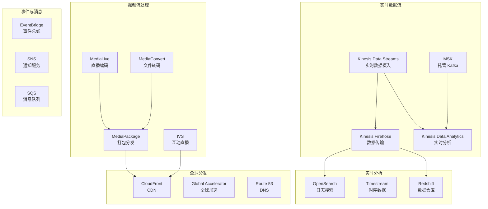
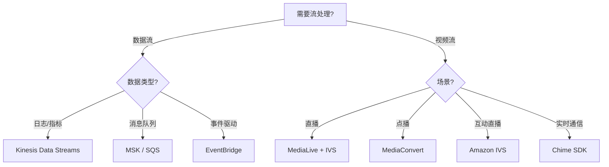

# 流媒体技术资源

> AWS 实时数据流与视频流处理全面指南  
> 从数据采集到实时分析，从视频处理到全球分发

---

## 🎯 主题介绍

本主题全面讲解 AWS 流媒体服务，帮助您构建实时数据处理和高性能视频流应用：

- **实时数据流** - Amazon Kinesis 系列 (Data Streams, Firehose, Analytics)
- **托管 Kafka** - Amazon MSK (Managed Streaming for Apache Kafka)
- **事件驱动** - Amazon EventBridge, SNS/SQS
- **视频处理** - AWS Elemental Media 系列 (MediaConvert, MediaLive, MediaPackage)
- **互动直播** - Amazon IVS (Interactive Video Service)
- **AI 视频识别** - AWS Rekognition + Kinesis Video Streams
- **实时分析** - Kinesis Data Analytics, Amazon OpenSearch
- **全球分发** - Amazon CloudFront, Global Accelerator

---

## 🏗️ 架构概览

### AWS 流媒体服务矩阵



### 流媒体架构决策树



---

## 📚 多语言资源

| 语言 | 目录 | 状态 | 规模 |
|------|------|------|------|
| 🇨🇳 中文 | [./zh/](./zh/) | ✅ 可用 | 完整文档 |
| 🇺🇸 English | [./en/](./en/) | 📝 计划中 | 核心文档 |
| 🇯🇵 日本語 | [./ja/](./ja/) | 📝 计划中 | 核心文档 |

---

## 📖 内容清单

### 电子书 (ebooks/)

| 文档 | 说明 |
|------|------|
| `README.md` | 导航索引 |
| `Streaming_Whitepaper.md` | 技术白皮书 (13章) |
| `Streaming_Quick_Reference.md` | 速查手册 |
| `Streaming_Learning_Roadmap.md` | 16周学习路线图 |

### 技术文档 (materials/)

| 文档 | 内容 |
|------|------|
| `kinesis_deep_dive.md` | Kinesis 深度解析 |
| `msk_kafka_guide.md` | MSK 与 Kafka 实践 |
| `video_streaming_architecture.md` | 视频流架构设计 |
| `real_time_analytics_patterns.md` | 实时分析模式 |

---

## 💻 实践项目

| 项目 | 难度 | 技术栈 | 目录 |
|------|------|--------|------|
| Kinesis 数据管道 | ⭐ 入门 | Kinesis + Lambda + S3 | [./projects/01-kinesis-data-pipeline/](./projects/01-kinesis-data-pipeline/) |
| 视频流媒体平台 | ⭐⭐ 进阶 | MediaLive + MediaPackage + CloudFront | [./projects/02-video-streaming-platform/](./projects/02-video-streaming-platform/) |
| 实时分析仪表盘 | ⭐⭐⭐ 高级 | Kinesis + OpenSearch + Grafana | [./projects/03-real-time-analytics/](./projects/03-real-time-analytics/) |

---

## 🚀 快速开始

### 中文用户

```bash
cd zh/ebooks/
cat README.md
```

### 学习路径

1. **新手**: 白皮书第1-3章 → 项目1
2. **进阶**: 白皮书第4-7章 → 项目2
3. **专家**: 全部白皮书 → 项目3

---

## 📊 资源统计

| 指标 | 数量 |
|------|------|
| **电子书** | 4本 |
| **技术文档** | 4篇 |
| **实践项目** | 3个 |
| **架构图** | 22+ |
| **代码示例** | 50+ |

---

## 🔗 相关主题

- [Serverless](../serverless/) - 无服务器计算与事件处理
- [Storage-Database](../storage-database/) - 数据存储与查询
- [DevTools](../devtools/) - CI/CD 与监控工具

---

**开始构建您的流媒体应用！** 🚀
