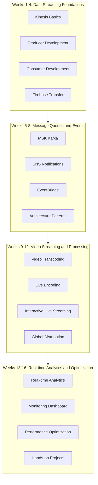

# Streaming Technology 16-Week Learning Roadmap

> Complete Learning Path from Data Collection to Real-time Analytics

---

## 🗺️ Learning Roadmap Overview

---

## 📅 Detailed Learning Plan

### Week 1: Kinesis Basics

**Learning Objectives**: Understand streaming data concepts and Kinesis core services

| Day | Topic | Practical Tasks |
|-----|-------|-----------------|
| Day 1 | Streaming Data Concepts | Learn producer-consumer model |
| Day 2 | Kinesis Data Streams | Create your first stream |
| Day 3 | Shards and Partitions | Understand partition key design |
| Day 4 | Record Lifecycle | Data retention and replay |
| Day 5 | CLI Operations | Manage streams using AWS CLI |
| Day 6 | SDK Basics | Python SDK fundamentals |
| Day 7 | Weekly Review | Create complete streaming application |

---

### Week 2: Producer Development

**Learning Objectives**: Master data production best practices

| Day | Topic | Practical Tasks |
|-----|-------|-----------------|
| Day 1 | PutRecord API | Single record sending |
| Day 2 | PutRecords API | Batch sending optimization |
| Day 3 | Partition Key Strategy | Avoid hot partitions |
| Day 4 | Error Handling | Retry and failure handling |
| Day 5 | Aggregation | Record aggregation optimization |
| Day 6 | KPL (Kinesis Producer Library) | Advanced producer library |
| Day 7 | Weekly Review | High-throughput producer |

---

### Week 3: Consumer Development

**Learning Objectives**: Implement efficient data consumers

| Day | Topic | Practical Tasks |
|-----|-------|-----------------|
| Day 1 | GetRecords API | Basic consumption patterns |
| Day 2 | Shard Iterator | Position and replay |
| Day 3 | Lambda Consumers | Serverless consumption |
| Day 4 | KCL Consumers | Advanced consumer library |
| Day 5 | Checkpoint Management | Offset management |
| Day 6 | Consumer Groups | Parallel processing |
| Day 7 | Weekly Review | Complete consumer application |

---

### Week 4: Firehose and Data Transfer

**Learning Objectives**: Master data ETL and transfer

| Day | Topic | Practical Tasks |
|-----|-------|-----------------|
| Day 1 | Firehose Basics | Create delivery stream |
| Day 2 | S3 Destination | Data lake construction |
| Day 3 | Data Transformation | Lambda transformation |
| Day 4 | Format Conversion | JSON to Parquet |
| Day 5 | OpenSearch | Log search |
| Day 6 | Dynamic Partitioning | Smart partitioning strategy |
| Day 7 | Weekly Review | Project 1 preparation |

---

### Week 5: MSK and Kafka

**Learning Objectives**: Master managed Kafka service

| Day | Topic | Practical Tasks |
|-----|-------|-----------------|
| Day 1 | Kafka Basics | Create MSK cluster |
| Day 2 | Topic Management | Create and configure Topics |
| Day 3 | Producers | Kafka producer development |
| Day 4 | Consumers | Consumer group management |
| Day 5 | Partitioning Strategy | Custom partitioner |
| Day 6 | Lambda Integration | MSK triggering Lambda |
| Day 7 | Weekly Review | Kafka application development |

---

### Week 6: SNS and SQS

**Learning Objectives**: Understand message queues and notifications

| Day | Topic | Practical Tasks |
|-----|-------|-----------------|
| Day 1 | SNS Basics | Create topics and subscriptions |
| Day 2 | SQS Basics | Create queues |
| Day 3 | SNS+SQS Integration | Fanout pattern |
| Day 4 | Message Filtering | Subscription filter policies |
| Day 5 | FIFO Queues | Ordering guarantees |
| Day 6 | Dead Letter Queues | Error handling |
| Day 7 | Weekly Review | Messaging system practice |

---

### Week 7: EventBridge

**Learning Objectives**: Build event-driven architectures

| Day | Topic | Practical Tasks |
|-----|-------|-----------------|
| Day 1 | EventBridge Basics | Event buses and rules |
| Day 2 | Event Patterns | Pattern matching |
| Day 3 | Custom Events | Application integration |
| Day 4 | SaaS Integration | Third-party services |
| Day 5 | Event Archive | Event replay |
| Day 6 | Schema Registry | Event schema management |
| Day 7 | Weekly Review | Event-driven application |

---

### Week 8: Architecture Patterns

**Learning Objectives**: Master stream processing architecture patterns

| Day | Topic | Practical Tasks |
|-----|-------|-----------------|
| Day 1 | Pub/Sub | Pub/Sub pattern |
| Day 2 | Event Sourcing | Event Sourcing |
| Day 3 | CQRS | Read/Write separation |
| Day 4 | Saga Pattern | Distributed transactions |
| Day 5 | Competing Consumers | Load balancing |
| Day 6 | Pipes and Filters | Data processing chain |
| Day 7 | Weekly Review | Project 2 preparation |

---

### Week 9: Video Transcoding (MediaConvert)

**Learning Objectives**: Master video file processing

| Day | Topic | Practical Tasks |
|-----|-------|-----------------|
| Day 1 | Video Format Basics | Learn encoding formats |
| Day 2 | MediaConvert Basics | Create transcoding job |
| Day 3 | HLS/DASH Output | Adaptive bitrate |
| Day 4 | Presets and Templates | Custom templates |
| Day 5 | Watermarks and Subtitles | Video processing |
| Day 6 | DRM Encryption | Content protection |
| Day 7 | Weekly Review | Transcoding pipeline |

---

### Week 10: Live Encoding (MediaLive)

**Learning Objectives**: Implement live channel management

| Day | Topic | Practical Tasks |
|-----|-------|-----------------|
| Day 1 | Live Streaming Basics | Input and output |
| Day 2 | Create Channel | Live configuration |
| Day 3 | Multi-bitrate Output | ABR live streaming |
| Day 4 | Input Switching | Live control |
| Day 5 | Subtitles and Graphics | Live enhancement |
| Day 6 | Recording and Archive | Time-shift replay |
| Day 7 | Weekly Review | Live channel management |

---

### Week 11: Interactive Live Streaming (IVS)

**Learning Objectives**: Build low-latency live streaming applications

| Day | Topic | Practical Tasks |
|-----|-------|-----------------|
| Day 1 | IVS Basics | Create channel and stream key |
| Day 2 | Web Player | Player integration |
| Day 3 | Real-time Metadata | Interactive features |
| Day 4 | Recording Storage | Video archive |
| Day 5 | Multi-host | Stage features |
| Day 6 | Chat Features | Real-time chat |
| Day 7 | Weekly Review | Interactive live streaming application |

---

### Week 12: CDN and Distribution

**Learning Objectives**: Global content distribution

| Day | Topic | Practical Tasks |
|-----|-------|-----------------|
| Day 1 | CloudFront Basics | Distribution configuration |
| Day 2 | Caching Strategy | Optimize caching |
| Day 3 | Signed URLs | Access control |
| Day 4 | Lambda@Edge | Edge computing |
| Day 5 | Global Accelerator | Global acceleration |
| Day 6 | Multi-CDN Strategy | Load balancing |
| Day 7 | Weekly Review | Project 3 preparation |

---

### Week 13: Real-time Analytics

**Learning Objectives**: Real-time streaming data analysis

| Day | Topic | Practical Tasks |
|-----|-------|-----------------|
| Day 1 | Kinesis Analytics | Flink applications |
| Day 2 | Window Operations | Time windows |
| Day 3 | Aggregation Calculations | Real-time metrics |
| Day 4 | Pattern Detection | Anomaly detection |
| Day 5 | OpenSearch | Log analysis |
| Day 6 | Timestream | Time series data |
| Day 7 | Weekly Review | Analytics pipeline |

---

### Week 14: Monitoring Dashboard

**Learning Objectives**: Build monitoring system

| Day | Topic | Practical Tasks |
|-----|-------|-----------------|
| Day 1 | CloudWatch Metrics | Stream monitoring |
| Day 2 | CloudWatch Logs | Log analysis |
| Day 3 | Grafana Setup | Visualization |
| Day 4 | Custom Dashboards | Business metrics |
| Day 5 | Alarm Configuration | Auto-alerts |
| Day 6 | X-Ray Tracing | Distributed tracing |
| Day 7 | Weekly Review | Monitoring system |

---

### Week 15: Performance Optimization

**Learning Objectives**: Optimize cost and performance

| Day | Topic | Practical Tasks |
|-----|-------|-----------------|
| Day 1 | Shard Optimization | Auto-scaling |
| Day 2 | Batching | Throughput optimization |
| Day 3 | Compression | Transfer optimization |
| Day 4 | Cost Analysis | Billing optimization |
| Day 5 | Reserved Capacity | Reservation planning |
| Day 6 | Multi-region | Disaster recovery |
| Day 7 | Weekly Review | Optimization checklist |

---

### Week 16: Comprehensive Hands-on Project

**Learning Objectives**: Complete end-to-end project

| Day | Topic | Practical Tasks |
|-----|-------|-----------------|
| Day 1 | Architecture Design | System design |
| Day 2 | Data Ingestion | Kinesis configuration |
| Day 3 | Real-time Processing | Stream analysis |
| Day 4 | Video Processing | Media services |
| Day 5 | Distribution Deployment | CDN configuration |
| Day 6 | Monitoring Operations | Complete monitoring |
| Day 7 | Project Summary | Presentation |

---

## 📚 Learning Resources

### Official Resources

- [Kinesis Documentation](https://docs.aws.amazon.com/kinesis/)
- [MSK Documentation](https://docs.aws.amazon.com/msk/)
- [Elemental Documentation](https://docs.aws.amazon.com/elemental/)
- [IVS Documentation](https://docs.aws.amazon.com/ivs/)

### Recommended Books

- "Streaming Systems"
- "Kafka: The Definitive Guide"
- "Designing Data-Intensive Applications"

---

## ✅ Weekly Checklist

### Daily Tasks
- [ ] Read daily topic documentation
- [ ] Complete practical exercises
- [ ] Record learning notes

### Weekly Tasks
- [ ] Complete weekly review
- [ ] Pass knowledge quiz
- [ ] Update learning progress

---

Happy Learning! 🎉
