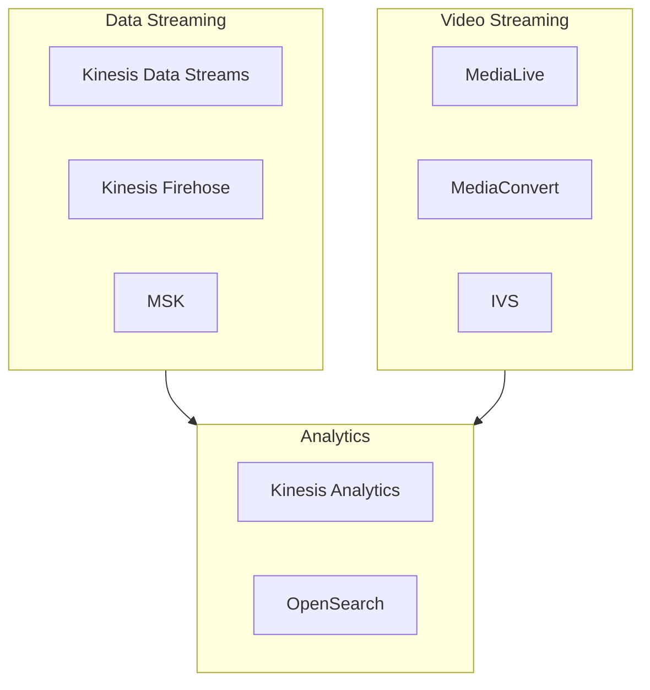

# AWS Streaming Media Technical Whitepaper

> Complete Guide to Real-time Data and Video Streaming

---

## Table of Contents

> **Learning Guide**: This whitepaper progresses from "Data Streaming Foundations → Video Processing → Real-time Analytics → Production Operations". Chapters 1-4 cover core data streaming, chapters 5-7 extend to video and AI, and chapters 8-13 focus on production practices.

1. **[Streaming Overview](#1-streaming-overview)**  
   *Establish streaming mindset: Understand stream data characteristics, AWS streaming service matrix, and real-time vs batch processing selection to build conceptual foundations.*

2. **[Amazon Kinesis Data Streams](#2-amazon-kinesis-data-streams)**  
   *Master core streaming services: Deep dive into Kinesis Data Streams, Firehose, and Analytics—the cornerstone of AWS real-time data processing.*

3. **[Amazon MSK Managed Kafka](#3-amazon-msk-managed-kafka)**  
   *Alternative message queue solution: After contrasting with Kinesis, learn managed Kafka and understand when to choose MSK and its ecosystem compatibility advantages.*

4. **[Event-Driven Architecture](#4-event-driven-architecture)**  
   *Build loosely coupled systems: Learn EventBridge, SNS, SQS integration patterns; master event sourcing, CQRS, and other architectural designs.*

5. **[AWS Elemental Video Services](#5-aws-elemental-video-services)**  
   *Video processing infrastructure: Deep dive into MediaConvert, MediaLive, MediaPackage; master VOD transcoding and live encoding.*

6. **[Amazon IVS Interactive Live Streaming](#6-amazon-ivs-interactive-live-streaming)**  
   *Low-latency live streaming solution: Learn IVS real-time streaming, metadata injection, audience interaction; compare with traditional streaming solutions.*

7. **[AWS Rekognition Real-time Video AI](#7-aws-rekognition-real-time-video-ai)**  
   *Video intelligent analysis: Combine Kinesis Video Streams with Rekognition for real-time face detection, content moderation, and label recognition.*

8. **[Real-time Data Analytics](#8-real-time-data-analytics)**  
   *Extract value from streaming data: Learn Flink SQL, OpenSearch, Timestream to derive real-time insights from streaming data.*

9. **[Global Distribution and CDN](#9-global-distribution-and-cdn)**  
   *Reach global audiences: Master CloudFront video distribution, Global Accelerator, and edge caching strategies to optimize global access.*

10. **[Monitoring and Observability](#10-monitoring-and-observability)**  
    *Gain streaming health insights: Learn streaming-specific monitoring metrics, latency analysis, consumer lag detection to build streaming system observability.*

11. **[Security and Compliance](#11-security-and-compliance)**  
    *Protect streaming data: Learn stream encryption, access control, VPC endpoints, and GDPR compliance to ensure real-time data security.*

12. **[Performance Optimization and Cost Control](#12-performance-optimization-and-cost-control)**  
    *Efficient stream processing: Master shard optimization, batch processing, auto-scaling, and reserved capacity to control costs while maintaining performance.*

13. **[Production Deployment Best Practices](#13-production-deployment-best-practices)**  
    *Ensure stable operations: Integrate all previous knowledge; learn multi-region disaster recovery, exactly-once semantics, and monitoring alerts for production-grade practices.*

---

## 1. Streaming Overview

### 1.1 What is Streaming

Streaming refers to continuous data transmission and processing where data is processed immediately as it's generated, without waiting for all data to arrive.

**Key Characteristics**:
- Real-time processing
- Continuous data flow
- Event-driven architecture
- Scalable ingestion

### 1.2 AWS Streaming Service Matrix

---

*Version: v1.0*  
*Last Updated: 2026-03-02*
