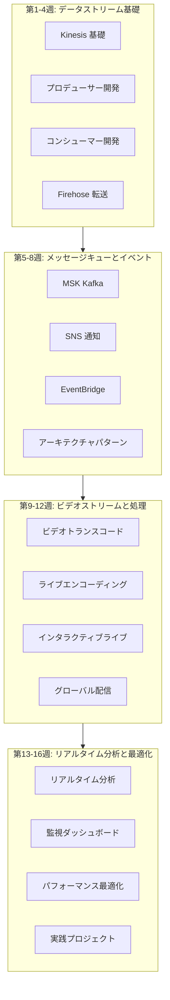

# ストリーミング技術 16週間学習ロードマップ

> データ収集からリアルタイム分析までの完全な学習パス

---

## 🗺️ 学習ロードマップ概要

---

## 📅 詳細学習計画

### 第1週: Kinesis 基礎

**学習目標**: ストリームデータの概念と Kinesis 中核サービスを理解します

| 日数 | テーマ | 実践タスク |
|------|------|----------|
| 第1日 | ストリームデータ概念 | プロデューサー-コンシューマーモデルを理解する |
| 第2日 | Kinesis Data Streams | 最初のストリームを作成する |
| 第3日 | シャードとパーティション | パーティションキー設計を理解する |
| 第4日 | レコードライフサイクル | データ保持とリプレイ |
| 第5日 | CLI 操作 | AWS CLI でストリームを管理する |
| 第6日 | SDK 入門 | Python SDK 基礎 |
| 第7日 | 週復習 | 完全なストリームアプリケーションを作成する |

---

### 第2週: プロデューサー開発

**学習目標**: データ生成のベストプラクティスを習得します

| 日数 | テーマ | 実践タスク |
|------|------|----------|
| 第1日 | PutRecord API | 単一レコード送信 |
| 第2日 | PutRecords API | バッチ送信最適化 |
| 第3日 | パーティションキー戦略 | ホットシャードを回避する |
| 第4日 | エラー処理 | リトライと失敗処理 |
| 第5日 | 集約 | レコード集約最適化 |
| 第6日 | KPL (Kinesis Producer Library) | 高度なプロデューサーライブラリ |
| 第7日 | 週復習 | 高スループットプロデューサー |

---

### 第3週: コンシューマー開発

**学習目標**: 効率的なデータコンシューマーを実装します

| 日数 | テーマ | 実践タスク |
|------|------|----------|
| 第1日 | GetRecords API | 基礎的な消費パターン |
| 第2日 | シャードイテレーター | 位置とリプレイ |
| 第3日 | Lambda コンシューマー | サーバーレス消費 |
| 第4日 | KCL コンシューマー | 高度な消費ライブラリ |
| 第5日 | チェックポイント管理 | オフセット管理 |
| 第6日 | コンシューマグループ | 並列処理 |
| 第7日 | 週復習 | 完全な消費アプリケーション |

---

### 第4週: Firehose とデータ転送

**学習目標**: データ ETL と転送を習得します

| 日数 | テーマ | 実践タスク |
|------|------|----------|
| 第1日 | Firehose 基礎 | デリバリーストリームを作成する |
| 第2日 | S3 宛先 | データレイク構築 |
| 第3日 | データ変換 | Lambda 変換 |
| 第4日 | フォーマット変換 | JSON から Parquet |
| 第5日 | OpenSearch | ログ検索 |
| 第6日 | 動的パーティション | インテリジェントパーティション戦略 |
| 第7日 | 週復習 | プロジェクト1準備 |

---

### 第5週: MSK と Kafka

**学習目標**: マネージド Kafka サービスを習得します

| 日数 | テーマ | 実践タスク |
|------|------|----------|
| 第1日 | Kafka 基礎 | MSK クラスターを作成する |
| 第2日 | Topic 管理 | Topic の作成と設定 |
| 第3日 | プロデューサー | Kafka プロデューサー開発 |
| 第4日 | コンシューマー | コンシューマグループ管理 |
| 第5日 | パーティション戦略 | カスタムパーティショナー |
| 第6日 | Lambda との統合 | MSK トリガー Lambda |
| 第7日 | 週復習 | Kafka アプリケーション開発 |

---

### 第6週: SNS と SQS

**学習目標**: メッセージキューと通知を理解します

| 日数 | テーマ | 実践タスク |
|------|------|----------|
| 第1日 | SNS 基礎 | トピックとサブスクリプションを作成する |
| 第2日 | SQS 基礎 | キューを作成する |
| 第3日 | SNS+SQS 統合 | ファンアウトパターン |
| 第4日 | メッセージフィルタリング | サブスクリプションフィルターポリシー |
| 第5日 | FIFO キュー | 順序保証 |
| 第6日 | デッドレターキュー | エラー処理 |
| 第7日 | 週復習 | メッセージシステム実践 |

---

### 第7週: EventBridge

**学習目標**: イベント駆動アーキテクチャを構築します

| 日数 | テーマ | 実践タスク |
|------|------|----------|
| 第1日 | EventBridge 基礎 | イベントバスとルール |
| 第2日 | イベントパターン | パターンマッチング |
| 第3日 | カスタムイベント | アプリケーション統合 |
| 第4日 | SaaS 統合 | サードパーティサービス |
| 第5日 | イベントアーカイブ | イベントリプレイ |
| 第6日 | Schema Registry | イベントスキーマ管理 |
| 第7日 | 週復習 | イベント駆動アプリケーション |

---

### 第8週: アーキテクチャパターン

**学習目標**: ストリーム処理アーキテクチャパターンを習得します

| 日数 | テーマ | 実践タスク |
|------|------|----------|
| 第1日 | パブリッシュサブスクライブ | Pub/Sub パターン |
| 第2日 | イベントソーシング | Event Sourcing |
| 第3日 | CQRS | 読み書き分離 |
| 第4日 | Saga パターン | 分散トランザクション |
| 第5日 | 競合コンシューマー | ロードバランシング |
| 第6日 | パイプラインフィルター | データ処理チェーン |
| 第7日 | 週復習 | プロジェクト2準備 |

---

### 第9週: ビデオトランスコード (MediaConvert)

**学習目標**: ビデオファイル処理を習得します

| 日数 | テーマ | 実践タスク |
|------|------|----------|
| 第1日 | ビデオフォーマット基礎 | エンコーディングフォーマットを理解する |
| 第2日 | MediaConvert 入門 | トランスコードジョブを作成する |
| 第3日 | HLS/DASH 出力 | アダプティブビットレート |
| 第4日 | プリセットとテンプレート | カスタムテンプレート |
| 第5日 | ウォーターマークと字幕 | ビデオ処理 |
| 第6日 | DRM 暗号化 | コンテンツ保護 |
| 第7日 | 週復習 | トランスコードパイプライン |

---

### 第10週: ライブエンコーディング (MediaLive)

**学習目標**: ライブチャンネル管理を実装します

| 日数 | テーマ | 実践タスク |
|------|------|----------|
| 第1日 | ライブ基礎 | 入力と出力 |
| 第2日 | チャンネル作成 | ライブ設定 |
| 第3日 | マルチビットレート出力 | ABR ライブ |
| 第4日 | 入力切り替え | ライブ制御 |
| 第5日 | 字幕とグラフィック | ライブエンハンスメント |
| 第6日 | 録画とアーカイブ | タイムシフト視聴 |
| 第7日 | 週復習 | ライブチャンネル管理 |

---

### 第11週: インタラクティブライブ (IVS)

**学習目標**: 低遅延ライブアプリケーションを構築します

| 日数 | テーマ | 実践タスク |
|------|------|----------|
| 第1日 | IVS 基礎 | チャンネルとストリームキーを作成する |
| 第2日 | Web プレイヤー | プレイヤー統合 |
| 第3日 | リアルタイム Metadata | インタラクション機能 |
| 第4日 | 録画ストレージ | ビデオアーカイブ |
| 第5日 | マルチ配信者 | ステージ機能 |
| 第6日 | チャット機能 | リアルタイムチャット |
| 第7日 | 週復習 | インタラクティブライブアプリケーション |

---

### 第12週: CDN と配信

**学習目標**: グローバルコンテンツ配信を実現します

| 日数 | テーマ | 実践タスク |
|------|------|----------|
| 第1日 | CloudFront 基礎 | 配信設定 |
| 第2日 | キャッシュ戦略 | キャッシュ最適化 |
| 第3日 | 署名 URL | アクセス制御 |
| 第4日 | Lambda@Edge | エッジコンピューティング |
| 第5日 | Global Accelerator | グローバル加速 |
| 第6日 | マルチCDN 戦略 | ロードバランシング |
| 第7日 | 週復習 | プロジェクト3準備 |

---

### 第13週: リアルタイム分析

**学習目標**: ストリームデータのリアルタイム分析を行います

| 日数 | テーマ | 実践タスク |
|------|------|----------|
| 第1日 | Kinesis Analytics | Flink アプリケーション |
| 第2日 | ウィンドウ操作 | 時間ウィンドウ |
| 第3日 | 集計計算 | リアルタイムメトリクス |
| 第4日 | パターン検出 | 異常検出 |
| 第5日 | OpenSearch | ログ分析 |
| 第6日 | Timestream | 時系列データ |
| 第7日 | 週復習 | 分析パイプライン |

---

### 第14週: 監視ダッシュボード

**学習目標**: 監視体系を構築します

| 日数 | テーマ | 実践タスク |
|------|------|----------|
| 第1日 | CloudWatch メトリクス | ストリーム監視 |
| 第2日 | CloudWatch Logs | ログ分析 |
| 第3日 | Grafana 構築 | 可視化 |
| 第4日 | カスタムダッシュボード | 業務メトリクス |
| 第5日 | アラート設定 | 自動アラート |
| 第6日 | X-Ray トレーシング | 分散トレーシング |
| 第7日 | 週復習 | 監視体系 |

---

### 第15週: パフォーマンス最適化

**学習目標**: コストとパフォーマンスを最適化します

| 日数 | テーマ | 実践タスク |
|------|------|----------|
| 第1日 | シャード最適化 | 自動スケーリング |
| 第2日 | バッチ処理 | スループット最適化 |
| 第3日 | 圧縮 | 転送最適化 |
| 第4日 | コスト分析 | 請求最適化 |
| 第5日 | 予約容量 | 前払い計画 |
| 第6日 | マルチリージョン | 災害復旧 |
| 第7日 | 週復習 | 最適化チェック |

---

### 第16週: 総合実践

**学習目標**: エンドツーエンドのプロジェクトを完了します

| 日数 | テーマ | 実践タスク |
|------|------|----------|
| 第1日 | アーキテクチャ設計 | システム設計 |
| 第2日 | データ取り込み | Kinesis 設定 |
| 第3日 | リアルタイム処理 | ストリーム分析 |
| 第4日 | ビデオ処理 | メディアサービス |
| 第5日 | 配信展開 | CDN 設定 |
| 第6日 | 監視運用 | 完全監視 |
| 第7日 | プロジェクトまとめ | 成果発表 |

---

## 📚 学習リソース

### 公式リソース

- [Kinesis ドキュメント](https://docs.aws.amazon.com/kinesis/)
- [MSK ドキュメント](https://docs.aws.amazon.com/msk/)
- [Elemental ドキュメント](https://docs.aws.amazon.com/elemental/)
- [IVS ドキュメント](https://docs.aws.amazon.com/ivs/)

### 推奨書籍

- 《Streaming Systems》
- 《Kafka: The Definitive Guide》
- 《Designing Data-Intensive Applications》

---

## ✅ 毎週チェックリスト

### 毎日のタスク
- [ ] 当日のテーマドキュメントを読む
- [ ] 実践演習を完了する
- [ ] 学習ノートを記録する

### 毎週のタスク
- [ ] 週復習を完了する
- [ ] 知識テストに合格する
- [ ] 学習進捗を更新する

---

学習が順調に進みますように！🎉
