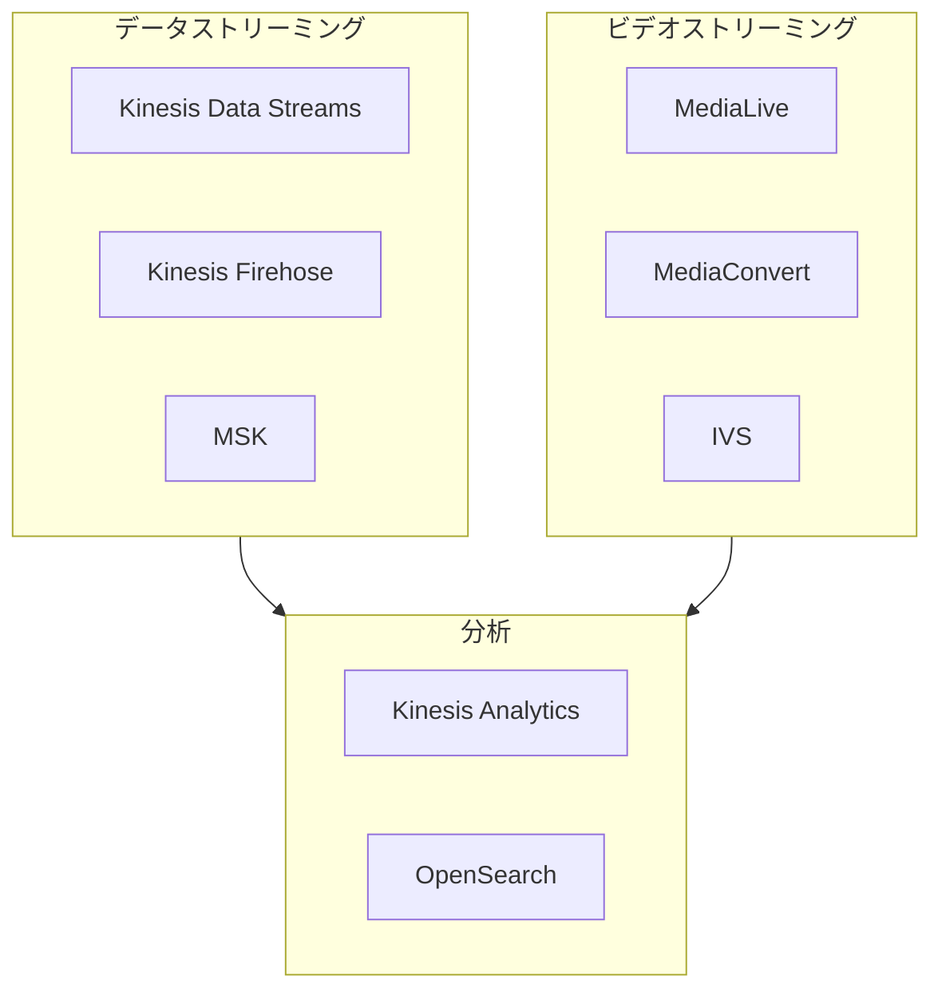

# AWS ストリーミングメディア技術白書

> リアルタイムデータとビデオストリーミングの完全ガイド

---

## 目次

> **学習ガイド**: 本白書は「データストリーミング基礎→ビデオ処理→リアルタイム分析→本番運用」の順に進みます。第 1 章〜第 4 章でデータストリーミングのコアを習得し、第 5 章〜第 7 章でビデオと AI を拡張し、第 8 章〜第 13 章で本番実践に焦点を当てます。

1. **[ストリーミング概要](#1-ストリーミング概要)**  
   *ストリーミング思考を確立: ストリームデータの特性、AWS ストリーミングサービスマトリクス、リアルタイム vs バッチ処理の選定を理解し、概念的基盤を構築します。*

2. **[Amazon Kinesis データストリーム](#2-amazon-kinesis-データストリーム)**  
   *コアストリーミングサービスを習得: Kinesis Data Streams、Firehose、Analytics を深く学びます——AWS リアルタイムデータ処理の基石です。*

3. **[Amazon MSK マネージド Kafka](#3-amazon-msk-マネージド-kafka)**  
   *代替メッセージキューソリューション: Kinesis と対比しながら、マネージド Kafka を学び、MSK を選ぶ状況とそのエコシステム互換性の優位性を理解します。*

4. **[イベント駆動型アーキテクチャ](#4-イベント駆動型アーキテクチャ)**  
   *疎結合システムを構築: EventBridge、SNS、SQS の統合パターンを学び、イベントソーシング、CQRS、その他のアーキテクチャ設計を習得します。*

5. **[AWS Elemental ビデオサービス](#5-aws-elemental-ビデオサービス)**  
   *ビデオ処理インフラストラクチャ: MediaConvert、MediaLive、MediaPackage を深く学び、VOD トランスコーディングとライブエンコーディングを習得します。*

6. **[Amazon IVS インタラクティブライブストリーミング](#6-amazon-ivs-インタラクティブライブストリーミング)**  
   *低レイテンシライブストリーミングソリューション: IVS リアルタイムストリーミング、メタデータ注入、視聴者インタラクションを学び、従来のストリーミングソリューションと対比します。*

7. **[AWS Rekognition リアルタイムビデオ AI](#7-aws-rekognition-リアルタイムビデオ-ai)**  
   *ビデオインテリジェント分析: Kinesis Video Streams と Rekognition を組み合わせて、リアルタイム顔検出、コンテンツモデレーション、ラベル認識を実現します。*

8. **[リアルタイムデータ分析](#8-リアルタイムデータ分析)**  
   *ストリーミングデータから価値を抽出: Flink SQL、OpenSearch、Timestream を学び、ストリーミングデータからリアルタイムインサイトを導出します。*

9. **[グローバル配信と CDN](#9-グローバル配信と-cdn)**  
   *グローバル視聴者にリーチ: CloudFront ビデオ配信、Global Accelerator、エッジキャッシング戦略を習得し、グローバルアクセスを最適化します。*

10. **[モニタリングと可観測性](#10-モニタリングと可観測性)**  
    *ストリーミング健全性の洞察を得る: ストリーミング特化モニタリングメトリクス、レイテンシ分析、コンシューマーラグ検出を学び、ストリーミングシステムの可観測性を構築します。*

11. **[セキュリティとコンプライアンス](#11-セキュリティとコンプライアンス)**  
    *ストリーミングデータを保護: ストリーム暗号化、アクセス制御、VPC エンドポイント、GDPR コンプライアンスを学び、リアルタイムデータのセキュリティを確保します。*

12. **[パフォーマンス最適化とコスト管理](#12-パフォーマンス最適化とコスト管理)**  
    *効率的なストリーム処理: シャード最適化、バッチ処理、自動スケーリング、リザーブドキャパシティを習得し、パフォーマンスを維持しながらコストを管理します。*

13. **[本番環境デプロイメントベストプラクティス](#13-本番環境デプロイメントベストプラクティス)**  
    *安定的な運用を確保: これまでの知識を統合し、マルチリージョン災害復旧、Exactly-Once セマンティクス、モニタリングアラートなどの本番グレード実践を学びます。*

---

## 1. ストリーミング概要

### 1.1 ストリーミングとは

ストリーミングとは、すべてのデータが到着するのを待たずに、データが生成されるとすぐに処理される継続的なデータ伝送と処理を指します。

**主な特性**:
- リアルタイム処理
- 継続的なデータフロー
- イベント駆動型アーキテクチャ
- スケーラブルな取り込み

### 1.2 AWS ストリーミングサービスマトリクス

---

*バージョン: v1.0*  
*最終更新日: 2026-03-02*
