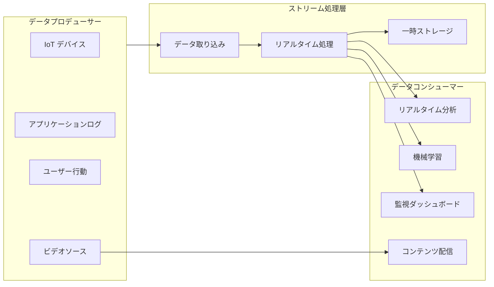
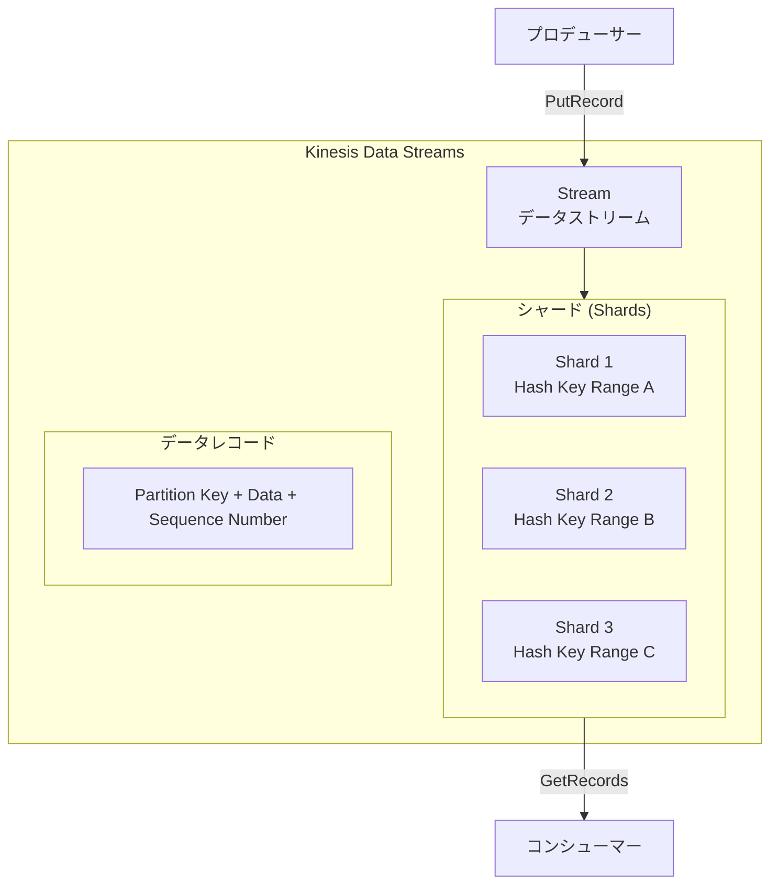
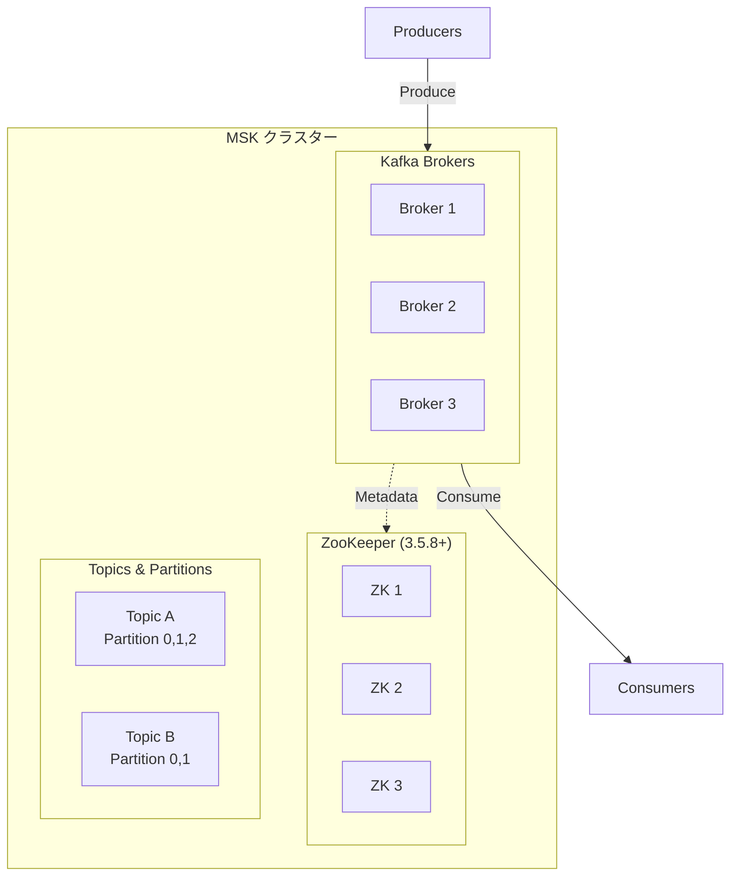
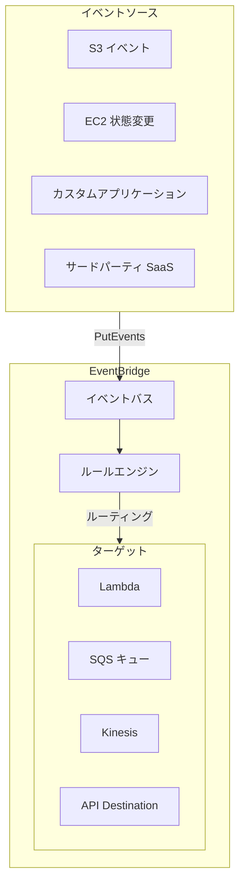
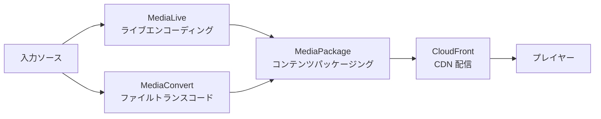
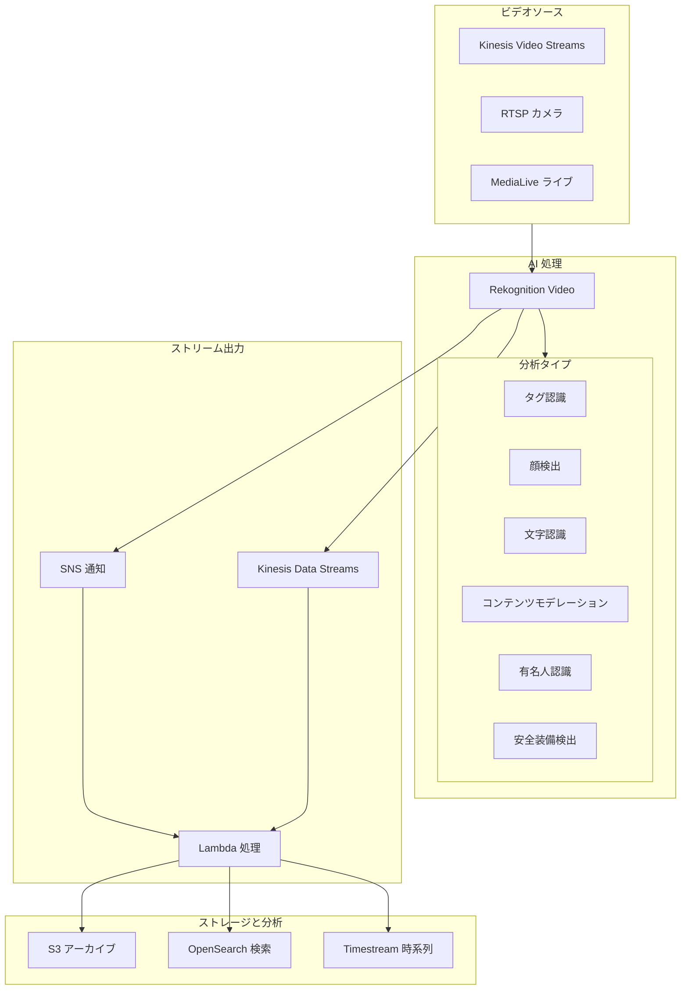
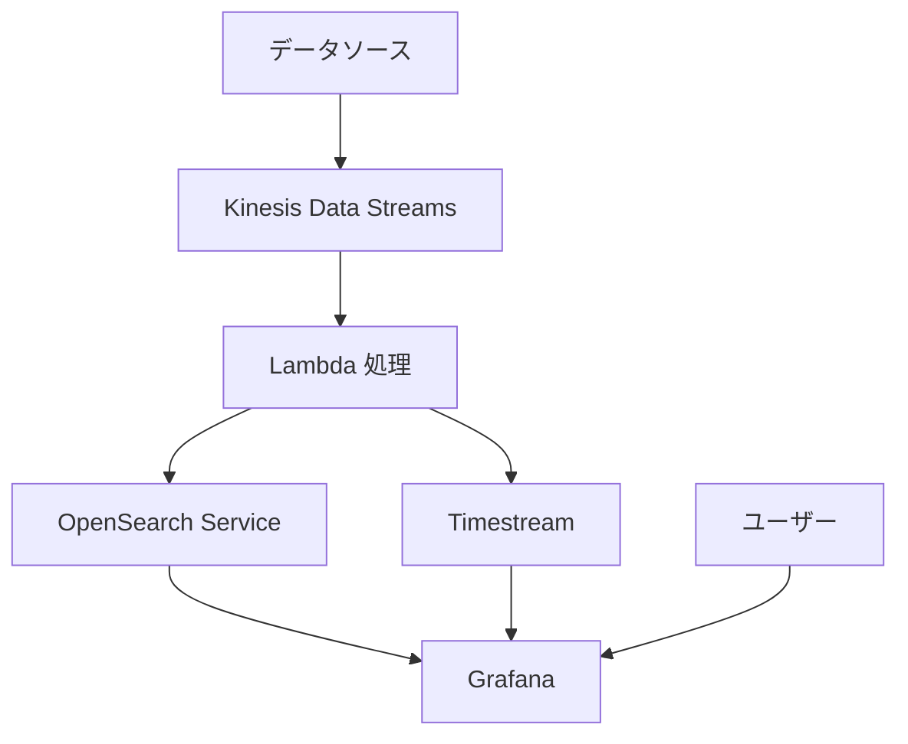
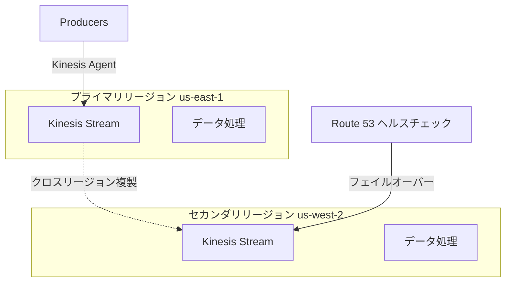

# AWS ストリーミング技術白書

> リアルタイムデータストリームとビデオストリーム処理の完全ガイド

---

## 目次

> **学習ガイド**: 本白書は「データストリーム基礎→ビデオストリーム処理→リアルタイム分析→運用管理」の順に進みます。前4章でデータストリームの中核技術を習得し、中間4章でビデオとAI機能を拡張し、後5章で本番運用に焦点を当てます。

1. **[ストリーミング概要](#1-ストリーミング概要)**  
   *ストリーム処理の考え方を確立：ストリームデータの特徴、AWSストリーミングサービス群、リアルタイム vs バッチ処理の選定を理解し、後続の技術学習の概念基盤を築きます。*

2. **[Amazon Kinesis データストリーム](#2-amazon-kinesis-データストリーム)**  
   *中核的なストリームサービスを習得：Kinesis Data Streams、Firehose、Analyticsを深く学び、AWSリアルタイムデータ処理の基盤となるサービスを理解します。*

3. **[Amazon MSK マネージドKafka](#3-amazon-msk-マネージドkafka)**  
   *代替メッセージキュー・ソリューション：Kinesisとの比較を通じてマネージドKafkaを学び、MSKを選択すべき状況とそのエコシステム互換性の利点を理解します。*

4. **[イベント駆動アーキテクチャ](#4-イベント駆動アーキテクチャ)**  
   *疎結合システムの構築：EventBridge、SNS、SQSの統合パターンを学び、イベントソーシング、CQRSなどのアーキテクチャ設計を習得します。*

5. **[AWS Elemental ビデオサービス](#5-aws-elemental-ビデオサービス)**  
   *ビデオ処理インフラストラクチャ：MediaConvert、MediaLive、MediaPackageを深く理解し、VODトランスコードとライブエンコーディング技術を習得します。*

6. **[Amazon IVS インタラクティブライブ](#6-amazon-ivs-インタラクティブライブ)**  
   *低遅延ライブ・ソリューション：IVSリアルタイムライブ、Metadata注入、視聴者インタラクション機能を学び、従来のライブ配信方式と比較します。*

7. **[AWS Rekognition リアルタイムビデオAI認識](#7-aws-rekognition-リアルタイムビデオai認識)**  
   *ビデオインテリジェンス分析：Kinesis Video StreamsとRekognitionを組み合わせ、リアルタイム顔検出、コンテンツモデレーション、タグ認識を実現します。*

8. **[リアルタイムデータ分析](#8-リアルタイムデータ分析)**  
   *ストリームデータの価値抽出：Flink SQL、OpenSearch、Timestreamを学び、ストリームデータからリアルタイムインサイトを抽出します。*

9. **[グローバル配信とCDN](#9-グローバル配信とcdn)**  
   *グローバルユーザーへのリーチ：CloudFrontビデオ配信、Global Accelerator、エッジキャッシュ戦略を習得し、グローバルアクセス体験を最適化します。*

10. **[監視とオブザーバビリティ](#10-監視とオブザーバビリティ)**  
    *ストリーム処理の健全性を可視化：ストリーム処理専用の監視メトリクス、レイテンシ分析、コンシューマ遅延検出を学び、ストリームシステムのオブザーバビリティを構築します。*

11. **[セキュリティとコンプライアンス](#11-セキュリティとコンプライアンス)**  
    *ストリームデータの保護：ストリーム暗号化、アクセス制御、VPCエンドポイント、GDPRコンプライアンスを学び、リアルタイムデータのセキュリティを確保します。*

12. **[パフォーマンス最適化とコスト管理](#12-パフォーマンス最適化とコスト管理)**  
    *効率的なストリーム処理：シャード最適化、バッチ処理、自動スケーリング、予約容量を習得し、パフォーマンスを確保しながらコストを管理します。*

13. **[本番展開のベストプラクティス](#13-本番展開のベストプラクティス)**  
    *安定稼働の保証：これまでの知識を統合し、マルチリージョン災害対策、Exactly-Onceセマンティクス、監視アラートなどの本番レベルの実践を学びます。*

---

## 1. ストリーミング概要

### 1.1 ストリーミングとは

ストリーミングとは、連続的なデータ転送と処理を指し、データは生成直後に処理・消費され、すべてのデータが到着するのを待つ必要がありません。



### 1.2 AWS ストリーミングサービス分類

| サービスタイプ | AWS サービス | 適用シナリオ |
|----------|----------|----------|
| **リアルタイムデータストリーム** | Kinesis Data Streams | ログ収集、イベント処理 |
| **データ転送** | Kinesis Firehose | データETL、データレイク構築 |
| **ストリーム分析** | Kinesis Data Analytics | リアルタイムメトリクス、異常検出 |
| **マネージドKafka** | MSK | メッセージキュー、イベントバス |
| **ビデオライブ** | MediaLive | ライブエンコーディング、チャンネル管理 |
| **ビデオトランスコード** | MediaConvert | ファイルトランスコード、フォーマット変換 |
| **ビデオ配信** | MediaPackage | コンテンツパッケージング、DRM |
| **インタラクティブライブ** | IVS | 低遅延ライブ、インタラクション機能 |

---

## 2. Amazon Kinesis データストリーム

### 2.1 Kinesis Data Streams 中核概念



**中核概念**:
- **Stream**: データストリーム。複数のシャードで構成されます
- **Shard**: データシャード。各シャードは1MB/sの書き込みと2MB/sの読み取りを提供します
- **Partition Key**: データがどのシャードに入るかを決定するために使用されます
- **Sequence Number**: 各レコードの一意の識別子

### 2.2 Kinesis プロデューサーコード例

```python
import boto3
import json
from datetime import datetime

# Kinesis クライアントを作成
kinesis = boto3.client('kinesis', region_name='us-east-1')

def put_log_record(log_data):
    """ログレコードをKinesisに送信"""
    response = kinesis.put_record(
        StreamName='application-logs',
        Data=json.dumps(log_data),
        PartitionKey=log_data['user_id']  # ユーザーIDをパーティションキーとして使用
    )
    return response['SequenceNumber']

def put_records_batch(records):
    """レコードをバッチ送信（推奨）"""
    kinesis_records = [
        {
            'Data': json.dumps(record),
            'PartitionKey': record.get('user_id', 'default')
        }
        for record in records
    ]
    
    response = kinesis.put_records(
        StreamName='application-logs',
        Records=kinesis_records
    )
    
    # 失敗したレコードをチェック
    if response['FailedRecordCount'] > 0:
        failed_records = [
            kinesis_records[i]
            for i, record in enumerate(response['Records'])
            if 'ErrorCode' in record
        ]
        print(f"Failed records: {len(failed_records)}")
        # リトライロジック
    
    return response

# 使用例
log_event = {
    'timestamp': datetime.utcnow().isoformat(),
    'level': 'INFO',
    'message': 'User login successful',
    'user_id': 'user-12345',
    'ip': '192.168.1.1',
    'service': 'auth-service'
}

put_log_record(log_event)
```

### 2.3 Kinesis コンシューマー (Lambda と SDK)

```python
# Lambda コンシューマー処理関数
import base64
import json

def lambda_handler(event, context):
    """Kinesis データストリームを処理する Lambda 関数"""
    
    for record in event['Records']:
        # Kinesis データは Base64 エンコードされています
        payload = base64.b64decode(record['kinesis']['data'])
        data = json.loads(payload)
        
        # データを処理
        process_log(data)
        
        # 処理情報を記録
        print(f"Processed record: {record['kinesis']['sequenceNumber']}")
    
    return {'statusCode': 200}

def process_log(data):
    """ログデータを処理"""
    if data['level'] == 'ERROR':
        # アラートを送信
        send_alert(data)
    
    # S3 または OpenSearch に書き込み
    store_log(data)

# KCL (Kinesis Client Library) を使用した高度なコンシューマー
from amazon_kclpy import kcl

class RecordProcessor(kcl.RecordProcessor):
    """カスタムレコードプロセッサー"""
    
    def process_records(self, records, checkpointer):
        for record in records:
            data = record.binary_data.decode('utf-8')
            print(f"Processing: {data}")
        
        # チェックポイントで進捗を保存
        checkpointer.checkpoint()
```

### 2.4 Kinesis Firehose データ転送

```python
# Firehose デリバリーストリーム設定
import boto3

firehose = boto3.client('firehose')

# Firehose デリバリーストリームを S3 に作成
response = firehose.create_delivery_stream(
    DeliveryStreamName='logs-to-s3',
    DeliveryStreamType='DirectPut',
    ExtendedS3DestinationConfiguration={
        'RoleARN': 'arn:aws:iam::123456789:role/firehose-role',
        'BucketARN': 'arn:aws:s3:::data-lake-bucket',
        'Prefix': 'logs/year=!{timestamp:yyyy}/month=!{timestamp:MM}/day=!{timestamp:dd}/',
        'ErrorOutputPrefix': 'errors/',
        'BufferingHints': {
            'SizeInMBs': 64,
            'IntervalInSeconds': 60
        },
        'CompressionFormat': 'GZIP',
        'FormatConverterConfiguration': {
            'SchemaConfiguration': {
                'DatabaseName': 'analytics',
                'TableName': 'logs',
                'RoleARN': 'arn:aws:iam::123456789:role/firehose-role'
            },
            'InputFormatConfiguration': {
                'Deserializer': {
                    'OpenXJsonSerDe': {}
                }
            },
            'OutputFormatConfiguration': {
                'Serializer': {
                    'ParquetSerDe': {}
                }
            }
        }
    }
)

# Firehose にデータを送信
def send_to_firehose(data):
    firehose.put_record(
        DeliveryStreamName='logs-to-s3',
        Record={'Data': json.dumps(data).encode()}
    )
```

### 2.5 Kinesis Data Analytics リアルタイム分析

```sql
-- Apache Flink SQL を使用したリアルタイム分析
-- 入力テーブルを作成
CREATE TABLE user_events (
    user_id VARCHAR,
    event_type VARCHAR,
    event_time TIMESTAMP(3),
    properties ROW<page VARCHAR, duration INT>,
    WATERMARK FOR event_time AS event_time - INTERVAL '5' SECOND
) WITH (
    'connector' = 'kinesis',
    'stream' = 'user-events',
    'aws.region' = 'us-east-1',
    'scan.stream.initpos' = 'LATEST',
    'format' = 'json'
);

-- 出力テーブルを作成
CREATE TABLE page_view_metrics (
    window_start TIMESTAMP(3),
    window_end TIMESTAMP(3),
    page VARCHAR,
    view_count BIGINT,
    avg_duration DOUBLE,
    PRIMARY KEY (window_start, page) NOT ENFORCED
) WITH (
    'connector' = 'elasticsearch-7',
    'hosts' = 'https://search-my-domain.us-east-1.es.amazonaws.com',
    'index' = 'page-metrics',
    'format' = 'json'
);

-- リアルタイム集計クエリ
INSERT INTO page_view_metrics
SELECT 
    TUMBLE_START(event_time, INTERVAL '1' MINUTE) as window_start,
    TUMBLE_END(event_time, INTERVAL '1' MINUTE) as window_end,
    properties.page,
    COUNT(*) as view_count,
    AVG(properties.duration) as avg_duration
FROM user_events
WHERE event_type = 'page_view'
GROUP BY 
    TUMBLE(event_time, INTERVAL '1' MINUTE),
    properties.page;
```

---

## 3. Amazon MSK マネージドKafka

### 3.1 MSK アーキテクチャと利点



**MSK の利点**:
- 完全マネージド。Kafka クラスターのメンテナンスが不要です
- 自動パッチとバージョンアップグレード
- AWS IAM との統合によるセキュリティ制御
- VPC ネットワーク分離
- CloudWatch 監視統合

### 3.2 MSK プロデューサーとコンシューマー

```python
from kafka import KafkaProducer, KafkaConsumer
import json
import ssl

# MSK 設定
bootstrap_servers = [
    'b-1.my-cluster.kafka.us-east-1.amazonaws.com:9094',
    'b-2.my-cluster.kafka.us-east-1.amazonaws.com:9094'
]

# SSL 設定 (MSK はデフォルトで TLS を有効化)
ssl_context = ssl.create_default_context()

# プロデューサー
producer = KafkaProducer(
    bootstrap_servers=bootstrap_servers,
    security_protocol='SSL',
    ssl_context=ssl_context,
    value_serializer=lambda v: json.dumps(v).encode('utf-8'),
    key_serializer=lambda k: k.encode('utf-8') if k else None
)

# メッセージを送信
future = producer.send(
    'orders-topic',
    key='order-12345',
    value={
        'order_id': 'order-12345',
        'customer_id': 'cust-67890',
        'amount': 99.99,
        'timestamp': '2024-01-15T10:30:00Z'
    }
)

# 確認を待つ
record_metadata = future.get(timeout=10)
print(f"Sent to partition {record_metadata.partition}, offset {record_metadata.offset}")

# コンシューマー (コンシューマグループ)
consumer = KafkaConsumer(
    'orders-topic',
    bootstrap_servers=bootstrap_servers,
    security_protocol='SSL',
    ssl_context=ssl_context,
    group_id='order-processors',
    auto_offset_reset='latest',
    enable_auto_commit=False,  # 手動でオフセットをコミット
    value_deserializer=lambda v: json.loads(v.decode('utf-8'))
)

# メッセージを消費
for message in consumer:
    print(f"Received: {message.value}")
    
    # メッセージを処理
    process_order(message.value)
    
    # 手動でオフセットをコミット
    consumer.commit()
```

### 3.3 MSK と Lambda 統合

```yaml
# SAM テンプレート: MSK トリガー Lambda
Resources:
  OrderProcessorFunction:
    Type: AWS::Serverless::Function
    Properties:
      Handler: app.handler
      Runtime: python3.11
      CodeUri: src/
      Events:
        MSKEvent:
          Type: MSK
          Properties:
            StartingPosition: LATEST
            Stream: arn:aws:kafka:us-east-1:123456789:cluster/my-cluster/abc123-456
            Topics:
              - orders-topic
            ConsumerGroupId: lambda-order-processors
            FilterCriteria:
              Filters:
                - Pattern: '{"data":{"amount":[{"numeric":[">",100]}]}}'
```

---

## 4. イベント駆動アーキテクチャ

### 4.1 EventBridge イベントバス



```python
# EventBridge イベント発行
import boto3
events = boto3.client('events')

def publish_order_created(order_data):
    """注文作成イベントを発行"""
    response = events.put_events(
        Entries=[
            {
                'Source': 'order.service',
                'DetailType': 'Order Created',
                'Detail': json.dumps({
                    'orderId': order_data['id'],
                    'customerId': order_data['customer_id'],
                    'amount': order_data['amount'],
                    'timestamp': datetime.utcnow().isoformat()
                }),
                'EventBusName': 'custom-event-bus'
            }
        ]
    )
    return response
```

### 4.2 SNS + SQS メッセージパターン

```yaml
# CloudFormation: SNS + SQS ファンアウトパターン
Resources:
  OrderTopic:
    Type: AWS::SNS::Topic
    Properties:
      TopicName: order-events
      
  InventoryQueue:
    Type: AWS::SQS::Queue
    Properties:
      QueueName: inventory-updates
      VisibilityTimeout: 300
      
  NotificationQueue:
    Type: AWS::SQS::Queue
    Properties:
      QueueName: customer-notifications
      
  # SNS が SQS をサブスクライブ
  InventorySubscription:
    Type: AWS::SNS::Subscription
    Properties:
      TopicArn: !Ref OrderTopic
      Endpoint: !GetAtt InventoryQueue.Arn
      Protocol: sqs
      FilterPolicy:
        eventType:
          - order_created
          - order_cancelled
          
  NotificationSubscription:
    Type: AWS::SNS::Subscription
    Properties:
      TopicArn: !Ref OrderTopic
      Endpoint: !GetAtt NotificationQueue.Arn
      Protocol: sqs
```

---

## 5. AWS Elemental ビデオサービス

### 5.1 ビデオ処理ワークフロー



### 5.2 MediaLive ライブチャンネル設定

```json
{
  "Name": "live-channel-1",
  "InputAttachments": [
    {
      "InputId": "input-rtmp-1",
      "InputSettings": {
        "SourceEndBehavior": "LOOP",
        "NetworkInputSettings": {
          "HlsInputSettings": {
            "BufferSegments": 3
          }
        }
      }
    }
  ],
  "Destinations": [
    {
      "Id": "destination-1",
      "MediaPackageSettings": [
        {
          "ChannelId": "mediapackage-channel-1"
        }
      ]
    }
  ],
  "EncoderSettings": {
    "VideoDescriptions": [
      {
        "Name": "video-1080p",
        "Width": 1920,
        "Height": 1080,
        "CodecSettings": {
          "H264Settings": {
            "RateControlMode": "CBR",
            "Bitrate": 5000000,
            "FramerateNumerator": 30,
            "FramerateDenominator": 1
          }
        }
      },
      {
        "Name": "video-720p",
        "Width": 1280,
        "Height": 720,
        "CodecSettings": {
          "H264Settings": {
            "RateControlMode": "CBR",
            "Bitrate": 2500000
          }
        }
      }
    ],
    "AudioDescriptions": [
      {
        "Name": "audio-aac",
        "CodecSettings": {
          "AacSettings": {
            "Bitrate": 128000,
            "CodingMode": "CODING_MODE_2_0"
          }
        }
      }
    ],
    "OutputGroups": [
      {
        "Name": "HLS",
        "OutputGroupSettings": {
          "HlsGroupSettings": {
            "SegmentLength": 6,
            "MinSegmentLength": 2
          }
        },
        "Outputs": [
          {
            "VideoDescriptionName": "video-1080p",
            "AudioDescriptionNames": ["audio-aac"]
          }
        ]
      }
    ]
  }
}
```

### 5.3 MediaConvert トランスコードジョブ

```python
import boto3

mediaconvert = boto3.client('mediaconvert', endpoint_url='https://xyz.mediaconvert.us-east-1.amazonaws.com')

def create_job(input_s3, output_s3):
    """ビデオトランスコードジョブを作成"""
    
    job_settings = {
        "Inputs": [{
            "FileInput": input_s3,
            "AudioSelectors": {
                "Audio Selector 1": {
                    "Offset": 0,
                    "DefaultSelection": "NOT_DEFAULT",
                    "ProgramSelection": 1,
                    "SelectorType": "TRACK",
                    "Tracks": [1]
                }
            }
        }],
        "OutputGroups": [
            {
                "Name": "Apple HLS",
                "OutputGroupSettings": {
                    "Type": "HLS_GROUP_SETTINGS",
                    "HlsGroupSettings": {
                        "SegmentLength": 6,
                        "Destination": output_s3
                    }
                },
                "Outputs": [
                    {
                        "NameModifier": "_1080p",
                        "VideoDescription": {
                            "Width": 1920,
                            "Height": 1080,
                            "CodecSettings": {
                                "Codec": "H_264",
                                "H264Settings": {
                                    "RateControlMode": "QVBR",
                                    "QualityTuningLevel": "SINGLE_PASS",
                                    "QvbrSettings": {"QvbrQualityLevel": 8}
                                }
                            }
                        }
                    },
                    {
                        "NameModifier": "_720p",
                        "VideoDescription": {
                            "Width": 1280,
                            "Height": 720,
                            "CodecSettings": {
                                "Codec": "H_264",
                                "H264Settings": {
                                    "RateControlMode": "QVBR",
                                    "QvbrQualityLevel": 7
                                }
                            }
                        }
                    }
                ]
            }
        ]
    }
    
    response = mediaconvert.create_job(
        Role='arn:aws:iam::123456789:role/MediaConvertRole',
        Settings=job_settings
    )
    
    return response['Job']['Id']
```

---

## 6. Amazon IVS インタラクティブライブ

### 6.1 IVS 低遅延ライブ

```javascript
// IVS Web プレイヤー統合
import IVSPlayer from 'amazon-ivs-player';

const player = IVSPlayer.create();
player.attachHTMLVideoElement(document.getElementById('video-player'));

// ライブストリームを読み込む
player.load('https://abc123.ivsregion.live-video.net/live/xyz456');

// 再生
player.play();

// ライブイベントをリッスン
player.addEventListener(IVSPlayer.PlayerEventType.ERROR, (error) => {
    console.error('Player error:', error);
});

// リアルタイム Metadata 受信（インタラクション機能用）
player.addEventListener(IVSPlayer.PlayerEventType.TEXT_METADATA_CUE, (cue) => {
    const metadata = JSON.parse(cue.text);
    
    if (metadata.type === 'quiz') {
        showQuiz(metadata.question, metadata.options);
    } else if (metadata.type === 'poll') {
        showPoll(metadata.question);
    }
});
```

### 6.2 IVS リアルタイム Metadata 注入

```python
import boto3
import json

ivs = boto3.client('ivs')

def send_quiz_to_stream(channel_arn, question, options):
    """インタラクティブクイズをライブストリームに送信"""
    
    metadata = {
        'type': 'quiz',
        'question': question,
        'options': options,
        'timestamp': datetime.utcnow().isoformat()
    }
    
    # Metadata をライブストリームに注入
    ivs.put_metadata(
        channelArn=channel_arn,
        metadata=json.dumps(metadata)
    )

def notify_viewers(channel_arn, message):
    """すべての視聴者に通知を送信"""
    
    ivs.put_metadata(
        channelArn=channel_arn,
        metadata=json.dumps({
            'type': 'notification',
            'message': message
        })
    )
```

---

## 7. AWS Rekognition リアルタイムビデオAI認識

### 7.1 Rekognition Streaming Video アーキテクチャ



### 7.2 Kinesis Video Streams + Rekognition リアルタイム分析

```python
import boto3
import json

kinesisvideo = boto3.client('kinesisvideo')
rekognition = boto3.client('rekognition')

class VideoStreamAnalyzer:
    """Kinesis Video Streams + Rekognition リアルタイムビデオアナライザー"""
    
    def __init__(self, stream_name):
        self.stream_name = stream_name
        self.kinesisvideo = boto3.client('kinesisvideo')
        self.rekognition = boto3.client('rekognition')
        
    def create_stream(self, retention_hours=24):
        """Kinesis Video Stream を作成"""
        try:
            response = self.kinesisvideo.create_stream(
                StreamName=self.stream_name,
                DataRetentionInHours=retention_hours,
                MediaType='video/h264'
            )
            return response['StreamARN']
        except self.kinesisvideo.exceptions.ResourceInUseException:
            # ストリームが既に存在する場合、ARN を取得
            response = self.kinesisvideo.describe_stream(
                StreamName=self.stream_name
            )
            return response['StreamInfo']['StreamARN']
    
    def start_label_detection(self, sns_topic_arn, role_arn):
        """リアルタイムタグ検出を開始"""
        response = self.rekognition.create_stream_processor(
            Input={
                'KinesisVideoStream': {
                    'Arn': self.get_stream_arn()
                }
            },
            Output={
                'KinesisDataStream': {
                    'Arn': 'arn:aws:kinesis:us-east-1:123456789:stream/rekognition-output'
                }
            },
            Name=f'{self.stream_name}-label-detection',
            Settings={
                'LabelDetection': {
                    'LabelInclusionFilters': ['Person', 'Vehicle', 'Animal', 'Package'],
                    'LabelExclusionFilters': ['Indoor', 'Outdoor']
                }
            },
            NotificationChannel={
                'SNSTopicArn': sns_topic_arn,
                'RoleArn': role_arn
            },
            RoleArn=role_arn
        )
        return response['StreamProcessorArn']
    
    def start_face_detection(self, collection_id, face_match_threshold=90):
        """リアルタイム顔検出と認識を開始"""
        response = self.rekognition.create_stream_processor(
            Input={
                'KinesisVideoStream': {
                    'Arn': self.get_stream_arn()
                }
            },
            Output={
                'KinesisDataStream': {
                    'Arn': 'arn:aws:kinesis:us-east-1:123456789:stream/face-detection-output'
                }
            },
            Name=f'{self.stream_name}-face-detection',
            Settings={
                'FaceSearch': {
                    'CollectionId': collection_id,
                    'FaceMatchThreshold': face_match_threshold
                }
            },
            RoleArn='arn:aws:iam::123456789:role/RekognitionRole'
        )
        return response['StreamProcessorArn']
    
    def start_content_moderation(self):
        """リアルタイムコンテンツモデレーションを開始"""
        response = self.rekognition.create_stream_processor(
            Input={
                'KinesisVideoStream': {
                    'Arn': self.get_stream_arn()
                }
            },
            Output={
                'KinesisDataStream': {
                    'Arn': 'arn:aws:kinesis:us-east-1:123456789:stream/moderation-output'
                }
            },
            Name=f'{self.stream_name}-content-moderation',
            Settings={
                'ContentModeration': {
                    'MinConfidence': 60
                }
            },
            RoleArn='arn:aws:iam::123456789:role/RekognitionRole'
        )
        return response['StreamProcessorArn']
    
    def start_ppe_detection(self):
        """リアルタイム PPE (個人防護具) 検出を開始"""
        response = self.rekognition.create_stream_processor(
            Input={
                'KinesisVideoStream': {
                    'Arn': self.get_stream_arn()
                }
            },
            Output={
                'KinesisDataStream': {
                    'Arn': 'arn:aws:kinesis:us-east-1:123456789:stream/ppe-detection-output'
                }
            },
            Name=f'{self.stream_name}-ppe-detection',
            Settings={
                'ConnectedHome': {
                    'Labels': ['PERSON', 'PET', 'PACKAGE'],
                    'MinConfidence': 80
                }
            },
            RoleArn='arn:aws:iam::123456789:role/RekognitionRole'
        )
        return response['StreamProcessorArn']
    
    def get_stream_arn(self):
        """Stream ARN を取得"""
        response = self.kinesisvideo.describe_stream(
            StreamName=self.stream_name
        )
        return response['StreamInfo']['StreamARN']
    
    def start_processor(self, processor_arn):
        """ストリームプロセッサーを開始"""
        self.rekognition.start_stream_processor(
            Name=processor_arn.split('/')[-1]
        )
    
    def stop_processor(self, processor_arn):
        """ストリームプロセッサーを停止"""
        self.rekognition.stop_stream_processor(
            Name=processor_arn.split('/')[-1]
        )

# 使用例
analyzer = VideoStreamAnalyzer('security-camera-stream')
stream_arn = analyzer.create_stream(retention_hours=48)

# タグ検出を開始
label_processor = analyzer.start_label_detection(
    sns_topic_arn='arn:aws:sns:us-east-1:123456789:alerts',
    role_arn='arn:aws:iam::123456789:role/RekognitionRole'
)
analyzer.start_processor(label_processor)
```

### 7.3 リアルタイム顔認識システム

```python
# 顔コレクション管理
import boto3

rekognition = boto3.client('rekognition')

def create_face_collection(collection_id):
    """顔コレクションを作成"""
    try:
        response = rekognition.create_collection(
            CollectionId=collection_id
        )
        print(f"Collection created: {response['CollectionArn']}")
        return response['CollectionArn']
    except rekognition.exceptions.ResourceAlreadyExistsException:
        print(f"Collection {collection_id} already exists")
        return f"arn:aws:rekognition:us-east-1:123456789:collection/{collection_id}"

def index_face(collection_id, image_path, external_image_id):
    """顔をコレクションにインデックス"""
    with open(image_path, 'rb') as image_file:
        response = rekognition.index_faces(
            CollectionId=collection_id,
            Image={'Bytes': image_file.read()},
            ExternalImageId=external_image_id,
            DetectionAttributes=['ALL'],
            MaxFaces=1,
            QualityFilter='AUTO'
        )
    
    face_records = response['FaceRecords']
    print(f"Indexed {len(face_records)} face(s)")
    return face_records

def search_face_by_image(collection_id, image_path, threshold=90):
    """コレクション内で顔を検索"""
    with open(image_path, 'rb') as image_file:
        response = rekognition.search_faces_by_image(
            CollectionId=collection_id,
            Image={'Bytes': image_file.read()},
            FaceMatchThreshold=threshold,
            MaxFaces=5
        )
    
    matches = response['FaceMatches']
    results = []
    for match in matches:
        results.append({
            'face_id': match['Face']['FaceId'],
            'external_id': match['Face']['ExternalImageId'],
            'confidence': match['Similarity']
        })
    
    return results

# リアルタイム顔検出結果の処理
def process_face_detection_result(record):
    """Rekognition リアルタイム顔検出結果を処理"""
    
    face_search_response = record['FaceSearchResponse']
    
    detected_persons = []
    for face_match in face_search_response:
        face = face_match['Face']
        matched_faces = face_match.get('MatchedFaces', [])
        
        person_info = {
            'timestamp': record['InputInformation']['KinesisVideo']['Timestamp'],
            'face_id': face['FaceId'],
            'bounding_box': face['BoundingBox'],
            'confidence': face['Confidence']
        }
        
        if matched_faces:
            # 既知の人物を認識
            best_match = matched_faces[0]
            person_info['recognized'] = True
            person_info['name'] = best_match['Face']['ExternalImageId']
            person_info['match_confidence'] = best_match['Similarity']
        else:
            # 未知の人物
            person_info['recognized'] = False
        
        detected_persons.append(person_info)
    
    return detected_persons
```

### 7.4 インテリジェントコンテンツモデレーションとアラート

```python
import boto3
import json

sns = boto3.client('sns')
ses = boto3.client('ses')

def process_moderation_result(record):
    """コンテンツモデレーション結果を処理"""
    
    moderation_labels = record.get('ModerationLabels', [])
    
    # 重大な違反タグ
    severe_labels = ['Explicit Nudity', 'Violence', 'Visually Disturbing', 'Hate Symbols']
    
    alerts = []
    for label in moderation_labels:
        if label['Name'] in severe_labels and label['Confidence'] > 80:
            alerts.append({
                'type': 'severe_content',
                'label': label['Name'],
                'confidence': label['Confidence'],
                'timestamp': record['Timestamp'],
                'parent_name': label.get('ParentName', '')
            })
    
    if alerts:
        send_moderation_alert(alerts, record['FragmentNumber'])
    
    return alerts

def send_moderation_alert(alerts, fragment_number):
    """コンテンツモデレーションアラートを送信"""
    
    alert_message = {
        'default': f'{len(alerts)} 件の違反コンテンツを検出',
        'email': f"""
        コンテンツモデレーションアラート
        
        以下の違反コンテンツを検出しました：
        {json.dumps(alerts, indent=2, ensure_ascii=False)}
        
        ビデオフラグメント: {fragment_number}
        時刻: {alerts[0]['timestamp']}
        
        ビデオストリームを直ちに確認してください。
        """
    }
    
    # SNS 通知を送信
    sns.publish(
        TopicArn='arn:aws:sns:us-east-1:123456789:content-moderation-alerts',
        Message=json.dumps(alert_message),
        MessageStructure='json',
        Subject='コンテンツモデレーションアラート: 違反コンテンツを検出'
    )

def lambda_handler(event, context):
    """Lambda で Rekognition 出力を処理"""
    
    for record in event['Records']:
        kinesis_record = json.loads(record['kinesis']['data'])
        
        # プロセッサータイプに応じて結果を処理
        processor_type = kinesis_record.get('StreamProcessorInformation', {}).get('Name', '')
        
        if 'face-detection' in processor_type:
            faces = process_face_detection_result(kinesis_record)
            store_face_detection_results(faces)
            
        elif 'content-moderation' in processor_type:
            violations = process_moderation_result(kinesis_record)
            if violations:
                print(f"Found {len(violations)} content violations")
                
        elif 'label-detection' in processor_type:
            labels = kinesis_record.get('LabelDetection', {}).get('Labels', [])
            process_detected_labels(labels)

def store_face_detection_results(faces):
    """顔検出結果を DynamoDB に保存"""
    
    dynamodb = boto3.resource('dynamodb')
    table = dynamodb.Table('face-detection-records')
    
    with table.batch_writer() as batch:
        for face in faces:
            batch.put_item(Item=face)

def process_detected_labels(labels):
    """検出されたタグを処理"""
    
    # 興味のあるオブジェクト
    interested_objects = ['Person', 'Vehicle', 'Animal', 'Package', 'Weapon']
    
    detected_objects = []
    for label in labels:
        if label['Name'] in interested_objects and label['Confidence'] > 70:
            detected_objects.append({
                'object': label['Name'],
                'confidence': label['Confidence'],
                'instances': len(label.get('Instances', [])),
                'parents': [p['Name'] for p in label.get('Parents', [])]
            })
    
    # 不審な物品を検出した場合、アラートを送信
    if any(obj['object'] == 'Weapon' for obj in detected_objects):
        send_security_alert(detected_objects)
    
    return detected_objects
```

### 7.5 Rekognition と IVS 統合 - ライブコンテンツモデレーション

```python
# ライブストリームリアルタイムモデレーション
import boto3

class LiveStreamModerator:
    """ライブストリームリアルタイムコンテンツモデレーター"""
    
    def __init__(self, ivs_channel_arn):
        self.ivs = boto3.client('ivs')
        self.rekognition = boto3.client('rekognition')
        self.kinesisvideo = boto3.client('kinesisvideo')
        self.channel_arn = ivs_channel_arn
        
    def setup_moderation_pipeline(self):
        """モデレーションパイプラインを設定"""
        
        # 1. Kinesis Video Stream を作成
        stream_name = f"ivs-moderation-{self.channel_arn.split('/')[-1]}"
        
        # 2. IVS を Kinesis に録画するように設定
        # 注意：IVS は S3 への録画設定が必要で、他の方法で分析をトリガーする必要があります
        # または MediaLive を使用して IVS 出力を Kinesis Video Streams に転送します
        
        # 3. Rekognition ストリームプロセッサーを作成
        processor_arn = self.create_moderation_processor(stream_name)
        
        return processor_arn
    
    def create_moderation_processor(self, stream_name):
        """コンテンツモデレーションプロセッサーを作成"""
        
        response = self.rekognition.create_stream_processor(
            Input={
                'KinesisVideoStream': {
                    'Arn': self.get_or_create_video_stream(stream_name)
                }
            },
            Output={
                'KinesisDataStream': {
                    'Arn': 'arn:aws:kinesis:us-east-1:123456789:stream/live-moderation'
                }
            },
            Name=f'{stream_name}-moderation',
            Settings={
                'ContentModeration': {
                    'MinConfidence': 60
                }
            },
            NotificationChannel={
                'SNSTopicArn': 'arn:aws:sns:us-east-1:123456789:moderation-alerts',
                'RoleArn': 'arn:aws:iam::123456789:role/RekognitionRole'
            },
            RoleArn='arn:aws:iam::123456789:role/RekognitionRole'
        )
        
        return response['StreamProcessorArn']
    
    def get_or_create_video_stream(self, stream_name):
        """ビデオストリームを取得または作成"""
        try:
            response = self.kinesisvideo.describe_stream(
                StreamName=stream_name
            )
            return response['StreamInfo']['StreamARN']
        except self.kinesisvideo.exceptions.ResourceNotFoundException:
            response = self.kinesisvideo.create_stream(
                StreamName=stream_name,
                DataRetentionInHours=2
            )
            return response['StreamARN']

# リアルタイム文字認識 (OCR) をライブ字幕に使用
class LiveStreamOCR:
    """ライブストリームリアルタイム文字認識"""
    
    def __init__(self):
        self.rekognition = boto3.client('rekognition')
    
    def detect_text_in_frame(self, image_bytes):
        """画像内の文字を検出"""
        
        response = self.rekognition.detect_text(
            Image={'Bytes': image_bytes}
        )
        
        text_detections = response['TextDetections']
        
        results = []
        for detection in text_detections:
            if detection['Type'] == 'LINE':  # 一行の文字
                results.append({
                    'text': detection['DetectedText'],
                    'confidence': detection['Confidence'],
                    'bounding_box': detection['Geometry']['BoundingBox']
                })
        
        return results
    
    def extract_live_captions(self, frame_interval_seconds=5):
        """ライブ字幕を抽出"""
        # Kinesis Video Stream からフレームを抽出し OCR を実行
        # 実際の実装ではビデオストリームのデコードが必要です
        pass
```

### 7.6 Rekognition リアルタイム分析ダッシュボード

```python
# リアルタイム分析結果の可視化
import boto3
from opensearchpy import OpenSearch

def index_rekognition_results(results, index_prefix='rekognition'):
    """Rekognition 結果を OpenSearch にインデックス"""
    
    client = OpenSearch(
        hosts=[{'host': 'search-domain.us-east-1.es.amazonaws.com', 'port': 443}],
        http_auth=('user', 'password'),
        use_ssl=True
    )
    
    index_name = f"{index_prefix}-{datetime.now().strftime('%Y.%m.%d')}"
    
    actions = []
    for result in results:
        actions.append({
            "_index": index_name,
            "_source": result
        })
    
    helpers.bulk(client, actions)

# Grafana クエリ例
def get_face_detection_query():
    """Grafana 顔検出クエリ"""
    return {
        "query": {
            "bool": {
                "must": [
                    {"term": {"type": "face_detection"}},
                    {"range": {"timestamp": {"gte": "now-5m"}}}
                ]
            }
        },
        "aggs": {
            "recognized_vs_unknown": {
                "terms": {
                    "field": "recognized"
                }
            }
        }
    }
```

---

## 8. リアルタイムデータ分析

### 8.1 リアルタイムダッシュボードアーキテクチャ



### 8.2 OpenSearch リアルタイムログ分析

```python
from opensearchpy import OpenSearch, helpers

# OpenSearch クライアント
client = OpenSearch(
    hosts=[{'host': 'search-domain.us-east-1.es.amazonaws.com', 'port': 443}],
    http_auth=('user', 'password'),
    use_ssl=True,
    verify_certs=True
)

def index_logs_batch(logs):
    """ログをバッチでインデックス"""
    
    actions = [
        {
            "_index": f"logs-{datetime.now().strftime('%Y.%m.%d')}",
            "_source": log
        }
        for log in logs
    ]
    
    helpers.bulk(client, actions)

def search_recent_errors():
    """最近のエラーログを検索"""
    
    query = {
        "query": {
            "bool": {
                "must": [
                    {"match": {"level": "ERROR"}},
                    {
                        "range": {
                            "timestamp": {
                                "gte": "now-5m"
                            }
                        }
                    }
                ]
            }
        },
        "aggs": {
            "by_service": {
                "terms": {
                    "field": "service.keyword"
                }
            }
        },
        "sort": [{"timestamp": "desc"}],
        "size": 100
    }
    
    response = client.search(index="logs-*", body=query)
    return response['hits']['hits']
```

---

## 9. グローバル配信とCDN

### 9.1 CloudFront ビデオ配信設定

```yaml
# CloudFormation: CloudFront ビデオ配信
Resources:
  VideoDistribution:
    Type: AWS::CloudFront::Distribution
    Properties:
      DistributionConfig:
        Origins:
          - Id: MediaPackageOrigin
            DomainName: abc123.mediapackage.us-east-1.amazonaws.com
            CustomOriginConfig:
              OriginProtocolPolicy: https-only
          - Id: S3Origin
            DomainName: video-assets.s3.amazonaws.com
            S3OriginConfig:
              OriginAccessIdentity: origin-access-identity/cloudfront/E123456789
        
        DefaultCacheBehavior:
          TargetOriginId: MediaPackageOrigin
          ViewerProtocolPolicy: redirect-to-https
          AllowedMethods: [GET, HEAD, OPTIONS]
          CachedMethods: [GET, HEAD]
          ForwardedValues:
            QueryString: false
          TTL: 86400
          
        CacheBehaviors:
          - PathPattern: /api/*
            TargetOriginId: S3Origin
            ViewerProtocolPolicy: https-only
            TTL: 0  # API はキャッシュしない
            
        PriceClass: PriceClass_100  # 北米+欧州
        
        # 署名 URL (DRM)
        Restrictions:
          GeoRestriction:
            RestrictionType: whitelist
            Locations: ['US', 'CA', 'GB']
```

### 9.2 Global Accelerator リアルタイムゲーム加速

```yaml
Resources:
  GameAccelerator:
    Type: AWS::GlobalAccelerator::Accelerator
    Properties:
      Name: game-realtime-accelerator
      IpAddressType: IPV4
      Enabled: true
      
  GameListener:
    Type: AWS::GlobalAccelerator::Listener
    Properties:
      AcceleratorArn: !Ref GameAccelerator
      PortRanges:
        - FromPort: 7777
          ToPort: 7777
      Protocol: UDP
      
  GameEndpointGroup:
    Type: AWS::GlobalAccelerator::EndpointGroup
    Properties:
      EndpointGroupRegion: us-east-1
      ListenerArn: !Ref GameListener
      EndpointConfigurations:
        - EndpointId: !Ref GameServerInstance
          Weight: 100
          ClientIPPreservation: true
```

---

## 10. 監視とオブザーバビリティ

### 10.1 CloudWatch ストリーム監視

```python
import boto3

cloudwatch = boto3.client('cloudwatch')

def create_kinesis_alarms(stream_name):
    """Kinesis 監視アラートを作成"""
    
    # 読み取り遅延アラート
    cloudwatch.put_metric_alarm(
        AlarmName=f'{stream_name}-HighIteratorAge',
        MetricName='GetRecords.IteratorAgeMilliseconds',
        Namespace='AWS/Kinesis',
        Dimensions=[
            {'Name': 'StreamName', 'Value': stream_name}
        ],
        Statistic='Average',
        Period=300,
        EvaluationPeriods=2,
        Threshold=30000,  # 30秒
        ComparisonOperator='GreaterThanThreshold',
        AlarmActions=['arn:aws:sns:us-east-1:123456789:alerts']
    )
    
    # 書き込み制限アラート
    cloudwatch.put_metric_alarm(
        AlarmName=f'{stream_name}-WriteThrottled',
        MetricName='WriteProvisionedThroughputExceeded',
        Namespace='AWS/Kinesis',
        Dimensions=[
            {'Name': 'StreamName', 'Value': stream_name}
        ],
        Statistic='Sum',
        Period=60,
        EvaluationPeriods=1,
        Threshold=1,
        ComparisonOperator='GreaterThanThreshold'
    )
```

---

## 11. セキュリティとコンプライアンス

### 11.1 ストリームデータ暗号化

```python
# Kinesis サーバーサイド暗号化
kinesis = boto3.client('kinesis')

# 暗号化を有効化
kinesis.start_stream_encryption(
    StreamName='sensitive-data',
    EncryptionType='KMS',
    KeyId='alias/aws/kinesis'
)

# VPC エンドポイント設定 (PrivateLink)
ec2 = boto3.client('ec2')

ec2.create_vpc_endpoint(
    VpcId='vpc-123456',
    ServiceName='com.amazonaws.us-east-1.kinesis-streams',
    VpcEndpointType='Interface',
    SubnetIds=['subnet-1', 'subnet-2'],
    SecurityGroupIds=['sg-123456'],
    PrivateDnsEnabled=True
)
```

---

## 12. パフォーマンス最適化とコスト管理

### 12.1 Kinesis シャード自動スケーリング

```python
import boto3

kinesis = boto3.client('kinesis')

def auto_scale_shards(stream_name, target_utilization=0.7):
    """負荷に応じてシャード数を自動調整"""
    
    # 現在のメトリクスを取得
    cloudwatch = boto3.client('cloudwatch')
    
    response = cloudwatch.get_metric_statistics(
        Namespace='AWS/Kinesis',
        MetricName='IncomingRecords',
        Dimensions=[{'Name': 'StreamName', 'Value': stream_name}],
        StartTime=datetime.utcnow() - timedelta(minutes=5),
        EndTime=datetime.utcnow(),
        Period=60,
        Statistics=['Sum']
    )
    
    # 必要なシャード数を計算
    total_records = sum(dp['Sum'] for dp in response['Datapoints'])
    records_per_second = total_records / 300
    
    # 各シャードは 1000 records/s をサポート
    needed_shards = int(records_per_second / (1000 * target_utilization)) + 1
    
    # 現在のシャード数を取得
    stream_info = kinesis.describe_stream(StreamName=stream_name)
    current_shards = len(stream_info['StreamDescription']['Shards'])
    
    # シャードを調整
    if needed_shards > current_shards:
        kinesis.update_shard_count(
            StreamName=stream_name,
            TargetShardCount=needed_shards,
            ScalingType='UNIFORM_SCALING'
        )
        print(f"Scaled up from {current_shards} to {needed_shards} shards")
```

---

## 13. 本番展開のベストプラクティス

### 13.1 マルチリージョンストリームアーキテクチャ



---

*バージョン: v1.0*  
*更新日: 2026-03-02*
