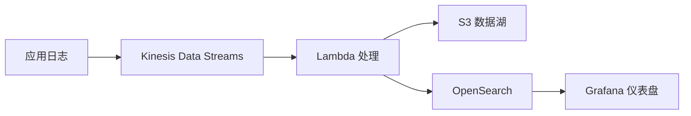

# 项目1: Kinesis 实时数据管道

> 难度: ⭐ 入门 | 预计时间: 3-4 小时

---

## 项目概述

构建一个完整的实时数据管道，使用 Kinesis 收集应用日志，Lambda 处理数据，最终存储到 S3 和 OpenSearch。



---

## 学习目标

- 创建和配置 Kinesis Data Streams
- 开发数据生产者
- 使用 Lambda 处理流数据
- 构建实时日志分析仪表盘

---

## 项目结构

```
kinesis-pipeline/
├── producer/
│   └── log_producer.py       # 日志生产器
├── lambda/
│   └── log_processor.py      # Lambda 处理函数
├── terraform/
│   └── main.tf               # 基础设施代码
├── docker-compose.yml        # 本地开发环境
└── README.md
```

---

## 实施步骤

### 步骤1: 创建 Kinesis 流

```bash
# 创建 Kinesis 流
aws kinesis create-stream \
    --stream-name application-logs \
    --shard-count 2

# 验证流创建
aws kinesis describe-stream --stream-name application-logs
```

### 步骤2: 日志生产者

```python
# producer/log_producer.py
import boto3
import json
import time
import random
from datetime import datetime

class LogProducer:
    def __init__(self, stream_name):
        self.kinesis = boto3.client('kinesis')
        self.stream_name = stream_name
        
    def generate_log(self):
        """生成模拟日志"""
        levels = ['INFO', 'WARN', 'ERROR', 'DEBUG']
        services = ['auth-service', 'payment-service', 'user-service']
        
        return {
            'timestamp': datetime.utcnow().isoformat(),
            'level': random.choice(levels),
            'service': random.choice(services),
            'message': f'Operation completed successfully',
            'user_id': f'user-{random.randint(1, 1000)}',
            'request_id': f'req-{random.randint(10000, 99999)}',
            'duration_ms': random.randint(10, 5000)
        }
    
    def send_logs(self, count=100):
        """发送日志到 Kinesis"""
        for i in range(count):
            log = self.generate_log()
            
            response = self.kinesis.put_record(
                StreamName=self.stream_name,
                Data=json.dumps(log),
                PartitionKey=log['user_id']
            )
            
            print(f"Sent log {i+1}: {response['SequenceNumber']}")
            time.sleep(0.1)  # 模拟实时流量

if __name__ == '__main__':
    producer = LogProducer('application-logs')
    producer.send_logs(1000)
```

### 步骤3: Lambda 处理函数

```python
# lambda/log_processor.py
import json
import base64
import boto3
from datetime import datetime

s3 = boto3.client('s3')
os_client = boto3.client('opensearch')

def lambda_handler(event, context):
    """处理 Kinesis 流数据"""
    
    processed_records = []
    
    for record in event['Records']:
        # 解码 Kinesis 数据
        payload = base64.b64decode(record['kinesis']['data'])
        log_data = json.loads(payload)
        
        # 处理日志
        processed_log = process_log(log_data)
        processed_records.append(processed_log)
    
    # 批量写入 S3
    write_to_s3(processed_records)
    
    # 索引到 OpenSearch
    index_to_opensearch(processed_records)
    
    return {'processed': len(processed_records)}

def process_log(log):
    """处理单条日志"""
    # 添加处理时间
    log['processed_at'] = datetime.utcnow().isoformat()
    
    # 解析时间戳
    log['hour'] = datetime.fromisoformat(log['timestamp']).hour
    
    # 错误标记
    log['is_error'] = log['level'] == 'ERROR'
    
    return log

def write_to_s3(records):
    """写入 S3"""
    import gzip
    from io import BytesIO
    
    # 按小时分区
    now = datetime.utcnow()
    key = f"logs/year={now.year}/month={now.month:02d}/day={now.day:02d}/hour={now.hour:02d}/{now.minute:02d}.json.gz"
    
    # 压缩数据
    buffer = BytesIO()
    with gzip.GzipFile(fileobj=buffer, mode='w') as f:
        for record in records:
            f.write(json.dumps(record).encode() + b'\n')
    
    s3.put_object(
        Bucket='log-data-lake',
        Key=key,
        Body=buffer.getvalue(),
        ContentType='application/gzip'
    )

def index_to_opensearch(records):
    """索引到 OpenSearch"""
    # 简化的批量索引
    for record in records:
        try:
            os_client.index(
                index=f"logs-{datetime.utcnow().strftime('%Y.%m.%d')}",
                body=record
            )
        except Exception as e:
            print(f"Index error: {e}")
```

### 步骤4: 本地开发环境

```yaml
# docker-compose.yml
version: '3.8'

services:
  # Kinesis 本地模拟 (Kinesalite)
  kinesis-local:
    image: saidsef/aws-kinesis-local:latest
    ports:
      - "4567:4567"
    environment:
      - PORT=4567
    command: --port 4567

  # OpenSearch 本地
  opensearch:
    image: opensearchproject/opensearch:latest
    ports:
      - "9200:9200"
      - "9600:9600"
    environment:
      - discovery.type=single-node
      - plugins.security.disabled=true
    volumes:
      - opensearch_data:/usr/share/opensearch/data

  # Grafana
  grafana:
    image: grafana/grafana:latest
    ports:
      - "3000:3000"
    environment:
      - GF_SECURITY_ADMIN_PASSWORD=admin
    volumes:
      - grafana_data:/var/lib/grafana

volumes:
  opensearch_data:
  grafana_data:
```

---

## 验证步骤

1. **启动本地环境**:
   ```bash
   docker-compose up -d
   ```

2. **运行生产者**:
   ```bash
   cd producer
   python log_producer.py
   ```

3. **检查 OpenSearch**:
   ```bash
   curl http://localhost:9200/logs-*/_search
   ```

4. **查看 Grafana**:
   - 打开 http://localhost:3000
   - 配置 OpenSearch 数据源
   - 创建日志仪表盘

---

## 扩展挑战

1. **添加 Kinesis Firehose** - 直接传输到 S3
2. **实现错误告警** - 检测到 ERROR 日志时发送 SNS 通知
3. **添加数据转换** - 使用 Lambda 丰富日志数据

---

## 参考文档

- [Kinesis 开发者指南](https://docs.aws.amazon.com/kinesis/latest/dev/introduction.html)
- [Lambda 与 Kinesis 集成](https://docs.aws.amazon.com/lambda/latest/dg/with-kinesis.html)
