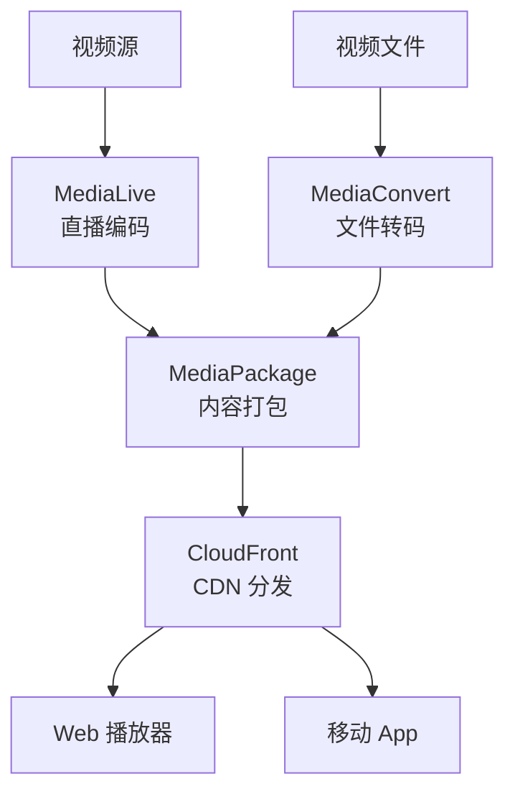
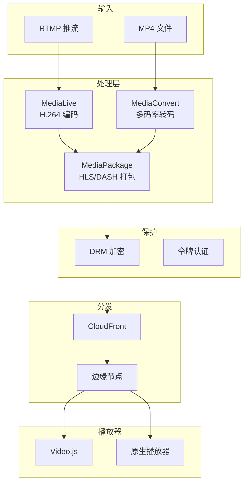

# 项目2: 视频流媒体平台

> 难度: ⭐⭐ 进阶 | 预计时间: 6-8 小时

---

## 项目概述

构建一个完整的视频流媒体平台，支持直播和点播，使用 AWS Elemental Media 服务和 CloudFront 分发。



---

## 学习目标

- 配置 MediaLive 直播频道
- 使用 MediaConvert 转码视频
- 实现 DRM 内容保护
- 构建自适应码率播放

---

## 架构图



---

## 实施步骤

### 步骤1: MediaConvert 转码模板

```python
import boto3
import json

mediaconvert = boto3.client('mediaconvert', endpoint_url='https://xxx.mediaconvert.us-east-1.amazonaws.com')

def create_job_template():
    """创建 ABR (自适应码率) 转码模板"""
    
    template = {
        "Name": "ABR-Streaming-Template",
        "Description": "多码率 HLS 输出",
        "Settings": {
            "OutputGroups": [
                {
                    "Name": "Apple HLS",
                    "OutputGroupSettings": {
                        "Type": "HLS_GROUP_SETTINGS",
                        "HlsGroupSettings": {
                            "SegmentLength": 6,
                            "MinSegmentLength": 2,
                            "Destination": "s3://video-output-bucket/hls/",
                            "SegmentControl": "SEGMENTED_FILES"
                        }
                    },
                    "Outputs": [
                        {
                            "NameModifier": "_1080p",
                            "VideoDescription": {
                                "Width": 1920,
                                "Height": 1080,
                                "CodecSettings": {
                                    "Codec": "H_264",
                                    "H264Settings": {
                                        "RateControlMode": "QVBR",
                                        "QvbrQualityLevel": 8,
                                        "MaxBitrate": 5000000
                                    }
                                }
                            },
                            "AudioDescriptions": [
                                {
                                    "CodecSettings": {
                                        "Codec": "AAC",
                                        "AacSettings": {"Bitrate": 128000}
                                    }
                                }
                            ]
                        },
                        {
                            "NameModifier": "_720p",
                            "VideoDescription": {
                                "Width": 1280,
                                "Height": 720,
                                "CodecSettings": {
                                    "Codec": "H_264",
                                    "H264Settings": {
                                        "RateControlMode": "QVBR",
                                        "QvbrQualityLevel": 7,
                                        "MaxBitrate": 2500000
                                    }
                                }
                            }
                        },
                        {
                            "NameModifier": "_480p",
                            "VideoDescription": {
                                "Width": 854,
                                "Height": 480,
                                "CodecSettings": {
                                    "Codec": "H_264",
                                    "H264Settings": {
                                        "RateControlMode": "QVBR",
                                        "QvbrQualityLevel": 6,
                                        "MaxBitrate": 1000000
                                    }
                                }
                            }
                        }
                    ]
                }
            ]
        }
    }
    
    response = mediaconvert.create_job_template(**template)
    return response['JobTemplate']['Arn']
```

### 步骤2: MediaLive 直播配置

```json
{
  "Name": "live-streaming-channel",
  "InputAttachments": [
    {
      "InputId": "rtmp-input-1",
      "InputSettings": {
        "SourceEndBehavior": "CONTINUE",
        "NetworkInputSettings": {
          "HlsInputSettings": {
            "BufferSegments": 3
          }
        }
      }
    }
  ],
  "Destinations": [
    {
      "Id": "mediapackage-destination",
      "MediaPackageSettings": [
        {
          "ChannelId": "live-channel"
        }
      ]
    }
  ],
  "EncoderSettings": {
    "VideoDescriptions": [
      {
        "Name": "video-1080p",
        "Width": 1920,
        "Height": 1080,
        "CodecSettings": {
          "H264Settings": {
            "RateControlMode": "CBR",
            "Bitrate": 5000000,
            "FramerateNumerator": 30,
            "FramerateDenominator": 1,
            "GopSize": 60
          }
        }
      },
      {
        "Name": "video-720p",
        "Width": 1280,
        "Height": 720,
        "CodecSettings": {
          "H264Settings": {
            "RateControlMode": "CBR",
            "Bitrate": 2500000
          }
        }
      }
    ],
    "OutputGroups": [
      {
        "Name": "HLS",
        "OutputGroupSettings": {
          "HlsGroupSettings": {
            "SegmentLength": 6,
            "MinSegmentLength": 2,
            "Destination": {
              "DestinationRefId": "mediapackage-destination"
            }
          }
        },
        "Outputs": [
          {
            "VideoDescriptionName": "video-1080p",
            "AudioDescriptionNames": ["audio-aac"]
          },
          {
            "VideoDescriptionName": "video-720p",
            "AudioDescriptionNames": ["audio-aac"]
          }
        ]
      }
    ]
  }
}
```

### 步骤3: CloudFront 分发配置

```yaml
# CloudFormation 配置
Resources:
  VideoDistribution:
    Type: AWS::CloudFront::Distribution
    Properties:
      DistributionConfig:
        Origins:
          - Id: MediaPackageOrigin
            DomainName: abc123.mediapackage.us-east-1.amazonaws.com
            CustomOriginConfig:
              OriginProtocolPolicy: https-only
              OriginSSLProtocols:
                - TLSv1.2
        DefaultCacheBehavior:
          TargetOriginId: MediaPackageOrigin
          ViewerProtocolPolicy: redirect-to-https
          AllowedMethods: [GET, HEAD, OPTIONS]
          CachedMethods: [GET, HEAD]
          ForwardedValues:
            QueryString: true
            Headers:
              - Origin
          TTL: 86400
          Compress: true
        PriceClass: PriceClass_100
        Enabled: true
```

### 步骤4: Web 播放器

```html
<!-- index.html -->
<!DOCTYPE html>
<html>
<head>
    <link href="https://vjs.zencdn.net/7.20.3/video-js.css" rel="stylesheet" />
</head>
<body>
    <video
        id="video-player"
        class="video-js vjs-default-skin vjs-big-play-centered"
        controls
        preload="auto"
        width="640"
        height="360"
        data-setup='{}'>
        <source src="https://d1234.cloudfront.net/live/master.m3u8" type="application/x-mpegURL">
    </video>

    <script src="https://vjs.zencdn.net/7.20.3/video.min.js"></script>
    <script>
        var player = videojs('video-player', {
            html5: {
                vhs: {
                    overrideNative: true,
                    limitRenditionByPlayerDimensions: true,
                    useDevicePixelRatio: true
                }
            }
        });
        
        player.ready(function() {
            console.log('Player ready');
        });
    </script>
</body>
</html>
```

---

## 验证步骤

1. **上传测试视频**:
   ```bash
   aws s3 cp test-video.mp4 s3://video-input-bucket/
   ```

2. **触发转码作业**:
   ```python
   python create_job.py
   ```

3. **检查输出**:
   ```bash
   aws s3 ls s3://video-output-bucket/hls/
   ```

4. **测试播放**:
   - 打开播放器页面
   - 验证自适应码率切换

---

## 扩展挑战

1. **添加 DRM** - 使用 AWS KMS 加密内容
2. **实现时移回看** - MediaPackage 时移配置
3. **广告插入** - MediaTailor 广告个性化

---

## 参考文档

- [MediaConvert 文档](https://docs.aws.amazon.com/mediaconvert/)
- [MediaLive 文档](https://docs.aws.amazon.com/medialive/)
- [HLS 播放指南](https://developer.apple.com/streaming/)
