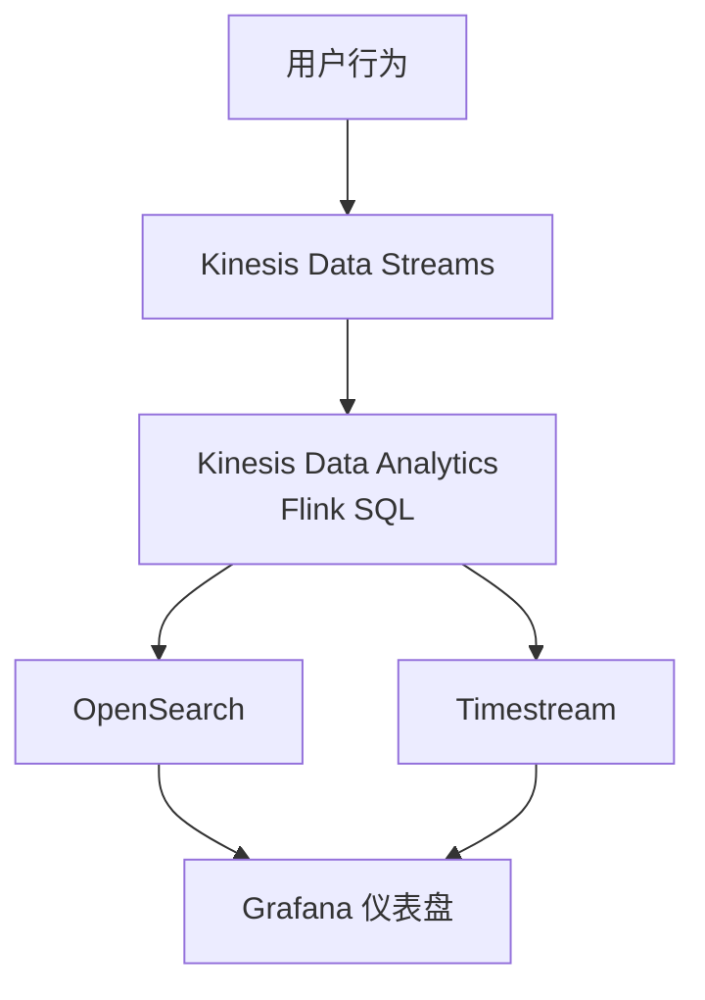
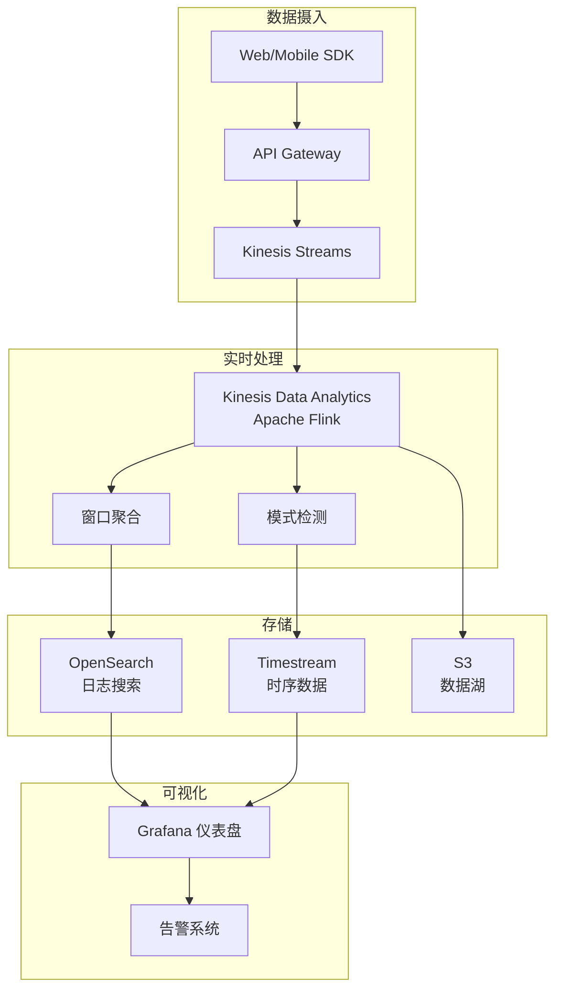

# 项目3: 实时分析仪表盘

> 难度: ⭐⭐⭐ 高级 | 预计时间: 8-10 小时

---

## 项目概述

构建一个完整的实时分析平台，处理用户行为数据，使用 Kinesis Data Analytics (Flink) 进行流处理，OpenSearch 存储，Grafana 可视化。



---

## 学习目标

- Apache Flink SQL 实时分析
- 复杂事件处理 (CEP)
- 实时异常检测
- 高性能可视化

---

## 架构图



---

## 实施步骤

### 步骤1: Flink SQL 应用

```sql
-- 创建用户行为表
CREATE TABLE user_events (
    event_id STRING,
    user_id STRING,
    event_type STRING,
    page STRING,
    product_id STRING,
    amount DECIMAL(10,2),
    event_time TIMESTAMP(3),
    WATERMARK FOR event_time AS event_time - INTERVAL '5' SECOND
) WITH (
    'connector' = 'kinesis',
    'stream' = 'user-events',
    'aws.region' = 'us-east-1',
    'scan.stream.initpos' = 'LATEST',
    'format' = 'json'
);

-- 创建指标输出表 (Timestream)
CREATE TABLE page_view_metrics (
    window_start TIMESTAMP(3),
    window_end TIMESTAMP(3),
    page STRING,
    view_count BIGINT,
    unique_users BIGINT,
    avg_duration DOUBLE,
    PRIMARY KEY (window_start, page) NOT ENFORCED
) WITH (
    'connector' = 'jdbc',
    'url' = 'jdbc:timestream://us-east-1',
    'table-name' = 'page_metrics',
    'driver' = 'com.amazonaws.timestream.jdbc.TimestreamDriver'
);

-- 创建异常输出表 (OpenSearch)
CREATE TABLE anomaly_events (
    event_time TIMESTAMP(3),
    user_id STRING,
    anomaly_type STRING,
    description STRING,
    severity STRING
) WITH (
    'connector' = 'elasticsearch-7',
    'hosts' = 'https://search-domain.us-east-1.es.amazonaws.com',
    'index' = 'anomalies',
    'document-type' = '_doc'
);

-- 实时页面浏览统计
INSERT INTO page_view_metrics
SELECT 
    TUMBLE_START(event_time, INTERVAL '1' MINUTE) as window_start,
    TUMBLE_END(event_time, INTERVAL '1' MINUTE) as window_end,
    page,
    COUNT(*) as view_count,
    COUNT(DISTINCT user_id) as unique_users,
    AVG(duration) as avg_duration
FROM user_events
WHERE event_type = 'page_view'
GROUP BY 
    TUMBLE(event_time, INTERVAL '1' MINUTE),
    page;

-- 异常检测：短时间内多次购买失败
INSERT INTO anomaly_events
SELECT 
    event_time,
    user_id,
    'PAYMENT_FAILURE_BURST' as anomaly_type,
    'Multiple payment failures in short time' as description,
    'HIGH' as severity
FROM (
    SELECT 
        event_time,
        user_id,
        COUNT(*) as failure_count
    FROM user_events
    WHERE event_type = 'payment_failed'
    GROUP BY 
        user_id,
        TUMBLE(event_time, INTERVAL '5' MINUTE)
    HAVING COUNT(*) >= 3
);

-- 热门商品实时排行
CREATE TABLE hot_products (
    window_time TIMESTAMP(3),
    product_id STRING,
    order_count BIGINT,
    total_amount DECIMAL(12,2),
    PRIMARY KEY (window_time, product_id) NOT ENFORCED
) WITH (
    'connector' = 'elasticsearch-7',
    'hosts' = 'https://search-domain.us-east-1.es.amazonaws.com',
    'index' = 'hot-products'
);

INSERT INTO hot_products
SELECT 
    HOP_END(event_time, INTERVAL '5' MINUTE, INTERVAL '1' HOUR) as window_time,
    product_id,
    COUNT(*) as order_count,
    SUM(amount) as total_amount
FROM user_events
WHERE event_type = 'purchase'
GROUP BY 
    product_id,
    HOP(event_time, INTERVAL '5' MINUTE, INTERVAL '1' HOUR)
ORDER BY order_count DESC;
```

### 步骤2: 数据生成器

```python
import boto3
import json
import random
import time
from datetime import datetime
from concurrent.futures import ThreadPoolExecutor

class DataGenerator:
    """生成模拟用户行为数据"""
    
    def __init__(self, stream_name):
        self.kinesis = boto3.client('kinesis')
        self.stream_name = stream_name
        self.pages = ['/home', '/products', '/cart', '/checkout', '/profile']
        self.products = ['prod-001', 'prod-002', 'prod-003', 'prod-004', 'prod-005']
        
    def generate_event(self):
        """生成单个事件"""
        event_types = ['page_view', 'click', 'add_to_cart', 'purchase', 'payment_failed']
        weights = [0.5, 0.2, 0.15, 0.1, 0.05]
        
        event_type = random.choices(event_types, weights=weights)[0]
        
        event = {
            'event_id': f'evt-{random.randint(100000, 999999)}',
            'user_id': f'user-{random.randint(1, 10000)}',
            'event_type': event_type,
            'event_time': datetime.utcnow().isoformat(),
            'page': random.choice(self.pages),
            'session_id': f'sess-{random.randint(10000, 99999)}',
            'ip': f'192.168.{random.randint(0,255)}.{random.randint(0,255)}',
            'user_agent': 'Mozilla/5.0...'
        }
        
        if event_type in ['add_to_cart', 'purchase']:
            event['product_id'] = random.choice(self.products)
            event['amount'] = round(random.uniform(10, 500), 2)
            event['quantity'] = random.randint(1, 5)
        
        if event_type == 'page_view':
            event['duration'] = random.randint(1, 300)
        
        return event
    
    def send_batch(self, batch_size=500):
        """批量发送"""
        records = []
        
        for _ in range(batch_size):
            event = self.generate_event()
            records.append({
                'Data': json.dumps(event),
                'PartitionKey': event['user_id']
            })
        
        response = self.kinesis.put_records(
            StreamName=self.stream_name,
            Records=records
        )
        
        failed = response.get('FailedRecordCount', 0)
        return batch_size - failed, failed
    
    def run(self, duration_minutes=10, throughput_per_second=1000):
        """持续生成数据"""
        print(f"Starting data generation: {throughput_per_second} events/sec for {duration_minutes} minutes")
        
        batch_size = 500
        batches_per_second = throughput_per_second // batch_size
        
        start_time = time.time()
        total_sent = 0
        
        while time.time() - start_time < duration_minutes * 60:
            for _ in range(batches_per_second):
                sent, failed = self.send_batch(batch_size)
                total_sent += sent
            
            time.sleep(1)
            
            if int(time.time() - start_time) % 10 == 0:
                print(f"Sent: {total_sent} events")
        
        print(f"Total events sent: {total_sent}")

if __name__ == '__main__':
    generator = DataGenerator('user-events')
    generator.run(duration_minutes=30, throughput_per_second=2000)
```

### 步骤3: Grafana 仪表盘配置

```json
{
  "dashboard": {
    "title": "实时用户行为分析",
    "panels": [
      {
        "title": "实时 QPS",
        "type": "stat",
        "targets": [
          {
            "expr": "sum(rate(events_total[1m]))",
            "legendFormat": "QPS"
          }
        ],
        "fieldConfig": {
          "defaults": {
            "unit": "reqps"
          }
        }
      },
      {
        "title": "页面浏览量 (1分钟窗口)",
        "type": "graph",
        "targets": [
          {
            "query": "SELECT * FROM \"page_metrics\" WHERE $timeFilter",
            "format": "time_series"
          }
        ]
      },
      {
        "title": "异常事件",
        "type": "table",
        "targets": [
          {
            "query": "SELECT event_time, user_id, anomaly_type, description FROM \"anomalies\" WHERE $timeFilter ORDER BY event_time DESC LIMIT 100"
          }
        ]
      },
      {
        "title": "热门商品 Top 10",
        "type": "bar gauge",
        "targets": [
          {
            "query": "SELECT product_id, order_count FROM \"hot-products\" WHERE $timeFilter ORDER BY order_count DESC LIMIT 10"
          }
        ]
      }
    ]
  }
}
```

### 步骤4: 告警系统

```python
import boto3

sns = boto3.client('sns')

def check_anomalies():
    """检查异常并发送告警"""
    
    # 查询最近异常
    es = boto3.client('opensearch')
    
    query = {
        "query": {
            "bool": {
                "must": [
                    {"term": {"severity": "HIGH"}},
                    {"range": {"event_time": {"gte": "now-5m"}}}
                ]
            }
        }
    }
    
    response = es.search(index="anomalies", body=query)
    
    if response['hits']['total']['value'] > 0:
        # 发送告警
        anomalies = [hit['_source'] for hit in response['hits']['hits']]
        
        message = {
            "default": f"检测到 {len(anomalies)} 个高严重性异常",
            "email": f"最近5分钟内检测到 {len(anomalies)} 个异常事件:\n" + 
                     "\n".join([f"- {a['anomaly_type']}: {a['description']}" for a in anomalies])
        }
        
        sns.publish(
            TopicArn='arn:aws:sns:us-east-1:123456789:alerts',
            Message=json.dumps(message),
            MessageStructure='json'
        )
```

---

## 验证步骤

1. **启动 Flink 应用**:
   ```bash
   aws kinesisanalyticsv2 create-application \
       --application-name real-time-analytics \
       --runtime-environment FLINK-1_15 \
       --service-execution-role arn:aws:iam::123456789:role/kinesis-analytics-role
   ```

2. **运行数据生成器**:
   ```bash
   python data_generator.py
   ```

3. **查看 Grafana**:
   - 导入仪表盘配置
   - 验证实时数据更新

4. **测试告警**:
   - 模拟异常行为
   - 验证 SNS 通知

---

## 扩展挑战

1. **机器学习集成** - 使用 SageMaker 进行异常检测
2. **实时推荐** - 基于用户行为的实时推荐
3. **多租户支持** - 按客户隔离数据

---

## 参考文档

- [Flink SQL 文档](https://nightlies.apache.org/flink/flink-docs-stable/docs/dev/table/sql/)
- [OpenSearch 查询 DSL](https://opensearch.org/docs/latest/query-dsl/)
- [Grafana Timestream](https://grafana.com/docs/grafana/latest/datasources/aws-timestream/)
