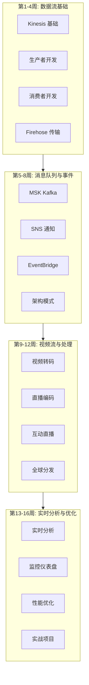

# 流媒体技术 16周学习路线图

> 从数据采集到实时分析的完整学习路径

---

## 🗺️ 学习路线图概览

---

## 📅 详细学习计划

### 第1周: Kinesis 基础

**学习目标**: 理解流数据概念和 Kinesis 核心服务

| 天数 | 主题 | 实践任务 |
|------|------|----------|
| 第1天 | 流数据概念 | 了解生产者-消费者模型 |
| 第2天 | Kinesis Data Streams | 创建第一个流 |
| 第3天 | 分片和分区 | 理解分区键设计 |
| 第4天 | 记录生命周期 | 数据保留和重放 |
| 第5天 | CLI 操作 | 使用 AWS CLI 管理流 |
| 第6天 | SDK 入门 | Python SDK 基础 |
| 第7天 | 周复习 | 创建完整流应用 |

---

### 第2周: 生产者开发

**学习目标**: 掌握数据生产最佳实践

| 天数 | 主题 | 实践任务 |
|------|------|----------|
| 第1天 | PutRecord API | 单条记录发送 |
| 第2天 | PutRecords API | 批量发送优化 |
| 第3天 | 分区键策略 | 避免热分区 |
| 第4天 | 错误处理 | 重试和失败处理 |
| 第5天 | 聚合 | 记录聚合优化 |
| 第6天 | KPL (Kinesis Producer Library) | 高级生产者库 |
| 第7天 | 周复习 | 高吞吐量生产者 |

---

### 第3周: 消费者开发

**学习目标**: 实现高效的数据消费者

| 天数 | 主题 | 实践任务 |
|------|------|----------|
| 第1天 | GetRecords API | 基础消费模式 |
| 第2天 | 分片迭代器 | 位置和重放 |
| 第3天 | Lambda 消费者 | 无服务器消费 |
| 第4天 | KCL 消费者 | 高级消费库 |
| 第5天 | 检查点管理 | 偏移量管理 |
| 第6天 | 消费者组 | 并行处理 |
| 第7天 | 周复习 | 完整消费应用 |

---

### 第4周: Firehose 与数据传输

**学习目标**: 掌握数据 ETL 和传输

| 天数 | 主题 | 实践任务 |
|------|------|----------|
 第1天 | Firehose 基础 | 创建交付流 |
| 第2天 | S3 目的地 | 数据湖构建 |
| 第3天 | 数据转换 | Lambda 转换 |
| 第4天 | 格式转换 | JSON 到 Parquet |
| 第5天 | OpenSearch | 日志搜索 |
| 第6天 | 动态分区 | 智能分区策略 |
| 第7天 | 周复习 | 项目1准备 |

---

### 第5周: MSK 与 Kafka

**学习目标**: 掌握托管 Kafka 服务

| 天数 | 主题 | 实践任务 |
|------|------|----------|
| 第1天 | Kafka 基础 | 创建 MSK 集群 |
| 第2天 | Topic 管理 | 创建和配置 Topic |
| 第3天 | 生产者 | Kafka 生产者开发 |
| 第4天 | 消费者 | 消费者组管理 |
| 第5天 | 分区策略 | 自定义分区器 |
| 第6天 | 与 Lambda 集成 | MSK 触发 Lambda |
| 第7天 | 周复习 | Kafka 应用开发 |

---

### 第6周: SNS 和 SQS

**学习目标**: 理解消息队列和通知

| 天数 | 主题 | 实践任务 |
|------|------|----------|
| 第1天 | SNS 基础 | 创建主题和订阅 |
| 第2天 | SQS 基础 | 创建队列 |
| 第3天 | SNS+SQS 集成 | 扇出模式 |
| 第4天 | 消息过滤 | 订阅过滤策略 |
| 第5天 | FIFO 队列 | 顺序保证 |
| 第6天 | 死信队列 | 错误处理 |
| 第7天 | 周复习 | 消息系统实践 |

---

### 第7周: EventBridge

**学习目标**: 构建事件驱动架构

| 天数 | 主题 | 实践任务 |
|------|------|----------|
| 第1天 | EventBridge 基础 | 事件总线和规则 |
| 第2天 | 事件模式 | 模式匹配 |
| 第3天 | 自定义事件 | 应用集成 |
| 第4天 | SaaS 集成 | 第三方服务 |
| 第5天 | 事件存档 | 事件重放 |
| 第6天 | Schema Registry | 事件模式管理 |
| 第7天 | 周复习 | 事件驱动应用 |

---

### 第8周: 架构模式

**学习目标**: 掌握流处理架构模式

| 天数 | 主题 | 实践任务 |
|------|------|----------|
| 第1天 | 发布订阅 | Pub/Sub 模式 |
| 第2天 | 事件溯源 | Event Sourcing |
| 第3天 | CQRS | 读写分离 |
| 第4天 | Saga 模式 | 分布式事务 |
| 第5天 | 竞争消费者 | 负载均衡 |
| 第6天 | 管道过滤器 | 数据处理链 |
| 第7天 | 周复习 | 项目2准备 |

---

### 第9周: 视频转码 (MediaConvert)

**学习目标**: 掌握视频文件处理

| 天数 | 主题 | 实践任务 |
|------|------|----------|
| 第1天 | 视频格式基础 | 了解编码格式 |
| 第2天 | MediaConvert 入门 | 创建转码作业 |
| 第3天 | HLS/DASH 输出 | 自适应码率 |
| 第4天 | 预设和模板 | 自定义模板 |
| 第5天 | 水印和字幕 | 视频处理 |
| 第6天 | DRM 加密 | 内容保护 |
| 第7天 | 周复习 | 转码流水线 |

---

### 第10周: 直播编码 (MediaLive)

**学习目标**: 实现直播频道管理

| 天数 | 主题 | 实践任务 |
|------|------|----------|
| 第1天 | 直播基础 | 输入和输出 |
| 第2天 | 创建频道 | 直播配置 |
| 第3天 | 多码率输出 | ABR 直播 |
| 第4天 | 输入切换 | 直播控制 |
| 第5天 | 字幕和图文 | 直播增强 |
| 第6天 | 录制和存档 | 时移回看 |
| 第7天 | 周复习 | 直播频道管理 |

---

### 第11周: 互动直播 (IVS)

**学习目标**: 构建低延迟直播应用

| 天数 | 主题 | 实践任务 |
|------|------|----------|
| 第1天 | IVS 基础 | 创建频道和流密钥 |
| 第2天 | Web 播放器 | 播放器集成 |
| 第3天 | 实时 Metadata | 互动功能 |
| 第4天 | 录制存储 | 视频存档 |
| 第5天 | 多主播 | 舞台功能 |
| 第6天 | 聊天功能 | 实时聊天 |
| 第7天 | 周复习 | 互动直播应用 |

---

### 第12周: CDN 与分发

**学习目标**: 全球内容分发

| 天数 | 主题 | 实践任务 |
|------|------|----------|
| 第1天 | CloudFront 基础 | 分发配置 |
| 第2天 | 缓存策略 | 优化缓存 |
| 第3天 | 签名 URL | 访问控制 |
| 第4天 | Lambda@Edge | 边缘计算 |
| 第5天 | Global Accelerator | 全球加速 |
| 第6天 | 多 CDN 策略 | 负载均衡 |
| 第7天 | 周复习 | 项目3准备 |

---

### 第13周: 实时分析

**学习目标**: 流数据实时分析

| 天数 | 主题 | 实践任务 |
|------|------|----------|
| 第1天 | Kinesis Analytics | Flink 应用 |
| 第2天 | 窗口操作 | 时间窗口 |
| 第3天 | 聚合计算 | 实时指标 |
| 第4天 | 模式检测 | 异常检测 |
| 第5天 | OpenSearch | 日志分析 |
| 第6天 | Timestream | 时序数据 |
| 第7天 | 周复习 | 分析流水线 |

---

### 第14周: 监控仪表盘

**学习目标**: 构建监控体系

| 天数 | 主题 | 实践任务 |
|------|------|----------|
| 第1天 | CloudWatch 指标 | 流监控 |
| 第2天 | CloudWatch Logs | 日志分析 |
| 第3天 | Grafana 搭建 | 可视化 |
| 第4天 | 自定义仪表盘 | 业务指标 |
| 第5天 | 告警配置 | 自动告警 |
| 第6天 | X-Ray 追踪 | 分布式追踪 |
| 第7天 | 周复习 | 监控体系 |

---

### 第15周: 性能优化

**学习目标**: 优化成本和性能

| 天数 | 主题 | 实践任务 |
|------|------|----------|
| 第1天 | 分片优化 | 自动扩展 |
| 第2天 | 批处理 | 吞吐量优化 |
| 第3天 | 压缩 | 传输优化 |
| 第4天 | 成本分析 | 账单优化 |
| 第5天 | 预留容量 | 预购规划 |
| 第6天 | 多区域 | 灾难恢复 |
| 第7天 | 周复习 | 优化检查 |

---

### 第16周: 综合实战

**学习目标**: 完成端到端项目

| 天数 | 主题 | 实践任务 |
|------|------|----------|
| 第1天 | 架构设计 | 系统设计 |
| 第2天 | 数据摄入 | Kinesis 配置 |
| 第3天 | 实时处理 | 流分析 |
| 第4天 | 视频处理 | 媒体服务 |
| 第5天 | 分发部署 | CDN 配置 |
| 第6天 | 监控运维 | 完整监控 |
| 第7天 | 项目总结 | 成果展示 |

---

## 📚 学习资源

### 官方资源

- [Kinesis 文档](https://docs.aws.amazon.com/kinesis/)
- [MSK 文档](https://docs.aws.amazon.com/msk/)
- [Elemental 文档](https://docs.aws.amazon.com/elemental/)
- [IVS 文档](https://docs.aws.amazon.com/ivs/)

### 推荐书籍

- 《Streaming Systems》
- 《Kafka: The Definitive Guide》
- 《Designing Data-Intensive Applications》

---

## ✅ 每周检查清单

### 每日任务
- [ ] 阅读当日主题文档
- [ ] 完成实践练习
- [ ] 记录学习笔记

### 每周任务
- [ ] 完成周复习
- [ ] 通过知识测验
- [ ] 更新学习进度

---

祝学习顺利！🎉
