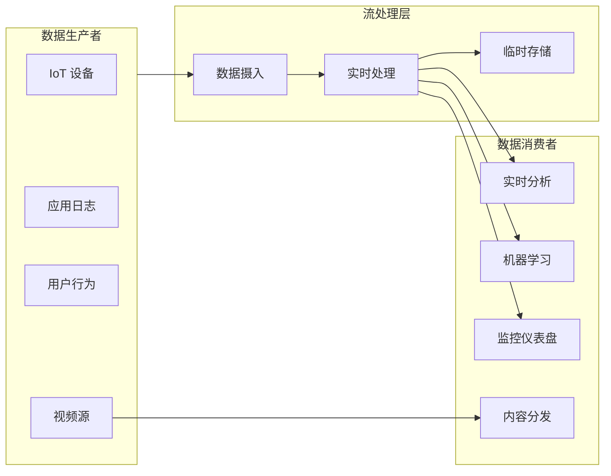
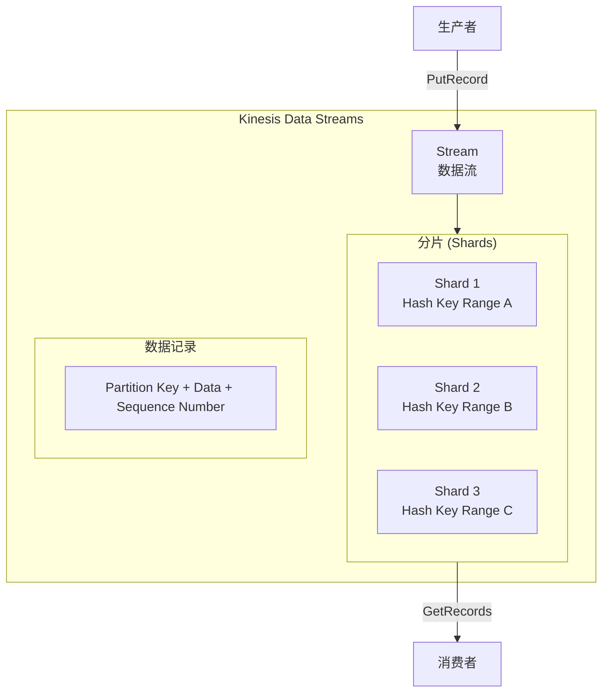
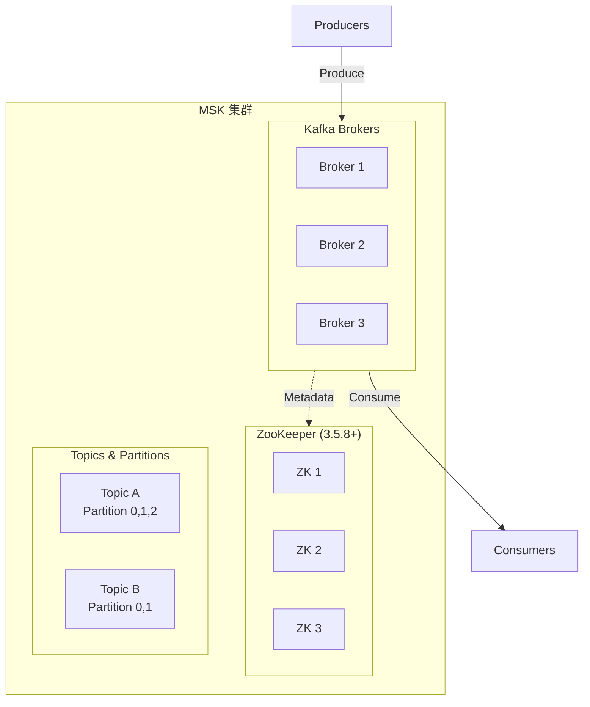
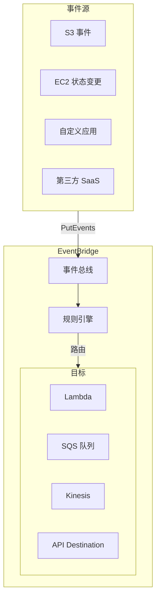
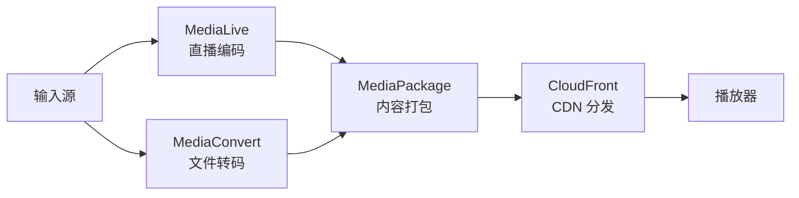
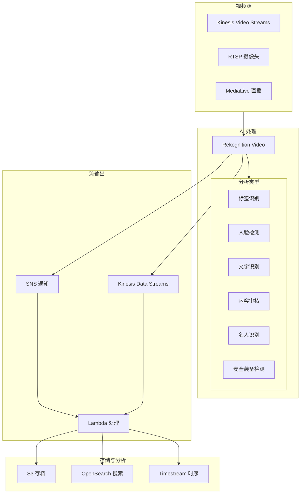
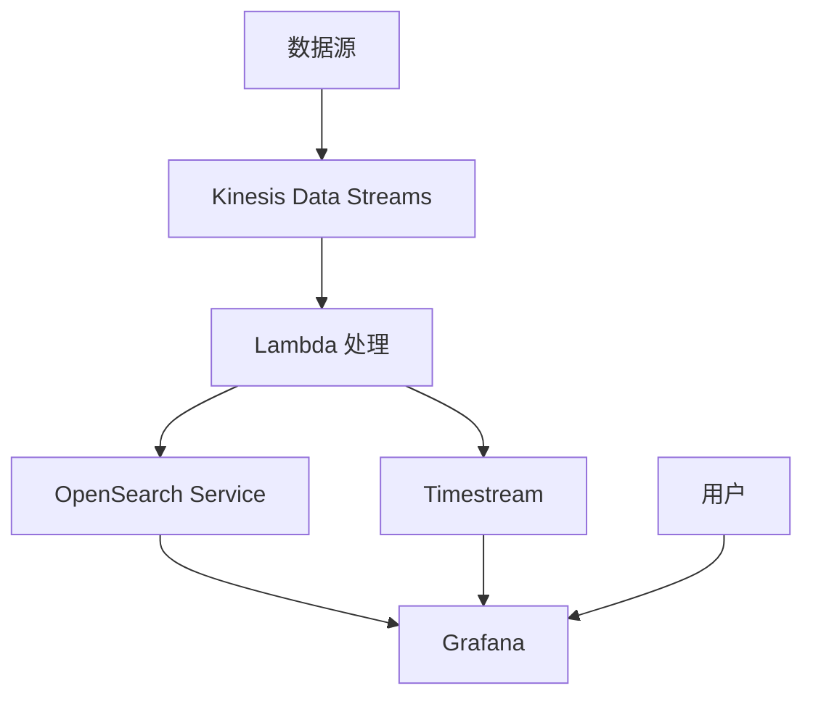
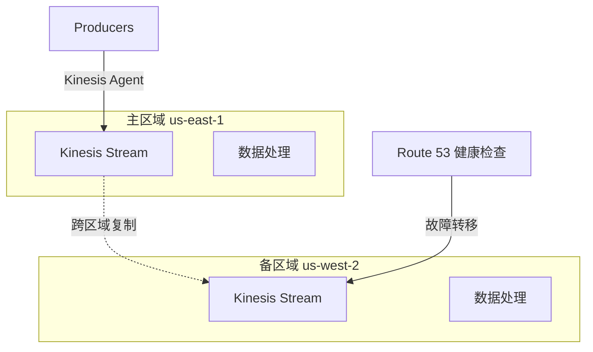

# AWS 流媒体技术白皮书

> 实时数据流与视频流处理完整指南

---

## 目录

> **学习指引**: 本白皮书按"数据流基础→视频流处理→实时分析→生产运维"递进。前4章掌握数据流核心技术，中间4章扩展视频与AI能力，后5章聚焦生产实践。

1. **[流媒体概述](#1-流媒体概述)**  
   *建立流处理思维：理解流数据特征、AWS 流服务矩阵、实时 vs 批处理选型，为后续技术学习奠定概念基础。*

2. **[Amazon Kinesis 数据流](#2-amazon-kinesis-数据流)**  
   *掌握核心流服务：深入学习 Kinesis Data Streams、Firehose、Analytics——AWS 实时数据处理的基石服务。*

3. **[Amazon MSK 托管 Kafka](#3-amazon-msk-托管-kafka)**  
   *替代消息队列方案：对比 Kinesis 后学习托管 Kafka，理解何时选择 MSK 及其生态兼容性优势。*

4. **[事件驱动架构](#4-事件驱动架构)**  
   *构建松耦合系统：学习 EventBridge、SNS、SQS 集成模式，掌握事件溯源、CQRS 等架构设计。*

5. **[AWS Elemental 视频服务](#5-aws-elemental-视频服务)**  
   *视频处理基础设施：深入 MediaConvert、MediaLive、MediaPackage，掌握 VOD 转码和直播编码技术。*

6. **[Amazon IVS 互动直播](#6-amazon-ivs-互动直播)**  
   *低延迟直播解决方案：学习 IVS 实时直播、Metadata 注入、观众互动功能，对比传统直播方案。*

7. **[AWS Rekognition 实时视频 AI 识别](#7-aws-rekognition-实时视频-ai-识别)**  
   *视频智能分析：结合 Kinesis Video Streams 与 Rekognition，实现实时人脸检测、内容审核、标签识别。*

8. **[实时数据分析](#8-实时数据分析)**  
   *流数据价值挖掘：学习 Flink SQL、OpenSearch、Timestream，从流数据中提取实时洞察。*

9. **[全球分发与 CDN](#9-全球分发与-cdn)**  
   *触达全球用户：掌握 CloudFront 视频分发、Global Accelerator、边缘缓存策略，优化全球访问体验。*

10. **[监控与可观测性](#10-监控与可观测性)**  
    *洞察流处理健康：学习流处理专用监控指标、延迟分析、消费者滞后检测，构建流系统可观测性。*

11. **[安全与合规](#11-安全与合规)**  
    *保护流数据：学习流加密、访问控制、VPC 端点、GDPR 合规，确保实时数据安全。*

12. **[性能优化与成本控制](#12-性能优化与成本控制)**  
    *高效流处理：掌握分片优化、批处理、自动扩展、预留容量，在保证性能的同时控制成本。*

13. **[生产部署最佳实践](#13-生产部署最佳实践)**  
    *稳定运行保障：整合前述所有知识，学习多区域容灾、 Exactly-Once 语义、监控告警等生产级实践。*

---

## 1. 流媒体概述

### 1.1 什么是流媒体

流媒体是指连续的数据传输和处理，数据在生成后立即被处理和消费，而不需要等待全部数据到达。



### 1.2 AWS 流媒体服务分类

| 服务类型 | AWS 服务 | 适用场景 |
|----------|----------|----------|
| **实时数据流** | Kinesis Data Streams | 日志收集、事件处理 |
| **数据传输** | Kinesis Firehose | 数据 ETL、数据湖构建 |
| **流分析** | Kinesis Data Analytics | 实时指标、异常检测 |
| **托管 Kafka** | MSK | 消息队列、事件总线 |
| **视频直播** | MediaLive | 直播编码、频道管理 |
| **视频转码** | MediaConvert | 文件转码、格式转换 |
| **视频分发** | MediaPackage | 内容打包、DRM |
| **互动直播** | IVS | 低延迟直播、互动功能 |

---

## 2. Amazon Kinesis 数据流

### 2.1 Kinesis Data Streams 核心概念



**核心概念**:
- **Stream**: 数据流，由多个分片组成
- **Shard**: 数据分片，每个分片提供 1MB/s 写入和 2MB/s 读取
- **Partition Key**: 用于决定数据进入哪个分片
- **Sequence Number**: 每个记录的唯一标识

### 2.2 Kinesis 生产者代码示例

```python
import boto3
import json
from datetime import datetime

# 创建 Kinesis 客户端
kinesis = boto3.client('kinesis', region_name='us-east-1')

def put_log_record(log_data):
    """发送日志记录到 Kinesis"""
    response = kinesis.put_record(
        StreamName='application-logs',
        Data=json.dumps(log_data),
        PartitionKey=log_data['user_id']  # 使用用户 ID 作为分区键
    )
    return response['SequenceNumber']

def put_records_batch(records):
    """批量发送记录（推荐）"""
    kinesis_records = [
        {
            'Data': json.dumps(record),
            'PartitionKey': record.get('user_id', 'default')
        }
        for record in records
    ]
    
    response = kinesis.put_records(
        StreamName='application-logs',
        Records=kinesis_records
    )
    
    # 检查失败记录
    if response['FailedRecordCount'] > 0:
        failed_records = [
            kinesis_records[i]
            for i, record in enumerate(response['Records'])
            if 'ErrorCode' in record
        ]
        print(f"Failed records: {len(failed_records)}")
        # 重试逻辑
    
    return response

# 使用示例
log_event = {
    'timestamp': datetime.utcnow().isoformat(),
    'level': 'INFO',
    'message': 'User login successful',
    'user_id': 'user-12345',
    'ip': '192.168.1.1',
    'service': 'auth-service'
}

put_log_record(log_event)
```

### 2.3 Kinesis 消费者 (Lambda 和 SDK)

```python
# Lambda 消费者处理函数
import base64
import json

def lambda_handler(event, context):
    """处理 Kinesis 数据流的 Lambda 函数"""
    
    for record in event['Records']:
        # Kinesis 数据是 Base64 编码的
        payload = base64.b64decode(record['kinesis']['data'])
        data = json.loads(payload)
        
        # 处理数据
        process_log(data)
        
        # 记录处理信息
        print(f"Processed record: {record['kinesis']['sequenceNumber']}")
    
    return {'statusCode': 200}

def process_log(data):
    """处理日志数据"""
    if data['level'] == 'ERROR':
        # 发送告警
        send_alert(data)
    
    # 写入 S3 或 OpenSearch
    store_log(data)

# 使用 KCL (Kinesis Client Library) 的高级消费者
from amazon_kclpy import kcl

class RecordProcessor(kcl.RecordProcessor):
    """自定义记录处理器"""
    
    def process_records(self, records, checkpointer):
        for record in records:
            data = record.binary_data.decode('utf-8')
            print(f"Processing: {data}")
        
        # 检查点保存进度
        checkpointer.checkpoint()
```

### 2.4 Kinesis Firehose 数据传输

```python
# Firehose 交付流配置
import boto3

firehose = boto3.client('firehose')

# 创建 Firehose 交付流到 S3
response = firehose.create_delivery_stream(
    DeliveryStreamName='logs-to-s3',
    DeliveryStreamType='DirectPut',
    ExtendedS3DestinationConfiguration={
        'RoleARN': 'arn:aws:iam::123456789:role/firehose-role',
        'BucketARN': 'arn:aws:s3:::data-lake-bucket',
        'Prefix': 'logs/year=!{timestamp:yyyy}/month=!{timestamp:MM}/day=!{timestamp:dd}/',
        'ErrorOutputPrefix': 'errors/',
        'BufferingHints': {
            'SizeInMBs': 64,
            'IntervalInSeconds': 60
        },
        'CompressionFormat': 'GZIP',
        'FormatConverterConfiguration': {
            'SchemaConfiguration': {
                'DatabaseName': 'analytics',
                'TableName': 'logs',
                'RoleARN': 'arn:aws:iam::123456789:role/firehose-role'
            },
            'InputFormatConfiguration': {
                'Deserializer': {
                    'OpenXJsonSerDe': {}
                }
            },
            'OutputFormatConfiguration': {
                'Serializer': {
                    'ParquetSerDe': {}
                }
            }
        }
    }
)

# 发送数据到 Firehose
def send_to_firehose(data):
    firehose.put_record(
        DeliveryStreamName='logs-to-s3',
        Record={'Data': json.dumps(data).encode()}
    )
```

### 2.5 Kinesis Data Analytics 实时分析

```sql
-- 使用 Apache Flink SQL 进行实时分析
-- 创建输入表
CREATE TABLE user_events (
    user_id VARCHAR,
    event_type VARCHAR,
    event_time TIMESTAMP(3),
    properties ROW<page VARCHAR, duration INT>,
    WATERMARK FOR event_time AS event_time - INTERVAL '5' SECOND
) WITH (
    'connector' = 'kinesis',
    'stream' = 'user-events',
    'aws.region' = 'us-east-1',
    'scan.stream.initpos' = 'LATEST',
    'format' = 'json'
);

-- 创建输出表
CREATE TABLE page_view_metrics (
    window_start TIMESTAMP(3),
    window_end TIMESTAMP(3),
    page VARCHAR,
    view_count BIGINT,
    avg_duration DOUBLE,
    PRIMARY KEY (window_start, page) NOT ENFORCED
) WITH (
    'connector' = 'elasticsearch-7',
    'hosts' = 'https://search-my-domain.us-east-1.es.amazonaws.com',
    'index' = 'page-metrics',
    'format' = 'json'
);

-- 实时聚合查询
INSERT INTO page_view_metrics
SELECT 
    TUMBLE_START(event_time, INTERVAL '1' MINUTE) as window_start,
    TUMBLE_END(event_time, INTERVAL '1' MINUTE) as window_end,
    properties.page,
    COUNT(*) as view_count,
    AVG(properties.duration) as avg_duration
FROM user_events
WHERE event_type = 'page_view'
GROUP BY 
    TUMBLE(event_time, INTERVAL '1' MINUTE),
    properties.page;
```

---

## 3. Amazon MSK 托管 Kafka

### 3.1 MSK 架构与优势



**MSK 优势**:
- 完全托管，无需维护 Kafka 集群
- 自动补丁和版本升级
- 与 AWS IAM 集成进行安全控制
- VPC 网络隔离
- CloudWatch 监控集成

### 3.2 MSK 生产者与消费者

```python
from kafka import KafkaProducer, KafkaConsumer
import json
import ssl

# MSK 配置
bootstrap_servers = [
    'b-1.my-cluster.kafka.us-east-1.amazonaws.com:9094',
    'b-2.my-cluster.kafka.us-east-1.amazonaws.com:9094'
]

# SSL 配置 (MSK 默认启用 TLS)
ssl_context = ssl.create_default_context()

# 生产者
producer = KafkaProducer(
    bootstrap_servers=bootstrap_servers,
    security_protocol='SSL',
    ssl_context=ssl_context,
    value_serializer=lambda v: json.dumps(v).encode('utf-8'),
    key_serializer=lambda k: k.encode('utf-8') if k else None
)

# 发送消息
future = producer.send(
    'orders-topic',
    key='order-12345',
    value={
        'order_id': 'order-12345',
        'customer_id': 'cust-67890',
        'amount': 99.99,
        'timestamp': '2024-01-15T10:30:00Z'
    }
)

# 等待确认
record_metadata = future.get(timeout=10)
print(f"Sent to partition {record_metadata.partition}, offset {record_metadata.offset}")

# 消费者 (消费者组)
consumer = KafkaConsumer(
    'orders-topic',
    bootstrap_servers=bootstrap_servers,
    security_protocol='SSL',
    ssl_context=ssl_context,
    group_id='order-processors',
    auto_offset_reset='latest',
    enable_auto_commit=False,  # 手动提交偏移量
    value_deserializer=lambda v: json.loads(v.decode('utf-8'))
)

# 消费消息
for message in consumer:
    print(f"Received: {message.value}")
    
    # 处理消息
    process_order(message.value)
    
    # 手动提交偏移量
    consumer.commit()
```

### 3.3 MSK 与 Lambda 集成

```yaml
# SAM 模板: MSK 触发 Lambda
Resources:
  OrderProcessorFunction:
    Type: AWS::Serverless::Function
    Properties:
      Handler: app.handler
      Runtime: python3.11
      CodeUri: src/
      Events:
        MSKEvent:
          Type: MSK
          Properties:
            StartingPosition: LATEST
            Stream: arn:aws:kafka:us-east-1:123456789:cluster/my-cluster/abc123-456
            Topics:
              - orders-topic
            ConsumerGroupId: lambda-order-processors
            FilterCriteria:
              Filters:
                - Pattern: '{"data":{"amount":[{"numeric":[">",100]}]}}'
```

---

## 4. 事件驱动架构

### 4.1 EventBridge 事件总线



```python
# EventBridge 事件发布
import boto3
events = boto3.client('events')

def publish_order_created(order_data):
    """发布订单创建事件"""
    response = events.put_events(
        Entries=[
            {
                'Source': 'order.service',
                'DetailType': 'Order Created',
                'Detail': json.dumps({
                    'orderId': order_data['id'],
                    'customerId': order_data['customer_id'],
                    'amount': order_data['amount'],
                    'timestamp': datetime.utcnow().isoformat()
                }),
                'EventBusName': 'custom-event-bus'
            }
        ]
    )
    return response
```

### 4.2 SNS + SQS 消息模式

```yaml
# CloudFormation: SNS + SQS 扇出模式
Resources:
  OrderTopic:
    Type: AWS::SNS::Topic
    Properties:
      TopicName: order-events
      
  InventoryQueue:
    Type: AWS::SQS::Queue
    Properties:
      QueueName: inventory-updates
      VisibilityTimeout: 300
      
  NotificationQueue:
    Type: AWS::SQS::Queue
    Properties:
      QueueName: customer-notifications
      
  # SNS 订阅 SQS
  InventorySubscription:
    Type: AWS::SNS::Subscription
    Properties:
      TopicArn: !Ref OrderTopic
      Endpoint: !GetAtt InventoryQueue.Arn
      Protocol: sqs
      FilterPolicy:
        eventType:
          - order_created
          - order_cancelled
          
  NotificationSubscription:
    Type: AWS::SNS::Subscription
    Properties:
      TopicArn: !Ref OrderTopic
      Endpoint: !GetAtt NotificationQueue.Arn
      Protocol: sqs
```

---

## 5. AWS Elemental 视频服务

### 5.1 视频处理工作流



### 5.2 MediaLive 直播频道配置

```json
{
  "Name": "live-channel-1",
  "InputAttachments": [
    {
      "InputId": "input-rtmp-1",
      "InputSettings": {
        "SourceEndBehavior": "LOOP",
        "NetworkInputSettings": {
          "HlsInputSettings": {
            "BufferSegments": 3
          }
        }
      }
    }
  ],
  "Destinations": [
    {
      "Id": "destination-1",
      "MediaPackageSettings": [
        {
          "ChannelId": "mediapackage-channel-1"
        }
      ]
    }
  ],
  "EncoderSettings": {
    "VideoDescriptions": [
      {
        "Name": "video-1080p",
        "Width": 1920,
        "Height": 1080,
        "CodecSettings": {
          "H264Settings": {
            "RateControlMode": "CBR",
            "Bitrate": 5000000,
            "FramerateNumerator": 30,
            "FramerateDenominator": 1
          }
        }
      },
      {
        "Name": "video-720p",
        "Width": 1280,
        "Height": 720,
        "CodecSettings": {
          "H264Settings": {
            "RateControlMode": "CBR",
            "Bitrate": 2500000
          }
        }
      }
    ],
    "AudioDescriptions": [
      {
        "Name": "audio-aac",
        "CodecSettings": {
          "AacSettings": {
            "Bitrate": 128000,
            "CodingMode": "CODING_MODE_2_0"
          }
        }
      }
    ],
    "OutputGroups": [
      {
        "Name": "HLS",
        "OutputGroupSettings": {
          "HlsGroupSettings": {
            "SegmentLength": 6,
            "MinSegmentLength": 2
          }
        },
        "Outputs": [
          {
            "VideoDescriptionName": "video-1080p",
            "AudioDescriptionNames": ["audio-aac"]
          }
        ]
      }
    ]
  }
}
```

### 5.3 MediaConvert 转码作业

```python
import boto3

mediaconvert = boto3.client('mediaconvert', endpoint_url='https://xyz.mediaconvert.us-east-1.amazonaws.com')

def create_job(input_s3, output_s3):
    """创建视频转码作业"""
    
    job_settings = {
        "Inputs": [{
            "FileInput": input_s3,
            "AudioSelectors": {
                "Audio Selector 1": {
                    "Offset": 0,
                    "DefaultSelection": "NOT_DEFAULT",
                    "ProgramSelection": 1,
                    "SelectorType": "TRACK",
                    "Tracks": [1]
                }
            }
        }],
        "OutputGroups": [
            {
                "Name": "Apple HLS",
                "OutputGroupSettings": {
                    "Type": "HLS_GROUP_SETTINGS",
                    "HlsGroupSettings": {
                        "SegmentLength": 6,
                        "Destination": output_s3
                    }
                },
                "Outputs": [
                    {
                        "NameModifier": "_1080p",
                        "VideoDescription": {
                            "Width": 1920,
                            "Height": 1080,
                            "CodecSettings": {
                                "Codec": "H_264",
                                "H264Settings": {
                                    "RateControlMode": "QVBR",
                                    "QualityTuningLevel": "SINGLE_PASS",
                                    "QvbrSettings": {"QvbrQualityLevel": 8}
                                }
                            }
                        }
                    },
                    {
                        "NameModifier": "_720p",
                        "VideoDescription": {
                            "Width": 1280,
                            "Height": 720,
                            "CodecSettings": {
                                "Codec": "H_264",
                                "H264Settings": {
                                    "RateControlMode": "QVBR",
                                    "QvbrQualityLevel": 7
                                }
                            }
                        }
                    }
                ]
            }
        ]
    }
    
    response = mediaconvert.create_job(
        Role='arn:aws:iam::123456789:role/MediaConvertRole',
        Settings=job_settings
    )
    
    return response['Job']['Id']
```

---

## 6. Amazon IVS 互动直播

### 6.1 IVS 低延迟直播

```javascript
// IVS Web 播放器集成
import IVSPlayer from 'amazon-ivs-player';

const player = IVSPlayer.create();
player.attachHTMLVideoElement(document.getElementById('video-player'));

// 加载直播流
player.load('https://abc123.ivsregion.live-video.net/live/xyz456');

// 播放
player.play();

// 监听直播事件
player.addEventListener(IVSPlayer.PlayerEventType.ERROR, (error) => {
    console.error('Player error:', error);
});

// 实时 Metadata 接收（用于互动功能）
player.addEventListener(IVSPlayer.PlayerEventType.TEXT_METADATA_CUE, (cue) => {
    const metadata = JSON.parse(cue.text);
    
    if (metadata.type === 'quiz') {
        showQuiz(metadata.question, metadata.options);
    } else if (metadata.type === 'poll') {
        showPoll(metadata.question);
    }
});
```

### 6.2 IVS 实时 Metadata 注入

```python
import boto3
import json

ivs = boto3.client('ivs')

def send_quiz_to_stream(channel_arn, question, options):
    """发送互动问答到直播流"""
    
    metadata = {
        'type': 'quiz',
        'question': question,
        'options': options,
        'timestamp': datetime.utcnow().isoformat()
    }
    
    # 注入 Metadata 到直播流
    ivs.put_metadata(
        channelArn=channel_arn,
        metadata=json.dumps(metadata)
    )

def notify_viewers(channel_arn, message):
    """向所有观众发送通知"""
    
    ivs.put_metadata(
        channelArn=channel_arn,
        metadata=json.dumps({
            'type': 'notification',
            'message': message
        })
    )
```

---

## 7. AWS Rekognition 实时视频 AI 识别

### 7.1 Rekognition Streaming Video 架构



### 7.2 Kinesis Video Streams + Rekognition 实时分析

```python
import boto3
import json

kinesisvideo = boto3.client('kinesisvideo')
rekognition = boto3.client('rekognition')

class VideoStreamAnalyzer:
    """Kinesis Video Streams + Rekognition 实时视频分析器"""
    
    def __init__(self, stream_name):
        self.stream_name = stream_name
        self.kinesisvideo = boto3.client('kinesisvideo')
        self.rekognition = boto3.client('rekognition')
        
    def create_stream(self, retention_hours=24):
        """创建 Kinesis Video Stream"""
        try:
            response = self.kinesisvideo.create_stream(
                StreamName=self.stream_name,
                DataRetentionInHours=retention_hours,
                MediaType='video/h264'
            )
            return response['StreamARN']
        except self.kinesisvideo.exceptions.ResourceInUseException:
            # 流已存在，获取 ARN
            response = self.kinesisvideo.describe_stream(
                StreamName=self.stream_name
            )
            return response['StreamInfo']['StreamARN']
    
    def start_label_detection(self, sns_topic_arn, role_arn):
        """启动实时标签检测"""
        response = self.rekognition.create_stream_processor(
            Input={
                'KinesisVideoStream': {
                    'Arn': self.get_stream_arn()
                }
            },
            Output={
                'KinesisDataStream': {
                    'Arn': 'arn:aws:kinesis:us-east-1:123456789:stream/rekognition-output'
                }
            },
            Name=f'{self.stream_name}-label-detection',
            Settings={
                'LabelDetection': {
                    'LabelInclusionFilters': ['Person', 'Vehicle', 'Animal', 'Package'],
                    'LabelExclusionFilters': ['Indoor', 'Outdoor']
                }
            },
            NotificationChannel={
                'SNSTopicArn': sns_topic_arn,
                'RoleArn': role_arn
            },
            RoleArn=role_arn
        )
        return response['StreamProcessorArn']
    
    def start_face_detection(self, collection_id, face_match_threshold=90):
        """启动实时人脸检测和识别"""
        response = self.rekognition.create_stream_processor(
            Input={
                'KinesisVideoStream': {
                    'Arn': self.get_stream_arn()
                }
            },
            Output={
                'KinesisDataStream': {
                    'Arn': 'arn:aws:kinesis:us-east-1:123456789:stream/face-detection-output'
                }
            },
            Name=f'{self.stream_name}-face-detection',
            Settings={
                'FaceSearch': {
                    'CollectionId': collection_id,
                    'FaceMatchThreshold': face_match_threshold
                }
            },
            RoleArn='arn:aws:iam::123456789:role/RekognitionRole'
        )
        return response['StreamProcessorArn']
    
    def start_content_moderation(self):
        """启动实时内容审核"""
        response = self.rekognition.create_stream_processor(
            Input={
                'KinesisVideoStream': {
                    'Arn': self.get_stream_arn()
                }
            },
            Output={
                'KinesisDataStream': {
                    'Arn': 'arn:aws:kinesis:us-east-1:123456789:stream/moderation-output'
                }
            },
            Name=f'{self.stream_name}-content-moderation',
            Settings={
                'ContentModeration': {
                    'MinConfidence': 60
                }
            },
            RoleArn='arn:aws:iam::123456789:role/RekognitionRole'
        )
        return response['StreamProcessorArn']
    
    def start_ppe_detection(self):
        """启动实时 PPE (个人防护装备) 检测"""
        response = self.rekognition.create_stream_processor(
            Input={
                'KinesisVideoStream': {
                    'Arn': self.get_stream_arn()
                }
            },
            Output={
                'KinesisDataStream': {
                    'Arn': 'arn:aws:kinesis:us-east-1:123456789:stream/ppe-detection-output'
                }
            },
            Name=f'{self.stream_name}-ppe-detection',
            Settings={
                'ConnectedHome': {
                    'Labels': ['PERSON', 'PET', 'PACKAGE'],
                    'MinConfidence': 80
                }
            },
            RoleArn='arn:aws:iam::123456789:role/RekognitionRole'
        )
        return response['StreamProcessorArn']
    
    def get_stream_arn(self):
        """获取 Stream ARN"""
        response = self.kinesisvideo.describe_stream(
            StreamName=self.stream_name
        )
        return response['StreamInfo']['StreamARN']
    
    def start_processor(self, processor_arn):
        """启动流处理器"""
        self.rekognition.start_stream_processor(
            Name=processor_arn.split('/')[-1]
        )
    
    def stop_processor(self, processor_arn):
        """停止流处理器"""
        self.rekognition.stop_stream_processor(
            Name=processor_arn.split('/')[-1]
        )

# 使用示例
analyzer = VideoStreamAnalyzer('security-camera-stream')
stream_arn = analyzer.create_stream(retention_hours=48)

# 启动标签检测
label_processor = analyzer.start_label_detection(
    sns_topic_arn='arn:aws:sns:us-east-1:123456789:alerts',
    role_arn='arn:aws:iam::123456789:role/RekognitionRole'
)
analyzer.start_processor(label_processor)
```

### 7.3 实时人脸识别系统

```python
# 人脸集合管理
import boto3

rekognition = boto3.client('rekognition')

def create_face_collection(collection_id):
    """创建人脸集合"""
    try:
        response = rekognition.create_collection(
            CollectionId=collection_id
        )
        print(f"Collection created: {response['CollectionArn']}")
        return response['CollectionArn']
    except rekognition.exceptions.ResourceAlreadyExistsException:
        print(f"Collection {collection_id} already exists")
        return f"arn:aws:rekognition:us-east-1:123456789:collection/{collection_id}"

def index_face(collection_id, image_path, external_image_id):
    """将人脸索引到集合"""
    with open(image_path, 'rb') as image_file:
        response = rekognition.index_faces(
            CollectionId=collection_id,
            Image={'Bytes': image_file.read()},
            ExternalImageId=external_image_id,
            DetectionAttributes=['ALL'],
            MaxFaces=1,
            QualityFilter='AUTO'
        )
    
    face_records = response['FaceRecords']
    print(f"Indexed {len(face_records)} face(s)")
    return face_records

def search_face_by_image(collection_id, image_path, threshold=90):
    """在集合中搜索人脸"""
    with open(image_path, 'rb') as image_file:
        response = rekognition.search_faces_by_image(
            CollectionId=collection_id,
            Image={'Bytes': image_file.read()},
            FaceMatchThreshold=threshold,
            MaxFaces=5
        )
    
    matches = response['FaceMatches']
    results = []
    for match in matches:
        results.append({
            'face_id': match['Face']['FaceId'],
            'external_id': match['Face']['ExternalImageId'],
            'confidence': match['Similarity']
        })
    
    return results

# 实时人脸检测结果处理
def process_face_detection_result(record):
    """处理 Rekognition 实时人脸检测结果"""
    
    face_search_response = record['FaceSearchResponse']
    
    detected_persons = []
    for face_match in face_search_response:
        face = face_match['Face']
        matched_faces = face_match.get('MatchedFaces', [])
        
        person_info = {
            'timestamp': record['InputInformation']['KinesisVideo']['Timestamp'],
            'face_id': face['FaceId'],
            'bounding_box': face['BoundingBox'],
            'confidence': face['Confidence']
        }
        
        if matched_faces:
            # 识别到已知人员
            best_match = matched_faces[0]
            person_info['recognized'] = True
            person_info['name'] = best_match['Face']['ExternalImageId']
            person_info['match_confidence'] = best_match['Similarity']
        else:
            # 未知人员
            person_info['recognized'] = False
        
        detected_persons.append(person_info)
    
    return detected_persons
```

### 7.4 智能内容审核与告警

```python
import boto3
import json

sns = boto3.client('sns')
ses = boto3.client('ses')

def process_moderation_result(record):
    """处理内容审核结果"""
    
    moderation_labels = record.get('ModerationLabels', [])
    
    # 严重违规标签
    severe_labels = ['Explicit Nudity', 'Violence', 'Visually Disturbing', 'Hate Symbols']
    
    alerts = []
    for label in moderation_labels:
        if label['Name'] in severe_labels and label['Confidence'] > 80:
            alerts.append({
                'type': 'severe_content',
                'label': label['Name'],
                'confidence': label['Confidence'],
                'timestamp': record['Timestamp'],
                'parent_name': label.get('ParentName', '')
            })
    
    if alerts:
        send_moderation_alert(alerts, record['FragmentNumber'])
    
    return alerts

def send_moderation_alert(alerts, fragment_number):
    """发送内容审核告警"""
    
    alert_message = {
        'default': f'检测到 {len(alerts)} 个违规内容',
        'email': f"""
        内容审核告警
        
        检测到以下违规内容：
        {json.dumps(alerts, indent=2, ensure_ascii=False)}
        
        视频片段: {fragment_number}
        时间: {alerts[0]['timestamp']}
        
        请立即检查视频流。
        """
    }
    
    # 发送 SNS 通知
    sns.publish(
        TopicArn='arn:aws:sns:us-east-1:123456789:content-moderation-alerts',
        Message=json.dumps(alert_message),
        MessageStructure='json',
        Subject='内容审核告警: 检测到违规内容'
    )

def lambda_handler(event, context):
    """Lambda 处理 Rekognition 输出"""
    
    for record in event['Records']:
        kinesis_record = json.loads(record['kinesis']['data'])
        
        # 根据处理器类型处理结果
        processor_type = kinesis_record.get('StreamProcessorInformation', {}).get('Name', '')
        
        if 'face-detection' in processor_type:
            faces = process_face_detection_result(kinesis_record)
            store_face_detection_results(faces)
            
        elif 'content-moderation' in processor_type:
            violations = process_moderation_result(kinesis_record)
            if violations:
                print(f"Found {len(violations)} content violations")
                
        elif 'label-detection' in processor_type:
            labels = kinesis_record.get('LabelDetection', {}).get('Labels', [])
            process_detected_labels(labels)

def store_face_detection_results(faces):
    """存储人脸检测结果到 DynamoDB"""
    
    dynamodb = boto3.resource('dynamodb')
    table = dynamodb.Table('face-detection-records')
    
    with table.batch_writer() as batch:
        for face in faces:
            batch.put_item(Item=face)

def process_detected_labels(labels):
    """处理检测到的标签"""
    
    # 感兴趣的对象
    interested_objects = ['Person', 'Vehicle', 'Animal', 'Package', 'Weapon']
    
    detected_objects = []
    for label in labels:
        if label['Name'] in interested_objects and label['Confidence'] > 70:
            detected_objects.append({
                'object': label['Name'],
                'confidence': label['Confidence'],
                'instances': len(label.get('Instances', [])),
                'parents': [p['Name'] for p in label.get('Parents', [])]
            })
    
    # 如果检测到可疑物品，发送告警
    if any(obj['object'] == 'Weapon' for obj in detected_objects):
        send_security_alert(detected_objects)
    
    return detected_objects
```

### 7.5 Rekognition 与 IVS 集成 - 直播内容审核

```python
# 直播流实时审核
import boto3

class LiveStreamModerator:
    """直播流实时内容审核器"""
    
    def __init__(self, ivs_channel_arn):
        self.ivs = boto3.client('ivs')
        self.rekognition = boto3.client('rekognition')
        self.kinesisvideo = boto3.client('kinesisvideo')
        self.channel_arn = ivs_channel_arn
        
    def setup_moderation_pipeline(self):
        """设置审核管道"""
        
        # 1. 创建 Kinesis Video Stream
        stream_name = f"ivs-moderation-{self.channel_arn.split('/')[-1]}"
        
        # 2. 配置 IVS 录制到 Kinesis
        # 注意：IVS 需要配置为录制到 S3，然后通过其他方式触发分析
        # 或使用 MediaLive 将 IVS 输出转发到 Kinesis Video Streams
        
        # 3. 创建 Rekognition 流处理器
        processor_arn = self.create_moderation_processor(stream_name)
        
        return processor_arn
    
    def create_moderation_processor(self, stream_name):
        """创建内容审核处理器"""
        
        response = self.rekognition.create_stream_processor(
            Input={
                'KinesisVideoStream': {
                    'Arn': self.get_or_create_video_stream(stream_name)
                }
            },
            Output={
                'KinesisDataStream': {
                    'Arn': 'arn:aws:kinesis:us-east-1:123456789:stream/live-moderation'
                }
            },
            Name=f'{stream_name}-moderation',
            Settings={
                'ContentModeration': {
                    'MinConfidence': 60
                }
            },
            NotificationChannel={
                'SNSTopicArn': 'arn:aws:sns:us-east-1:123456789:moderation-alerts',
                'RoleArn': 'arn:aws:iam::123456789:role/RekognitionRole'
            },
            RoleArn='arn:aws:iam::123456789:role/RekognitionRole'
        )
        
        return response['StreamProcessorArn']
    
    def get_or_create_video_stream(self, stream_name):
        """获取或创建视频流"""
        try:
            response = self.kinesisvideo.describe_stream(
                StreamName=stream_name
            )
            return response['StreamInfo']['StreamARN']
        except self.kinesisvideo.exceptions.ResourceNotFoundException:
            response = self.kinesisvideo.create_stream(
                StreamName=stream_name,
                DataRetentionInHours=2
            )
            return response['StreamARN']

# 实时文字识别 (OCR) 用于直播字幕
class LiveStreamOCR:
    """直播流实时文字识别"""
    
    def __init__(self):
        self.rekognition = boto3.client('rekognition')
    
    def detect_text_in_frame(self, image_bytes):
        """检测图片中的文字"""
        
        response = self.rekognition.detect_text(
            Image={'Bytes': image_bytes}
        )
        
        text_detections = response['TextDetections']
        
        results = []
        for detection in text_detections:
            if detection['Type'] == 'LINE':  # 整行文字
                results.append({
                    'text': detection['DetectedText'],
                    'confidence': detection['Confidence'],
                    'bounding_box': detection['Geometry']['BoundingBox']
                })
        
        return results
    
    def extract_live_captions(self, frame_interval_seconds=5):
        """提取直播字幕"""
        # 从 Kinesis Video Stream 中提取帧并进行 OCR
        # 实际实现需要解码视频流
        pass
```

### 7.6 Rekognition 实时分析仪表盘

```python
# 实时分析结果可视化
import boto3
from opensearchpy import OpenSearch

def index_rekognition_results(results, index_prefix='rekognition'):
    """索引 Rekognition 结果到 OpenSearch"""
    
    client = OpenSearch(
        hosts=[{'host': 'search-domain.us-east-1.es.amazonaws.com', 'port': 443}],
        http_auth=('user', 'password'),
        use_ssl=True
    )
    
    index_name = f"{index_prefix}-{datetime.now().strftime('%Y.%m.%d')}"
    
    actions = []
    for result in results:
        actions.append({
            "_index": index_name,
            "_source": result
        })
    
    helpers.bulk(client, actions)

# Grafana 查询示例
def get_face_detection_query():
    """Grafana 人脸检测查询"""
    return {
        "query": {
            "bool": {
                "must": [
                    {"term": {"type": "face_detection"}},
                    {"range": {"timestamp": {"gte": "now-5m"}}}
                ]
            }
        },
        "aggs": {
            "recognized_vs_unknown": {
                "terms": {
                    "field": "recognized"
                }
            }
        }
    }
```

---

## 8. 实时数据分析

### 8.1 实时仪表盘架构



### 8.2 OpenSearch 实时日志分析

```python
from opensearchpy import OpenSearch, helpers

# OpenSearch 客户端
client = OpenSearch(
    hosts=[{'host': 'search-domain.us-east-1.es.amazonaws.com', 'port': 443}],
    http_auth=('user', 'password'),
    use_ssl=True,
    verify_certs=True
)

def index_logs_batch(logs):
    """批量索引日志"""
    
    actions = [
        {
            "_index": f"logs-{datetime.now().strftime('%Y.%m.%d')}",
            "_source": log
        }
        for log in logs
    ]
    
    helpers.bulk(client, actions)

def search_recent_errors():
    """搜索最近的错误日志"""
    
    query = {
        "query": {
            "bool": {
                "must": [
                    {"match": {"level": "ERROR"}},
                    {
                        "range": {
                            "timestamp": {
                                "gte": "now-5m"
                            }
                        }
                    }
                ]
            }
        },
        "aggs": {
            "by_service": {
                "terms": {
                    "field": "service.keyword"
                }
            }
        },
        "sort": [{"timestamp": "desc"}],
        "size": 100
    }
    
    response = client.search(index="logs-*", body=query)
    return response['hits']['hits']
```

---

## 9. 全球分发与 CDN

### 9.1 CloudFront 视频分发配置

```yaml
# CloudFormation: CloudFront 视频分发
Resources:
  VideoDistribution:
    Type: AWS::CloudFront::Distribution
    Properties:
      DistributionConfig:
        Origins:
          - Id: MediaPackageOrigin
            DomainName: abc123.mediapackage.us-east-1.amazonaws.com
            CustomOriginConfig:
              OriginProtocolPolicy: https-only
          - Id: S3Origin
            DomainName: video-assets.s3.amazonaws.com
            S3OriginConfig:
              OriginAccessIdentity: origin-access-identity/cloudfront/E123456789
        
        DefaultCacheBehavior:
          TargetOriginId: MediaPackageOrigin
          ViewerProtocolPolicy: redirect-to-https
          AllowedMethods: [GET, HEAD, OPTIONS]
          CachedMethods: [GET, HEAD]
          ForwardedValues:
            QueryString: false
          TTL: 86400
          
        CacheBehaviors:
          - PathPattern: /api/*
            TargetOriginId: S3Origin
            ViewerProtocolPolicy: https-only
            TTL: 0  # 不缓存 API
            
        PriceClass: PriceClass_100  # 北美+欧洲
        
        # 签名 URL (DRM)
        Restrictions:
          GeoRestriction:
            RestrictionType: whitelist
            Locations: ['US', 'CA', 'GB']
```

### 9.2 Global Accelerator 实时游戏加速

```yaml
Resources:
  GameAccelerator:
    Type: AWS::GlobalAccelerator::Accelerator
    Properties:
      Name: game-realtime-accelerator
      IpAddressType: IPV4
      Enabled: true
      
  GameListener:
    Type: AWS::GlobalAccelerator::Listener
    Properties:
      AcceleratorArn: !Ref GameAccelerator
      PortRanges:
        - FromPort: 7777
          ToPort: 7777
      Protocol: UDP
      
  GameEndpointGroup:
    Type: AWS::GlobalAccelerator::EndpointGroup
    Properties:
      EndpointGroupRegion: us-east-1
      ListenerArn: !Ref GameListener
      EndpointConfigurations:
        - EndpointId: !Ref GameServerInstance
          Weight: 100
          ClientIPPreservation: true
```

---

## 10. 监控与可观测性

### 10.1 CloudWatch 流监控

```python
import boto3

cloudwatch = boto3.client('cloudwatch')

def create_kinesis_alarms(stream_name):
    """创建 Kinesis 监控告警"""
    
    # 读取延迟告警
    cloudwatch.put_metric_alarm(
        AlarmName=f'{stream_name}-HighIteratorAge',
        MetricName='GetRecords.IteratorAgeMilliseconds',
        Namespace='AWS/Kinesis',
        Dimensions=[
            {'Name': 'StreamName', 'Value': stream_name}
        ],
        Statistic='Average',
        Period=300,
        EvaluationPeriods=2,
        Threshold=30000,  # 30秒
        ComparisonOperator='GreaterThanThreshold',
        AlarmActions=['arn:aws:sns:us-east-1:123456789:alerts']
    )
    
    # 写入限制告警
    cloudwatch.put_metric_alarm(
        AlarmName=f'{stream_name}-WriteThrottled',
        MetricName='WriteProvisionedThroughputExceeded',
        Namespace='AWS/Kinesis',
        Dimensions=[
            {'Name': 'StreamName', 'Value': stream_name}
        ],
        Statistic='Sum',
        Period=60,
        EvaluationPeriods=1,
        Threshold=1,
        ComparisonOperator='GreaterThanThreshold'
    )
```

---

## 11. 安全与合规

### 11.1 流数据加密

```python
# Kinesis 服务器端加密
kinesis = boto3.client('kinesis')

# 启用加密
kinesis.start_stream_encryption(
    StreamName='sensitive-data',
    EncryptionType='KMS',
    KeyId='alias/aws/kinesis'
)

# VPC 端点配置 (PrivateLink)
ec2 = boto3.client('ec2')

ec2.create_vpc_endpoint(
    VpcId='vpc-123456',
    ServiceName='com.amazonaws.us-east-1.kinesis-streams',
    VpcEndpointType='Interface',
    SubnetIds=['subnet-1', 'subnet-2'],
    SecurityGroupIds=['sg-123456'],
    PrivateDnsEnabled=True
)
```

---

## 12. 性能优化与成本控制

### 12.1 Kinesis 分片自动扩展

```python
import boto3

kinesis = boto3.client('kinesis')

def auto_scale_shards(stream_name, target_utilization=0.7):
    """根据负载自动调整分片数量"""
    
    # 获取当前指标
    cloudwatch = boto3.client('cloudwatch')
    
    response = cloudwatch.get_metric_statistics(
        Namespace='AWS/Kinesis',
        MetricName='IncomingRecords',
        Dimensions=[{'Name': 'StreamName', 'Value': stream_name}],
        StartTime=datetime.utcnow() - timedelta(minutes=5),
        EndTime=datetime.utcnow(),
        Period=60,
        Statistics=['Sum']
    )
    
    # 计算所需分片数
    total_records = sum(dp['Sum'] for dp in response['Datapoints'])
    records_per_second = total_records / 300
    
    # 每个分片支持 1000 records/s
    needed_shards = int(records_per_second / (1000 * target_utilization)) + 1
    
    # 获取当前分片数
    stream_info = kinesis.describe_stream(StreamName=stream_name)
    current_shards = len(stream_info['StreamDescription']['Shards'])
    
    # 调整分片
    if needed_shards > current_shards:
        kinesis.update_shard_count(
            StreamName=stream_name,
            TargetShardCount=needed_shards,
            ScalingType='UNIFORM_SCALING'
        )
        print(f"Scaled up from {current_shards} to {needed_shards} shards")
```

---

## 13. 生产部署最佳实践

### 13.1 多区域流架构



---

*版本: v1.0*  
*更新日期: 2026-03-02*
